# Week 1 · Day 1 — Text Normalization and Tokenization (Word/Char/Subword, BPE/WordPiece)

Complexity: 1 (Easy)  •  Estimated time: 2–3 hours

This lesson introduces how raw text becomes model-ready tokens through a comprehensive exploration of text normalization and tokenization strategies. We'll build understanding from intuitive concepts to advanced technical details.

## Learning Objectives

- **Foundational**: Understand why computers need to convert text into numbers
- **Basic**: Explain normalization steps and tokenization strategies  
- **Intermediate**: Compare BPE and WordPiece algorithms with mathematical foundations
- **Advanced**: Analyze trade-offs in vocabulary design and sequence optimization

---

## Understanding Text Processing: From Layman to Expert

### 🌟 Layman's Explanation

**The Problem**: Imagine you're teaching a computer to read. Computers only understand numbers, but humans write with letters, words, and symbols. How do we bridge this gap?

**The Solution**: We need a systematic way to convert text into numbers that preserve meaning. This happens in two main steps:

1. **Cleaning the text** (normalization) - like standardizing handwriting
2. **Breaking it into pieces** (tokenization) - like cutting a sentence into puzzle pieces

**Real-world Analogy**: Think of tokenization like preparing ingredients for cooking. You don't throw a whole chicken into a pot - you cut it into manageable pieces. Similarly, we don't feed entire books to AI models - we break text into digestible "tokens."

### 📚 Basic Understanding

**Text Normalization** is the process of standardizing text to reduce variations that don't affect meaning:

- Converting "Café" and "Cafe" to the same form
- Handling different types of quotation marks (" " vs " ")
- Standardizing whitespace and punctuation

**Tokenization** splits text into units (tokens) that become the vocabulary of our model:

- **Word-level**: "Hello world" → ["Hello", "world"]
- **Character-level**: "Hello" → ["H", "e", "l", "l", "o"]
- **Subword-level**: "unhappiness" → ["un", "happy", "ness"]

**Why This Matters**: The choice affects how well the model handles new words, how long sequences become, and how much memory is needed.

### 🔬 Intermediate Understanding

**Mathematical Foundation**: Tokenization creates a mapping function `T: String → List[Integer]` where each unique token gets a unique ID. The vocabulary size `|V|` directly impacts model parameters and computational requirements.

**Normalization Algorithms**:

- **Unicode Normalization**: NFC (Canonical Composition) vs NFD (Canonical Decomposition)
- **Case Folding**: Language-aware lowercasing that handles special cases like German ß
- **Diacritic Handling**: Preserving vs. removing accent marks based on linguistic requirements

**Tokenization Trade-offs**:

```text
Vocabulary Size ↔ Sequence Length ↔ Out-of-Vocabulary Rate
     ↓                    ↓                      ↓
Model Parameters    Computational Cost    Coverage Quality
```

### 🎓 Advanced Understanding

**Algorithmic Complexity**:

- BPE training: O(n²) in vocabulary size due to pair frequency counting
- WordPiece inference: O(n·m) where n is text length, m is average token length
- Memory complexity: O(|V|·d) for embedding matrices where d is embedding dimension

**Information-Theoretic Perspective**: Optimal tokenization minimizes the expected number of tokens while maximizing semantic coherence. This relates to the compression-prediction trade-off in information theory.

**Linguistic Considerations**:

- **Morphological Awareness**: Subword tokenization naturally captures morphemes
- **Cross-lingual Transfer**: Shared subwords enable knowledge transfer between languages
- **Compositional Semantics**: Token boundaries affect how models learn word formation rules

---

## The Text Processing Pipeline

```mermaid
flowchart TD
  A[Raw Text] --> B[Normalization]
  B --> C[Tokenization: word/char/subword]
  C --> D[Tokens → IDs]
  D --> E[Embeddings]
  E --> F[+ Positional Encoding]
  F --> G[Transformer]
  G --> H[Logits → Probabilities]
```



- Normalization ensures consistent inputs (e.g., Unicode normalization, lowercasing, whitespace handling).
- Tokenization splits text into tokens (words, characters, or subwords) and maps them to integer IDs.
- Subword tokenization (BPE/WordPiece) gives a good trade-off between vocab size, sequence length, and OOV rate.

---

## Text Normalization: Deep Dive

### 🌟 Layman's Understanding

Text normalization is like standardizing handwriting - ensuring that "Café" written in different fonts or with different accent marks is recognized as the same word.

### 📚 Basic Understanding

**Core Normalization Steps**:

- **Unicode Normalization**: Standardizes character representations (é vs e + ´)
- **Case Normalization**: Converts text to consistent casing (lowercase/uppercase)
- **Whitespace Handling**: Standardizes spaces, tabs, and line breaks
- **Punctuation Processing**: Decides how to handle punctuation marks
- **Diacritic Processing**: Manages accent marks and special characters

### 🔬 Intermediate Understanding

**Unicode Normalization Forms**:

- **NFC (Canonical Composition)**: Combines base + modifier → single character
- **NFD (Canonical Decomposition)**: Splits composed characters → base + modifiers
- **NFKC/NFKD**: Compatibility forms that may change visual appearance

**Case Folding vs. Lowercasing**:

- Simple lowercasing: A → a
- Case folding: Handles special cases like German ß, Turkish İ/ı
- Language-aware processing for proper linguistic handling

### 🎓 Advanced Understanding

**Algorithmic Considerations**:

- **Normalization Order**: Unicode → Case → Whitespace → Punctuation
- **Reversibility**: Some normalizations are lossy (information cannot be recovered)
- **Performance**: NFC is generally faster for processing, NFD for searching
- **Cross-lingual Issues**: Different languages have different normalization needs

**Implementation Trade-offs**:

- **Aggressive normalization**: Better consistency, potential meaning loss
- **Conservative normalization**: Preserves information, may increase vocabulary
- **Context-dependent**: Different tasks require different normalization strategies

---

## Tokenization Strategies: Comprehensive Analysis

### 🌟 Layman's Understanding

Think of tokenization like deciding how to cut a pizza:

- **Word-level**: Cut along natural boundaries (whole words) - simple but some pieces might be too big
- **Character-level**: Cut into tiny pieces (letters) - no waste but too many pieces to handle
- **Subword-level**: Smart cutting that balances piece size and manageability

### 📚 Basic Understanding


**Strategy Comparison**:

- **Word-level**: Direct mapping of words to tokens, simple but limited
- **Character-level**: Maximum granularity, no OOV but computationally expensive
- **Subword-level**: Optimal balance between vocabulary size and sequence length

### 🔬 Intermediate Understanding

**Mathematical Analysis**:

For a corpus with vocabulary V and average word length L:

- Word-level: |Vocab| = |V|, Sequence length ≈ sentence word count
- Character-level: |Vocab| ≈ 100-300, Sequence length ≈ L × sentence word count  
- Subword-level: |Vocab| ≈ 30K-50K, Sequence length ≈ 1.3-2.0 × sentence word count

**Performance Metrics**:

- **Coverage**: Percentage of text representable without UNK tokens
- **Compression Ratio**: Original characters / Token count
- **Semantic Coherence**: How well tokens preserve meaning boundaries

### 🎓 Advanced Understanding

**Information-Theoretic Perspective**:
Optimal tokenization minimizes the cross-entropy H(X,Y) where X is the true text distribution and Y is the model's token distribution. This involves balancing:

- **Compression efficiency**: Fewer tokens per text
- **Predictive power**: Meaningful semantic units
- **Generalization**: Handling unseen text patterns

**Computational Complexity**:

- **Training**: O(|V|²) for BPE merge operations, O(|V|³) for WordPiece likelihood maximization
- **Inference**: O(n·m) where n is text length, m is average token length
- **Memory**: O(|V|·d) for embedding storage where d is embedding dimension

---

## Byte-Pair Encoding (BPE): Comprehensive Analysis

### 🌟 Layman's Understanding

BPE is like learning to write by finding the most common letter combinations. If you see "th" appearing frequently, you start treating it as a single unit instead of separate "t" and "h" letters.

### 📚 Basic Understanding

**Core Algorithm**:

1. Start with individual characters as initial vocabulary
2. Count frequency of all adjacent character pairs
3. Merge the most frequent pair into a new token
4. Repeat until desired vocabulary size is reached

**Example Process**:

- Corpus: "low lower lowest"
- Initial: `l o w | l o w e r | l o w e s t`
- Most frequent pair `l o` → merge to `lo`
- Continue: `lo w` → `low`, `e r` → `er`, etc.

### 🔬 Intermediate Understanding

**Mathematical Foundation**:
BPE maximizes compression while maintaining interpretability. The algorithm greedily selects merges that minimize the total number of tokens needed to represent the training corpus.

**Algorithmic Properties**:

- **Deterministic**: Same input always produces same vocabulary
- **Frequency-based**: High-frequency patterns get priority
- **Hierarchical**: Builds complex tokens from simpler components
- **Reversible**: Can always decompose tokens back to characters

**Byte-level BPE Advantages**:

- **Universal coverage**: Handles any Unicode text through byte representation
- **Robustness**: No out-of-vocabulary issues for any input
- **Efficiency**: Balances vocabulary size with sequence length

### 🎓 Advanced Understanding

**Information-Theoretic Analysis**:
BPE approximates optimal compression by iteratively reducing the description length of the corpus. Each merge operation reduces the total token count, approaching the entropy limit of the text distribution.

**Complexity Analysis**:

- **Training Time**: O(n²) where n is vocabulary size
- **Space Complexity**: O(|corpus| + |vocab|²) for frequency tables
- **Inference Time**: O(text_length × avg_token_length)

**Variants and Extensions**:

- **Byte-level BPE**: Operates on UTF-8 bytes for universal coverage
- **SentencePiece**: Treats whitespace as regular characters
- **Unigram Language Model**: Probabilistic alternative to BPE

```mermaid
flowchart LR
  A[Characters] --> B[Count Pairs]
  B --> C[Find Most Frequent]
  C --> D[Merge Pair]
  D --> E[Update Corpus]
  E --> F{Target Vocab Size?}
  F -- No --> B
flowchart TD
  A[Input Word] --> B[Greedy Longest Match]
  B --> C[Found in Vocab?]
  C -- Yes --> D[Add Token]
  C -- No --> E[Backtrack & Split]
  E --> F[Add ## Prefix]
  F --> G[Continue Matching]
  G --> H{Word Complete?}
  H -- No --> B
  H -- Yes --> I[Output Tokens]
```

---

## Practical Applications and Model Selection

### 🌟 Layman's Understanding

Different AI models use different tokenization strategies, like different languages having different alphabets. You typically use whatever tokenizer comes with your chosen model.

### 📚 Basic Understanding

**Model-Tokenizer Pairings**:

- **GPT Family**: Byte-level BPE (tiktoken, GPT-2/3/4 tokenizers)
- **BERT Family**: WordPiece (bert-base-uncased, RoBERTa variants)
- **T5 Family**: SentencePiece (treats spaces as tokens)
- **Modern Models**: Often custom variants optimized for specific tasks

### 🔬 Intermediate Understanding

**Selection Criteria**:

- **Task Requirements**: Generation vs. understanding vs. classification
- **Language Coverage**: Multilingual vs. English-only applications
- **Computational Constraints**: Vocabulary size vs. sequence length trade-offs
- **Domain Specificity**: General text vs. specialized domains (code, scientific text)

### 🎓 Advanced Understanding

**Optimization Considerations**:

- **Vocabulary Size**: Larger vocabularies reduce sequence length but increase parameter count
- **Subword Granularity**: Balance between semantic coherence and computational efficiency
- **Cross-lingual Transfer**: Shared subword spaces enable multilingual capabilities
- **Domain Adaptation**: Fine-tuning tokenizers for specialized vocabularies

---

## Key Takeaways and Best Practices

### Core Principles

1. **Normalization First**: Always apply consistent text normalization before tokenization
2. **Task-Appropriate Choice**: Match tokenization strategy to your specific use case
3. **Vocabulary Management**: Balance size, coverage, and computational requirements
4. **Evaluation Metrics**: Monitor OOV rates, compression ratios, and downstream performance

### Implementation Guidelines

- **Use Pretrained Tokenizers**: Leverage existing, well-tested implementations
- **Consistent Processing**: Apply identical normalization and tokenization in training and inference
- **Handle Edge Cases**: Plan for emojis, special characters, and multilingual text
- **Monitor Performance**: Track tokenization quality metrics throughout development

---

## Further Reading and Resources

**Foundational Papers**:

- Sennrich et al., 2016: Neural Machine Translation of Rare Words with Subword Units (BPE)
- Devlin et al., 2018: BERT: Pre-training of Deep Bidirectional Transformers (WordPiece)
- Kudo & Richardson, 2018: SentencePiece: A simple and language independent subword tokenizer

**Technical Resources**:

- [Hugging Face Tokenizers Library](https://github.com/huggingface/tokenizers)
- [OpenAI tiktoken Documentation](https://github.com/openai/tiktoken)
- [Google SentencePiece](https://github.com/google/sentencepiece)

---

## What's Next (Day 2 Preview)

**Hands-on Implementation**:

- Practical tokenizer usage with real libraries
- Vocabulary size optimization experiments
- Performance benchmarking across different strategies
- Custom tokenizer training for specialized domains

**Advanced Topics**:

- Measuring tokenization quality metrics
- Cross-lingual tokenization strategies  
- Domain adaptation techniques
- Integration with transformer architectures
