# Week 1 · Day 2 — Advanced Tokenization: tiktoken, tokenizers Library, Vocabulary & Merges

Complexity: 2 (Low-medium)  •  Estimated time: 2–3 hours

Building on Day 1's foundation, we explore advanced tokenization through comprehensive theoretical understanding and practical implementation with industry-standard libraries. This lesson bridges theory with real-world applications.

## Learning Objectives

- **Foundational**: Understand how tokenization libraries work under the hood
- **Basic**: Compare different tokenization libraries and their trade-offs
- **Intermediate**: Analyze vocabulary size optimization and merge operations
- **Advanced**: Design domain-specific tokenizers and performance optimization strategies

---

## Understanding Tokenization Libraries: From Layman to Expert

### 🌟 Layman's Understanding
Think of tokenization libraries as different brands of text processors, each with their own specialties:
- **tiktoken**: Like a Swiss Army knife designed specifically for OpenAI models
- **Hugging Face tokenizers**: Like a professional toolkit with many specialized tools
- **Custom tokenizers**: Like building your own tool for a specific job

### 📚 Basic Understanding
**Library Ecosystem Overview**:

**Key Differences**:
- **Performance**: tiktoken optimized for speed, HF tokenizers for flexibility
- **Compatibility**: tiktoken for OpenAI models, HF for research and custom models
- **Features**: tiktoken minimal but fast, HF comprehensive but complex

### 🔬 Intermediate Understanding
**Architectural Considerations**:

- **Memory Management**: Different libraries handle vocabulary storage differently
- **Threading**: Some libraries support parallel tokenization, others are single-threaded
- **Caching**: Smart libraries cache frequently used tokens for speed
- **Error Handling**: Robust libraries gracefully handle edge cases and malformed input

**Performance Characteristics**:
- **tiktoken**: O(n) tokenization with highly optimized C++ backend
- **HF tokenizers**: O(n) with Rust backend, more feature overhead
- **Custom implementations**: Performance varies based on implementation quality

### 🎓 Advanced Understanding
**Implementation Details**:

- **Memory Layout**: Efficient vocabulary storage using tries, hash maps, or arrays
- **Algorithmic Optimizations**: Suffix arrays, finite state machines for fast matching
- **Parallelization**: Thread-safe tokenization for batch processing
- **Hardware Optimization**: SIMD instructions, cache-friendly data structures

**Design Trade-offs**:
- **Speed vs. Flexibility**: Fast libraries sacrifice customization options
- **Memory vs. Speed**: Larger lookup tables enable faster tokenization
- **Compatibility vs. Performance**: Universal libraries may be slower than specialized ones

---

## tiktoken: Deep Dive Analysis

### 🌟 Layman's Understanding
tiktoken is OpenAI's specialized text processor, designed to work perfectly with their AI models like GPT-3 and GPT-4. It's like having the exact right key for a specific lock.

### 📚 Basic Understanding
**Core Features**:
- **Byte-level BPE**: Handles any Unicode text without failures
- **Pre-trained Vocabularies**: Optimized for different OpenAI model generations
- **Fast Implementation**: C++ backend for production-level performance
- **Simple API**: Minimal interface focused on encoding/decoding

**Model Compatibility**:
- **GPT-2**: `gpt2` encoding (50,257 tokens)
- **GPT-3.5/GPT-4**: `cl100k_base` encoding (100,256 tokens)  
- **Code models**: `p50k_base` encoding optimized for programming languages

### 🔬 Intermediate Understanding
**Technical Architecture**:

- **Vocabulary Structure**: Fixed vocabularies trained on massive corpora
- **Encoding Process**: Direct byte-to-token mapping without normalization steps
- **Decoding Guarantees**: Perfect reversibility - encode then decode returns original text
- **Memory Efficiency**: Compact vocabulary representation optimized for lookup speed

**Performance Characteristics**:
- **Tokenization Speed**: ~1M tokens/second on modern hardware
- **Memory Usage**: Minimal overhead, vocabulary loaded once
- **Thread Safety**: Safe for concurrent use across multiple threads
- **Deterministic**: Same input always produces identical output

### 🎓 Advanced Understanding
**Algorithmic Implementation**:

- **Trie-based Lookup**: Efficient prefix matching for subword identification
- **Greedy Matching**: Longest-first strategy for optimal compression
- **Byte-level Robustness**: Handles any input without out-of-vocabulary errors
- **Cache Optimization**: Frequently used patterns cached for repeated access

**Production Considerations**:
- **Latency**: Sub-millisecond tokenization for typical inputs
- **Scalability**: Designed for high-throughput production environments
- **Error Handling**: Graceful degradation for malformed or unusual inputs
- **Version Compatibility**: Stable APIs across model updates

---

## Hugging Face Tokenizers: Comprehensive Analysis

### 🌟 Layman's Understanding
Hugging Face tokenizers is like a comprehensive workshop with every tool you might need for text processing. While tiktoken is specialized for one job, HF tokenizers can handle any text processing task you throw at it.

### 📚 Basic Understanding
**Library Philosophy**:
- **Flexibility First**: Support for multiple tokenization algorithms
- **Research-Friendly**: Easy experimentation with different approaches
- **Production-Ready**: Fast Rust backend with Python bindings
- **Extensible**: Custom tokenizers for specialized domains

**Supported Algorithms**:
- **BPE**: Original and byte-level variants
- **WordPiece**: BERT-style tokenization with continuation markers
- **SentencePiece**: Treats spaces as regular tokens
- **Unigram**: Probabilistic subword tokenization

### 🔬 Intermediate Understanding
**Architecture Design**:

**Component Functions**:
- **Normalizer**: Text cleaning and standardization
- **Pre-tokenizer**: Initial splitting (whitespace, punctuation)
- **Model**: Core tokenization algorithm
- **Post-processor**: Add special tokens, create attention masks
- **Trainer**: Learn vocabulary from training data

**Performance Characteristics**:
- **Training Speed**: Optimized for large-scale vocabulary learning
- **Inference Speed**: Competitive with specialized libraries
- **Memory Efficiency**: Configurable trade-offs between speed and memory
- **Parallelization**: Built-in support for multi-threaded processing

### 🎓 Advanced Understanding
**Implementation Details**:
- **Rust Backend**: Memory-safe, high-performance core implementation
- **Python Bindings**: Convenient API with minimal overhead
- **Serialization**: Efficient vocabulary storage and loading
- **Extensibility**: Plugin architecture for custom components

**Training Algorithms**:
- **BPE Training**: Iterative merge-based vocabulary construction
- **WordPiece Training**: Likelihood-maximization approach
- **Unigram Training**: EM algorithm for probabilistic tokenization
- **Custom Training**: User-defined training procedures

**Advanced Features**:
- **Batch Processing**: Efficient handling of multiple texts
- **Streaming**: Process large datasets without loading into memory
- **Alignment**: Track original text positions through tokenization
- **Truncation/Padding**: Automatic sequence length management

---

## Vocabulary Size vs. Sequence Length: The Fundamental Trade-off

### 🌟 Layman's Understanding
Imagine you're learning a new language. You can either:
- Learn few words (small vocabulary) but need many words to express ideas (long sentences)
- Learn many words (large vocabulary) but can express ideas more concisely (short sentences)

This same trade-off exists in tokenization - fewer tokens in vocabulary means longer sequences, more tokens means shorter sequences.

### 📚 Basic Understanding
**The Core Trade-off**:

**Mathematical Relationship**:
- **Sequence Length**: Inversely proportional to vocabulary size
- **Memory Usage**: Linear with vocabulary size (embeddings) and sequence length (attention)
- **Computation**: Quadratic with sequence length (self-attention), linear with vocabulary size

### 🔬 Intermediate Understanding
**Quantitative Analysis**:

- **Embedding Memory**: `vocab_size × embedding_dim × 4 bytes` (float32)
- **Attention Computation**: `O(seq_len²)` for self-attention
- **Total Model Parameters**: Vocabulary contributes significantly to model size
- **Training Efficiency**: Shorter sequences enable larger batch sizes

**Optimization Strategies**:
- **Frequency-based Pruning**: Remove rare tokens to reduce vocabulary
- **Subword Regularization**: Randomly sample different tokenizations during training
- **Adaptive Vocabularies**: Dynamically adjust vocabulary based on domain
- **Hierarchical Tokenization**: Multiple granularity levels

### 🎓 Advanced Understanding
**Theoretical Foundations**:

- **Information Theory**: Optimal vocabulary size balances compression and expressiveness
- **Zipf's Law**: Token frequency distribution affects optimal vocabulary design
- **Computational Complexity**: Memory-computation trade-offs in transformer architectures
- **Statistical Efficiency**: Vocabulary size affects sample complexity for learning

**Production Considerations**:
- **Hardware Constraints**: GPU memory limits vocabulary and sequence length
- **Latency Requirements**: Inference speed depends on both factors
- **Quality Metrics**: BLEU, ROUGE scores affected by tokenization granularity
- **Domain Adaptation**: Optimal balance varies by application domain

---

## Understanding BPE Merge Operations: The Heart of Subword Tokenization

### 🌟 Layman's Understanding
BPE merges work like learning abbreviations. If you see "New York" frequently, you might start writing "NY". BPE does this automatically - it finds the most common pairs of characters or subwords and creates shortcuts for them.

### 📚 Basic Understanding
**The Merge Process**:

**Step-by-Step Process**:
1. **Initialize**: Start with character-level vocabulary
2. **Count Pairs**: Find all adjacent character/token pairs
3. **Select Best**: Choose most frequent pair to merge
4. **Create Token**: Add merged pair as new vocabulary entry
5. **Update Text**: Replace all instances of pair with new token
6. **Repeat**: Continue until desired vocabulary size

### 🔬 Intermediate Understanding
**Algorithmic Details**:

- **Frequency Counting**: Efficient data structures for pair frequency tracking
- **Merge Selection**: Greedy approach - always merge most frequent pair
- **Vocabulary Growth**: Systematic expansion from characters to subwords
- **Compression Effect**: Each merge reduces total token count in corpus

**Key Properties**:
- **Deterministic**: Same training data produces same merges
- **Hierarchical**: Later merges build on earlier ones
- **Frequency-driven**: Common patterns get shorter representations
- **Lossless**: Perfect reconstruction of original text possible

### 🎓 Advanced Understanding
**Theoretical Foundations**:

- **Information Theory**: Merges maximize compression ratio
- **Huffman Coding**: Similar principle of frequent patterns getting shorter codes
- **Minimum Description Length**: Balance between vocabulary size and sequence length
- **Statistical Modeling**: Implicit n-gram language model learning

**Implementation Optimizations**:
- **Priority Queues**: Efficient tracking of pair frequencies
- **Incremental Updates**: Fast recomputation after each merge
- **Memory Management**: Handling large vocabularies efficiently
- **Parallel Processing**: Distributed merge computation for large corpora

---

## Domain-Specific Tokenizer Design: Tailoring for Specialized Applications

### 🌟 Layman's Understanding
Just like different professions have their own jargon, different domains need specialized tokenizers. A medical tokenizer should understand "COVID-19" as one unit, while a programming tokenizer should recognize "def" as a keyword, not split it into "d", "e", "f".

### 📚 Basic Understanding
**Domain Adaptation Strategies**:

- **Vocabulary Customization**: Include domain-specific terms as single tokens
- **Normalization Rules**: Preserve important formatting (case sensitivity for code, scientific notation for research)
- **Special Tokens**: Add domain-specific markers ([GENE], [FUNC], [EQUATION])
- **Training Data**: Use domain-specific corpora for vocabulary learning

**Common Domains**:
- **Code**: Preserve keywords, variable names, function signatures
- **Biomedical**: Handle scientific terms, drug names, gene symbols
- **Legal**: Recognize legal terminology, case citations
- **Scientific**: Mathematical notation, chemical formulas

### 🔬 Intermediate Understanding
**Design Considerations**:

- **Token Granularity**: Balance between general and specific tokenization
- **OOV Handling**: Strategies for unseen domain terms
- **Cross-domain Transfer**: Leveraging general language understanding
- **Evaluation Metrics**: Domain-specific performance measures

**Implementation Strategies**:
- **Vocabulary Injection**: Add domain terms to existing vocabularies
- **Multi-stage Training**: General pre-training + domain fine-tuning
- **Hybrid Approaches**: Combine multiple tokenization strategies
- **Dynamic Vocabularies**: Adapt vocabulary during inference

### 🎓 Advanced Understanding
**Theoretical Foundations**:

- **Domain Adaptation Theory**: Transfer learning principles for tokenization
- **Information Bottleneck**: Optimal compression for domain-specific information
- **Multi-task Learning**: Joint optimization across domains
- **Continual Learning**: Updating tokenizers without catastrophic forgetting

**Production Challenges**:
- **Vocabulary Drift**: Handling evolving domain terminology
- **Computational Efficiency**: Managing larger, specialized vocabularies
- **Quality Assurance**: Testing across diverse domain scenarios
- **Maintenance**: Keeping domain knowledge current

---

## Performance and Memory Optimization: Production Considerations

### 🌟 Layman's Understanding
Think of tokenizer performance like choosing between different transportation methods. A bicycle (simple tokenizer) is lightweight and efficient for short distances, while a car (complex tokenizer) is faster for long distances but uses more fuel (memory).

### 📚 Basic Understanding
**Performance Trade-offs**:

```mermaid
flowchart TD
    A[Tokenizer Choice] --> B{Vocabulary Size}
    B -->|Small| C[Long Sequences]
    B -->|Large| D[Short Sequences]
    
    C --> E[More Computation]
    C --> F[Less Embedding Memory]
    
    D --> G[Less Computation]
    D --> H[More Embedding Memory]
    
    E --> I[Training Time ↑]
    F --> J[Model Size ↓]
    G --> K[Training Time ↓]
    H --> L[Model Size ↑]
```

**Key Metrics**:
- **Tokenization Speed**: Tokens processed per second
- **Memory Usage**: RAM required for vocabulary storage
- **Model Size**: Total parameters including embeddings
- **Training Time**: Impact on overall model training duration

### 🔬 Intermediate Understanding
**Optimization Strategies**:

- **Caching**: Store frequently used tokenizations in memory
- **Batch Processing**: Tokenize multiple texts simultaneously
- **Lazy Loading**: Load vocabulary components on demand
- **Compression**: Use efficient data structures for vocabulary storage

**Benchmarking Considerations**:
- **Hardware Variations**: Performance differs across CPU/GPU architectures
- **Text Characteristics**: Domain, length, and complexity affect performance
- **Concurrency**: Multi-threaded vs single-threaded performance
- **Memory Constraints**: Performance degradation under memory pressure

### 🎓 Advanced Understanding
**Production Optimization**:

- **SIMD Instructions**: Vectorized operations for faster processing
- **Memory Locality**: Cache-friendly data access patterns
- **Algorithmic Complexity**: O(n) vs O(n log n) tokenization algorithms
- **Hardware Acceleration**: GPU-accelerated tokenization for large-scale processing

**Scalability Considerations**:
- **Distributed Tokenization**: Parallel processing across multiple machines
- **Streaming Processing**: Handle large datasets without memory overflow
- **Dynamic Load Balancing**: Adapt to varying computational demands
- **Resource Monitoring**: Track performance metrics in production

---

## Key Takeaways

1. **Library Choice**: `tiktoken` for OpenAI models, `tokenizers` for custom implementations
2. **Vocabulary Size**: Balance between sequence length and memory usage
3. **Domain Adaptation**: Custom tokenizers can improve efficiency for specific domains
4. **Performance**: Consider speed vs. quality trade-offs for your use case
5. **Merge Operations**: Understanding BPE merges helps debug tokenization issues

---

## What's Next (Day 3 Preview)

Tomorrow we'll explore embeddings - how tokens become dense vector representations that capture semantic meaning. We'll implement both one-hot and learned embeddings, and explore similarity measures.

---

## Further Reading

- [tiktoken GitHub](https://github.com/openai/tiktoken)
- [Hugging Face tokenizers](https://github.com/huggingface/tokenizers)
- [BPE Paper](https://arxiv.org/abs/1508.07909) - Sennrich et al.
- [SentencePiece](https://github.com/google/sentencepiece) - Google's tokenizer
