# Week 1 · Day 3 — Embeddings: One-hot vs. Learned Embeddings, Cosine Similarity, Semantic Meaning

Complexity: 2 (Low-medium)  •  Estimated time: 2–3 hours

Today we transform discrete tokens into dense vector representations that capture semantic meaning. You'll implement both one-hot and learned embeddings, explore similarity measures, and visualize how embeddings encode relationships between words.

## Learning Objectives

- Understand the difference between one-hot and learned embeddings
- Implement embedding layers from scratch
- Compute and interpret cosine similarity between embeddings
- Visualize embedding spaces and semantic relationships
- Explore pre-trained embeddings (Word2Vec, GloVe concepts)

---

## Understanding Embeddings: From Tokens to Vectors

### 🌟 Layman's Understanding

Imagine you have a list of words. Instead of just using the words themselves, you convert each word into a list of numbers. These numbers act like coordinates that position each word in a "word universe." In this universe, similar words are placed close together, and different words are far apart. For example, "king" and "queen" would be neighbors, but "king" and "bicycle" would be far apart.

### 📚 Basic Understanding

Embeddings are numerical representations of tokens (words, subwords, or characters) as vectors in a continuous space. There are two main types:

1. **One-hot encodings**: Simple but inefficient representations where each token is a vector with a single 1 and all other values as 0
2. **Learned embeddings**: Dense vectors with values learned during model training that capture semantic relationships


### 🔬 Intermediate Understanding

Embeddings transform discrete tokens into continuous vector spaces where:

- **Dimensionality**: Learned embeddings typically use 50-300 dimensions, while one-hot encodings require dimensions equal to vocabulary size (often 10,000+)
- **Information density**: Learned embeddings pack semantic information into each dimension through training
- **Computational efficiency**: Dense vectors enable more efficient matrix operations than sparse one-hot vectors
- **Generalization**: Similar words have similar embeddings, enabling models to generalize across related concepts

### 🎓 Advanced Understanding

From an information theory perspective, embeddings are:

- **Distributed representations**: Information about each token is distributed across all dimensions
- **Low-rank approximations**: Learned embeddings can be viewed as low-rank factorizations of token co-occurrence matrices
- **Manifold learning**: Embeddings discover the underlying manifold structure in language data
- **Representation bottleneck**: By compressing token information into lower dimensions, embeddings force the model to learn generalizable features rather than memorizing specific examples

---

## One-hot Embeddings: The Simplest Vector Representation

### 🌟 Layman's Understanding

One-hot encoding is like giving each word its own light switch in a huge room full of switches. For each word, exactly one switch is turned on (set to 1), and all others are off (set to 0). For example, if "cat" is word #3 in your vocabulary, its encoding would have a 1 in position 3 and 0s everywhere else. It's simple but wasteful - imagine having thousands of switches just to represent one word at a time!

### 📚 Basic Understanding

One-hot encoding represents each token as a sparse vector with exactly one 1 and all other elements as 0. For a vocabulary of size V, each token is represented as a V-dimensional vector.


### 🔬 Intermediate Understanding

Mathematically, one-hot embeddings create an identity matrix where each row represents a token:

- For vocabulary size V, the embedding matrix is I<sub>V×V</sub>
- Each token vector e<sub>i</sub> has properties:
  - ||e<sub>i</sub>|| = 1 (unit length)
  - e<sub>i</sub>·e<sub>j</sub> = 0 for all i≠j (orthogonal)
  - e<sub>i</sub>·e<sub>i</sub> = 1 (dot product with self)

This representation treats all tokens as equally different from each other, with no notion of semantic similarity.

### 🎓 Advanced Understanding

From an information-theoretic perspective, one-hot encodings:

- Have maximum entropy for representing categorical data
- Create a discrete probability distribution (a categorical distribution with p=1 for the token and p=0 elsewhere)
- Form a basis for the V-dimensional vector space
- Can be viewed as the extreme case of a sparse distributed representation where each concept is represented by exactly one neuron

### Implementation

```python
import numpy as np
import torch
import torch.nn as nn
import matplotlib.pyplot as plt
from sklearn.metrics.pairwise import cosine_similarity
from sklearn.decomposition import PCA

class OneHotEmbedding:
    """Simple one-hot embedding implementation."""
    
    def __init__(self, vocab_size):
        self.vocab_size = vocab_size
        self.embedding_dim = vocab_size  # Same as vocab size for one-hot
    
    def encode(self, token_ids):
        """Convert token IDs to one-hot vectors."""
        if isinstance(token_ids, int):
            token_ids = [token_ids]
        
        one_hot = np.zeros((len(token_ids), self.vocab_size))
        for i, token_id in enumerate(token_ids):
            if 0 <= token_id < self.vocab_size:
                one_hot[i, token_id] = 1.0
        
        return one_hot
    
    def similarity(self, token_id1, token_id2):
        """Compute similarity between two tokens."""
        vec1 = self.encode([token_id1])[0]
        vec2 = self.encode([token_id2])[0]
        
        # Cosine similarity for one-hot is always 0 (orthogonal) or 1 (identical)
        return np.dot(vec1, vec2) / (np.linalg.norm(vec1) * np.linalg.norm(vec2))
```

### Limitations of One-hot Embeddings


---

## Learned Embeddings: Dense Semantic Representations

### 🌟 Layman's Understanding

Imagine if instead of each word having its own light switch (like one-hot encoding), each word is represented by adjusting many dimmer switches. Words with similar meanings would have similar dimmer settings. For example, "dog" and "puppy" might have almost identical settings, while "dog" and "computer" would be very different. These settings are learned automatically by the AI as it reads millions of texts and notices which words appear in similar contexts.

### 📚 Basic Understanding

Learned embeddings map tokens to dense, low-dimensional vectors (typically 50-300 dimensions) that capture semantic relationships between words. Unlike one-hot encodings, these vectors:

- Are much smaller than vocabulary size
- Have meaningful values in each dimension
- Position similar words close together in the vector space
- Are learned during model training


### 🔬 Intermediate Understanding

Mathematically, learned embeddings are represented as a matrix E ∈ ℝ<sup>V×d</sup> where:

- V is the vocabulary size
- d is the embedding dimension (d << V)
- Each row E<sub>i</sub> is the embedding vector for token i

The embedding lookup operation is simply a matrix multiplication of a one-hot vector with the embedding matrix:

embedding(token) = one_hot(token) × E

During training, the embedding matrix is treated as a set of learnable parameters that are updated through backpropagation to minimize the model's loss function.

### 🎓 Advanced Understanding

From a theoretical perspective, learned embeddings:

- Perform dimensionality reduction on the co-occurrence statistics of the corpus
- Create a continuous manifold where semantically similar tokens cluster together
- Capture linear relationships between concepts (e.g., king - man + woman ≈ queen)
- Form a distributed representation where each concept is represented by a pattern of activity across many dimensions
- Can be viewed as a form of matrix factorization of the pointwise mutual information (PMI) matrix between words and contexts

### PyTorch Implementation

```python
class LearnedEmbedding(nn.Module):
    """Learned embedding layer implementation."""
    
    def __init__(self, vocab_size, embedding_dim, padding_idx=None):
        super().__init__()
        self.vocab_size = vocab_size
        self.embedding_dim = embedding_dim
        
        # Initialize embedding matrix
        self.embedding = nn.Embedding(
            vocab_size, 
            embedding_dim, 
            padding_idx=padding_idx
        )
        
        # Initialize with small random values
        nn.init.normal_(self.embedding.weight, mean=0, std=0.1)
        
        if padding_idx is not None:
            # Zero out padding token embedding
            self.embedding.weight.data[padding_idx].fill_(0)
    
    def forward(self, token_ids):
        """Forward pass through embedding layer."""
        return self.embedding(token_ids)
    
    def get_embedding(self, token_id):
        """Get embedding for a specific token."""
        return self.embedding.weight[token_id].detach().numpy()
    
    def similarity(self, token_id1, token_id2):
        """Compute cosine similarity between two token embeddings."""
        emb1 = self.get_embedding(token_id1)
        emb2 = self.get_embedding(token_id2)
        
        return cosine_similarity([emb1], [emb2])[0][0]
    
    def most_similar(self, token_id, top_k=5):
        """Find most similar tokens to given token."""
        target_emb = self.get_embedding(token_id)
        all_embeddings = self.embedding.weight.detach().numpy()
        
        similarities = cosine_similarity([target_emb], all_embeddings)[0]
        
        # Get top-k most similar (excluding the token itself)
        similar_indices = np.argsort(similarities)[::-1]
        similar_indices = similar_indices[similar_indices != token_id][:top_k]
        
        return [(idx, similarities[idx]) for idx in similar_indices]
```

---

## Cosine Similarity: Measuring Semantic Relationships

### 🌟 Layman's Understanding

Imagine two people pointing in different directions. Cosine similarity is like measuring how closely they're pointing in the same direction, regardless of how far their arms reach. If they point in exactly the same direction, the similarity is 1 (100% similar). If they point at right angles to each other, the similarity is 0 (completely unrelated). And if they point in opposite directions, the similarity is -1 (completely opposite).

### 📚 Basic Understanding

Cosine similarity measures the cosine of the angle between two vectors, focusing on direction rather than magnitude. It's calculated using the dot product of the vectors divided by the product of their magnitudes:

cos(θ) = (A·B) / (||A|| × ||B||)

Where:

- A·B is the dot product of vectors A and B
- ||A|| and ||B|| are the magnitudes (lengths) of vectors A and B

```mermaid
graph TD
    A[Vector A] --> C[Dot Product]
    B[Vector B] --> C
    C --> D[Normalize by Magnitudes]
    D --> E[Cosine Similarity]
    
    F[cos θ = 1] --> G[Identical Direction]
    H[cos θ = 0] --> I[Orthogonal]
    J[cos θ = -1] --> K[Opposite Direction]
```



### 🔬 Intermediate Understanding

In the context of embeddings, cosine similarity has several important properties:

1. **Scale Invariance**: It measures only the angle between vectors, not their magnitudes, making it robust to differences in vector lengths
2. **Bounded Range**: Values range from -1 (opposite) to 1 (identical), making it easy to interpret
3. **Efficiency**: Computationally efficient for high-dimensional sparse vectors
4. **Semantic Sensitivity**: Captures semantic relationships in embedding spaces where direction encodes meaning

Mathematically, for two vectors A and B with n dimensions:

cos(θ) = Σ(A<sub>i</sub>B<sub>i</sub>) / (√Σ(A<sub>i</sub>²) × √Σ(B<sub>i</sub>²))

### 🎓 Advanced Understanding

From an information retrieval and machine learning perspective:

- Cosine similarity can be viewed as the normalized dot product of L2-normalized vectors
- It's equivalent to the Pearson correlation coefficient for centered data
- In probabilistic terms, it relates to the Bhattacharyya coefficient between two distributions
- For unit vectors, cosine similarity is related to Euclidean distance: d² = 2(1-cos(θ))
- In high-dimensional spaces, cosine similarity helps mitigate the "curse of dimensionality" where Euclidean distances become less meaningful

For embeddings specifically, cosine similarity captures semantic relationships because the training objective (like word2vec) tends to align vectors of semantically related tokens in similar directions.

### Implementation and Visualization

```python
def visualize_cosine_similarity():
    """Visualize cosine similarity with 2D examples."""
    
    # Create some 2D vectors for visualization
    vectors = {
        'A': np.array([1, 0]),
        'B': np.array([1, 1]),
        'C': np.array([0, 1]),
        'D': np.array([-1, 0]),
        'E': np.array([2, 0])  # Same direction as A, different magnitude
    }
    
    # Compute all pairwise similarities
    similarities = {}
    for name1, vec1 in vectors.items():
        for name2, vec2 in vectors.items():
            sim = cosine_similarity([vec1], [vec2])[0][0]
            similarities[(name1, name2)] = sim
    
    # Print similarity matrix
    print("Cosine Similarity Matrix:")
    print("    ", end="")
    for name in vectors.keys():
        print(f"{name:6s}", end="")
    print()
    
    for name1 in vectors.keys():
        print(f"{name1}: ", end="")
        for name2 in vectors.keys():
            sim = similarities[(name1, name2)]
            print(f"{sim:6.2f}", end="")
        print()
    
    # Visualize vectors
    plt.figure(figsize=(8, 6))
    colors = ['red', 'blue', 'green', 'orange', 'purple']
    
    for i, (name, vec) in enumerate(vectors.items()):
        plt.arrow(0, 0, vec[0], vec[1], head_width=0.1, head_length=0.1, 
                 fc=colors[i], ec=colors[i], label=f'Vector {name}')
        plt.text(vec[0]*1.1, vec[1]*1.1, name, fontsize=12, fontweight='bold')
    
    plt.xlim(-1.5, 2.5)
    plt.ylim(-0.5, 1.5)
    plt.grid(True, alpha=0.3)
    plt.axhline(y=0, color='k', linewidth=0.5)
    plt.axvline(x=0, color='k', linewidth=0.5)
    plt.title('Vector Visualization for Cosine Similarity')
    plt.legend()
    plt.show()
    
    return similarities

# Run visualization
similarities = visualize_cosine_similarity()
```

### Advanced Similarity Measures

```python
def compute_similarity_measures(emb1, emb2):
    """Compute various similarity measures between embeddings."""
    
    # Cosine similarity
    cos_sim = cosine_similarity([emb1], [emb2])[0][0]
    
    # Euclidean distance (lower = more similar)
    euclidean_dist = np.linalg.norm(emb1 - emb2)
    
    # Manhattan distance
    manhattan_dist = np.sum(np.abs(emb1 - emb2))
    
    # Dot product (unnormalized)
    dot_product = np.dot(emb1, emb2)
    
    return {
        'cosine_similarity': cos_sim,
        'euclidean_distance': euclidean_dist,
        'manhattan_distance': manhattan_dist,
        'dot_product': dot_product
    }

# Example with random embeddings
emb_dim = 50
emb1 = np.random.normal(0, 1, emb_dim)
emb2 = np.random.normal(0, 1, emb_dim)
emb3 = emb1 + 0.1 * np.random.normal(0, 1, emb_dim)  # Similar to emb1

print("Similarity between random embeddings:")
sim_random = compute_similarity_measures(emb1, emb2)
for measure, value in sim_random.items():
    print(f"{measure}: {value:.4f}")

print("\nSimilarity between similar embeddings:")
sim_similar = compute_similarity_measures(emb1, emb3)
for measure, value in sim_similar.items():
    print(f"{measure}: {value:.4f}")
```

---

## Training Embeddings with Context: How Words Learn from Their Neighbors

### 🌟 Layman's Understanding

Imagine learning about a person by looking at who they hang out with. If someone often hangs out with doctors and nurses, they might be in healthcare. Similarly, words learn their meaning from the company they keep. When we train embeddings, we teach the computer that words appearing near each other in sentences are probably related. Words like "hospital", "doctor", and "nurse" end up with similar embeddings because they often appear together in text.

### 📚 Basic Understanding

Embeddings become meaningful when trained with context. The most common approach is to predict either:

1. A target word from its surrounding context words (Continuous Bag of Words - CBOW)
2. The surrounding context words from a target word (Skip-gram)

This training process adjusts the embedding vectors so that words appearing in similar contexts have similar vectors.


### 🔬 Intermediate Understanding

The Skip-gram model with negative sampling (SGNS) trains embeddings by maximizing the probability of observing actual context words while minimizing the probability of random "negative" words. The objective function is:

L = Σ(log σ(v<sub>w</sub> · v<sub>c</sub>) + Σ log σ(-v<sub>w</sub> · v<sub>n</sub>))

Where:

- v<sub>w</sub> is the embedding of the target word
- v<sub>c</sub> is the embedding of a context word
- v<sub>n</sub> is the embedding of a negative sample
- σ is the sigmoid function

This approach efficiently learns word relationships by contrasting true contexts with random words.

### 🎓 Advanced Understanding

From a theoretical perspective, Skip-gram with negative sampling implicitly factorizes a word-context matrix whose cells contain the pointwise mutual information (PMI) of word and context pairs, shifted by a global constant:

M<sub>ij</sub> = PMI(w<sub>i</sub>, c<sub>j</sub>) - log k

Where:

- PMI(w<sub>i</sub>, c<sub>j</sub>) = log(P(w<sub>i</sub>,c<sub>j</sub>)/(P(w<sub>i</sub>)P(c<sub>j</sub>)))
- k is the number of negative samples

This connection to matrix factorization explains why word embeddings capture semantic relationships - they're effectively compressing the co-occurrence statistics of the corpus into a low-dimensional space that preserves the most important relationships.

### Implementation Example

```python
class ContextualEmbedding(nn.Module):
    """Embedding layer trained with contextual information."""
    
    def __init__(self, vocab_size, embedding_dim):
        super().__init__()
        self.vocab_size = vocab_size
        self.embedding_dim = embedding_dim
        
        # Target word embeddings
        self.target_embeddings = nn.Embedding(vocab_size, embedding_dim)
        # Context word embeddings
        self.context_embeddings = nn.Embedding(vocab_size, embedding_dim)
        
        # Initialize
        nn.init.uniform_(self.target_embeddings.weight, -0.5/embedding_dim, 0.5/embedding_dim)
        nn.init.uniform_(self.context_embeddings.weight, -0.5/embedding_dim, 0.5/embedding_dim)
    
    def forward(self, target_words, context_words):
        """Forward pass for skip-gram training."""
        target_emb = self.target_embeddings(target_words)  # [batch_size, emb_dim]
        context_emb = self.context_embeddings(context_words)  # [batch_size, emb_dim]
        
        # Compute similarity scores
        scores = torch.sum(target_emb * context_emb, dim=1)  # [batch_size]
        return scores
    
    def get_embedding(self, word_id):
        """Get final embedding for a word."""
        return self.target_embeddings.weight[word_id].detach().numpy()

def create_training_data(sentences, vocab, window_size=2):
    """Create skip-gram training data from sentences."""
    training_pairs = []
    
    for sentence in sentences:
        words = sentence.split()
        for i, target_word in enumerate(words):
            if target_word not in vocab:
                continue
                
            target_id = vocab[target_word]
            
            # Get context words within window
            start = max(0, i - window_size)
            end = min(len(words), i + window_size + 1)
            
            for j in range(start, end):
                if i != j and words[j] in vocab:
                    context_id = vocab[words[j]]
                    training_pairs.append((target_id, context_id))
    
    return training_pairs
```

---

## Embedding Visualization and Analysis: Exploring the Vector Space

### 🌟 Layman's Understanding

Imagine your words are stars in a night sky. Visualization helps us create a map of this word universe, where we can see which words cluster together (like "dog" and "puppy") and which ones are far apart (like "dog" and "mathematics"). By reducing this complex universe to a 2D map, we can actually see patterns with our eyes - like how all animal words might form one constellation, while food words form another.

### 📚 Basic Understanding

Embedding visualization helps us understand the relationships between words by projecting high-dimensional vectors (typically 50-300 dimensions) down to 2 or 3 dimensions that we can plot. Common techniques include:

- Principal Component Analysis (PCA): Projects data along directions of maximum variance
- t-SNE: Preserves local neighborhood relationships, good for cluster visualization
- UMAP: Similar to t-SNE but better preserves global structure


### 🔬 Intermediate Understanding

When analyzing embeddings, we typically look for several key properties:

1. **Clustering**: Words with similar meanings should cluster together
2. **Linear relationships**: Analogical relationships should be preserved (e.g., king - man + woman ≈ queen)
3. **Isotropy**: Embeddings should utilize the vector space uniformly rather than clustering in a narrow cone
4. **Norm distribution**: The distribution of vector norms can indicate quality issues
5. **Principal components**: The variance explained by top components indicates how efficiently the space is used

These properties help us evaluate embedding quality and diagnose issues like over-specialization or poor training.

### 🎓 Advanced Understanding

From a mathematical perspective, embedding visualization involves several important considerations:

- **Curse of dimensionality**: High-dimensional spaces have counterintuitive properties, making distance metrics less meaningful
- **Manifold hypothesis**: Word embeddings likely lie on a lower-dimensional manifold within the embedding space
- **Information loss**: Dimensionality reduction inevitably loses information, with different algorithms preserving different aspects
- **Intrinsic dimensionality**: The minimum number of dimensions needed to represent the data without significant information loss
- **Spectral properties**: The eigenvalue spectrum of the embedding matrix can reveal structure and noise characteristics

Advanced analysis might include measuring the alignment of embedding subspaces across languages or domains, or analyzing the geometry of the embedding space to understand how the model represents semantic concepts.

### Implementation Example

```python
def visualize_embeddings(embeddings, labels, title="Embedding Visualization"):
    """Visualize high-dimensional embeddings using PCA."""
    
    # Reduce dimensionality to 2D using PCA
    pca = PCA(n_components=2)
    embeddings_2d = pca.fit_transform(embeddings)
    
    plt.figure(figsize=(10, 8))
    scatter = plt.scatter(embeddings_2d[:, 0], embeddings_2d[:, 1], alpha=0.7)
    
    # Add labels
    for i, label in enumerate(labels):
        plt.annotate(label, (embeddings_2d[i, 0], embeddings_2d[i, 1]), 
                    xytext=(5, 5), textcoords='offset points', fontsize=9)
    
    plt.title(title)
    plt.xlabel(f'PC1 ({pca.explained_variance_ratio_[0]:.2%} variance)')
    plt.ylabel(f'PC2 ({pca.explained_variance_ratio_[1]:.2%} variance)')
    plt.grid(True, alpha=0.3)
    plt.show()
    
    return embeddings_2d, pca

def analyze_embedding_properties(embedding_layer, vocab, vocab_reverse):
    """Analyze properties of trained embeddings."""
    
    # Get all embeddings
    all_embeddings = []
    labels = []
    
    for word_id in range(len(vocab)):
        emb = embedding_layer.get_embedding(word_id)
        all_embeddings.append(emb)
        labels.append(vocab_reverse[word_id])
    
    all_embeddings = np.array(all_embeddings)
    
    # Compute embedding statistics
    print("Embedding Statistics:")
    print(f"Shape: {all_embeddings.shape}")
    print(f"Mean norm: {np.mean(np.linalg.norm(all_embeddings, axis=1)):.4f}")
    print(f"Std norm: {np.std(np.linalg.norm(all_embeddings, axis=1)):.4f}")
    
    # Find most similar word pairs
    print("\nMost similar word pairs:")
    similarities = cosine_similarity(all_embeddings)
    
    # Get top similar pairs (excluding self-similarity)
    np.fill_diagonal(similarities, -1)  # Remove self-similarity
    
    top_pairs = []
    for i in range(len(vocab)):
        for j in range(i+1, len(vocab)):
            top_pairs.append((similarities[i, j], labels[i], labels[j]))
    
    top_pairs.sort(reverse=True)
    
    for sim, word1, word2 in top_pairs[:5]:
        print(f"{word1} - {word2}: {sim:.4f}")
    
    # Visualize
    embeddings_2d, pca = visualize_embeddings(all_embeddings, labels, 
                                            "Word Embeddings (PCA)")
    
    return all_embeddings, similarities
```

---

## Pre-trained Embeddings: Building on Collective Knowledge

### 🌟 Layman's Understanding

Pre-trained embeddings are like language dictionaries that AI has already learned. Instead of starting from scratch, we can use these ready-made "dictionaries" where words with similar meanings are already grouped together. It's like getting a head start in understanding language. These dictionaries have evolved over time - early versions were simple, but modern ones understand that words can have different meanings in different contexts (like how "bank" can mean a financial institution or the side of a river).

### 📚 Basic Understanding

Pre-trained embeddings are word vectors that have been learned on large text corpora and can be reused in downstream tasks. They capture semantic relationships between words without requiring task-specific training. The field has evolved significantly over time:


Each generation improved on the previous one:

1. **Neural Language Models**: First introduced word embeddings as a byproduct of language modeling
2. **Word2Vec**: Efficient algorithms (Skip-gram and CBOW) specifically for learning word embeddings
3. **GloVe**: Combined count-based and prediction-based approaches for better global statistics
4. **Contextual Embeddings**: Dynamic embeddings that change based on surrounding context

### 🔬 Intermediate Understanding

Word2Vec revolutionized word embeddings with two key algorithms:

1. **Continuous Bag of Words (CBOW)**: Predicts a target word from its context words
2. **Skip-gram**: Predicts context words from a target word

These models learn vector representations that capture remarkable semantic properties, including linear relationships between concepts. For example, the vector arithmetic:

vec("king") - vec("man") + vec("woman") ≈ vec("queen")

This demonstrates that the embeddings have learned gender relationships, hierarchical relationships, and other semantic patterns from the training data.

GloVe further improved on this by explicitly factorizing the logarithm of the word co-occurrence matrix, combining the advantages of global matrix factorization and local context window methods.

### 🎓 Advanced Understanding

Contextual embeddings like ELMo and BERT represent a paradigm shift from static to dynamic word representations:

- **Polysemy handling**: The same word gets different embeddings based on context
- **Bidirectional context**: Incorporates information from both left and right contexts
- **Transfer learning**: Pre-training on large corpora followed by fine-tuning on specific tasks
- **Attention mechanisms**: Allow models to focus on relevant parts of the input

Theoretically, these models approximate a Bayesian posterior over possible word meanings given the context, effectively modeling P(meaning|context) rather than just providing a point estimate of word meaning.

The success of these models can be understood through the lens of the manifold hypothesis - natural language likely exists on a lower-dimensional manifold within the high-dimensional space of all possible word sequences, and these models learn this manifold structure.

### Understanding Word2Vec Concepts

```python
def demonstrate_word2vec_concepts():
    """Demonstrate key Word2Vec concepts with simple examples."""
    
    # Simulate Word2Vec-style relationships
    # In real Word2Vec, these emerge from training
    word_vectors = {
        'king': np.array([0.8, 0.2, 0.9, 0.1]),
        'queen': np.array([0.7, 0.8, 0.9, 0.2]),
        'man': np.array([0.9, 0.1, 0.2, 0.1]),
        'woman': np.array([0.8, 0.9, 0.2, 0.2]),
        'prince': np.array([0.85, 0.15, 0.8, 0.1]),
        'princess': np.array([0.75, 0.85, 0.8, 0.2])
    }
    
    def vector_analogy(a, b, c, word_vectors):
        """Solve analogy: a is to b as c is to ?"""
        # Vector arithmetic: b - a + c
        target_vector = word_vectors[b] - word_vectors[a] + word_vectors[c]
        
        best_match = None
        best_similarity = -1
        
        for word, vector in word_vectors.items():
            if word in [a, b, c]:  # Skip input words
                continue
            
            sim = cosine_similarity([target_vector], [vector])[0][0]
            if sim > best_similarity:
                best_similarity = sim
                best_match = word
        
        return best_match, best_similarity
    
    # Test analogies
    analogies = [
        ('king', 'queen', 'man'),  # king:queen :: man:?
        ('man', 'woman', 'prince')  # man:woman :: prince:?
    ]
    
    print("Vector Analogies:")
    for a, b, c in analogies:
        result, similarity = vector_analogy(a, b, c, word_vectors)
        print(f"{a}:{b} :: {c}:{result} (similarity: {similarity:.4f})")
    
    return word_vectors
```

---

## Practical Exercises: Hands-on with Embeddings

### 🌟 Layman's Understanding

These exercises are like science experiments that help us understand how word embeddings work. In the first exercise, we'll see what happens when we change the size of our "word universe" - does using more dimensions make our words more meaningful? In the second exercise, we'll see how words naturally form groups (like animals, colors, or actions) in the embedding space, just like stars form constellations in the night sky.

### 📚 Basic Understanding

These practical exercises demonstrate two fundamental properties of embeddings:

1. **Dimensionality trade-offs**: How the choice of embedding dimension affects memory usage, parameter count, and semantic capacity
2. **Semantic clustering**: How embeddings naturally organize words into semantic categories in the vector space

By experimenting with these properties, we gain intuition about how embeddings work in practice and how to optimize them for different applications.

### 🔬 Intermediate Understanding

The exercises explore key embedding characteristics:

**Exercise 1: Embedding Dimension Analysis**

- Examines the relationship between dimensionality and model properties
- Demonstrates how increasing dimensions affects:
  - Memory requirements (grows linearly with dimension)
  - Parameter count (grows linearly with dimension)
  - Average similarity between random vectors (decreases with higher dimensions)
  - Representational capacity (increases with higher dimensions)

**Exercise 2: Semantic Clustering**

- Demonstrates how semantically similar words cluster together in embedding space
- Quantifies within-category vs. between-category similarities
- Visualizes high-dimensional embeddings in 2D using dimensionality reduction

### 🎓 Advanced Understanding

From a theoretical perspective:

**Exercise 1** explores the "curse of dimensionality" and the Johnson-Lindenstrauss lemma, which states that random projections into sufficiently high-dimensional spaces approximately preserve distances between points. This explains why random initialization of embeddings already creates a useful structure that training can refine.

**Exercise 2** relates to manifold learning and the distributional hypothesis in linguistics (words that occur in similar contexts tend to have similar meanings). The clustering behavior emerges because semantically similar words form lower-dimensional manifolds within the higher-dimensional embedding space.

The visualization using PCA demonstrates how nonlinear relationships in high-dimensional space can often be approximated by linear projections into lower-dimensional spaces, revealing the underlying semantic structure.

### Implementation Examples

```python
def embedding_dimension_experiment():
    """Experiment with different embedding dimensions."""
    
    vocab_size = 100
    dimensions = [10, 50, 100, 200, 500]
    
    results = {}
    
    for dim in dimensions:
        # Create embedding layer
        emb_layer = LearnedEmbedding(vocab_size, dim)
        
        # Compute some statistics
        embeddings = emb_layer.embedding.weight.detach().numpy()
        
        # Memory usage (approximate)
        memory_mb = (vocab_size * dim * 4) / (1024 * 1024)  # 4 bytes per float32
        
        # Average pairwise similarity
        similarities = cosine_similarity(embeddings)
        np.fill_diagonal(similarities, 0)  # Remove self-similarity
        avg_similarity = np.mean(similarities)
        
        results[dim] = {
            'memory_mb': memory_mb,
            'avg_similarity': avg_similarity,
            'parameter_count': vocab_size * dim
        }
    
    print("Embedding Dimension Analysis:")
    print("Dim | Memory(MB) | Avg Sim | Parameters")
    print("-" * 40)
    
    for dim, stats in results.items():
        print(f"{dim:3d} | {stats['memory_mb']:8.2f} | {stats['avg_similarity']:7.4f} | {stats['parameter_count']:10d}")
    
    return results

def semantic_clustering_demo():
    """Demonstrate how embeddings capture semantic clusters."""
    
    # Create word categories
    categories = {
        'animals': ['cat', 'dog', 'bird', 'fish', 'lion'],
        'colors': ['red', 'blue', 'green', 'yellow', 'purple'],
        'numbers': ['one', 'two', 'three', 'four', 'five'],
        'actions': ['run', 'jump', 'swim', 'fly', 'walk']
    }
    
    # Build vocabulary
    vocab = {}
    for category, words in categories.items():
        for word in words:
            vocab[word] = len(vocab)
    
    # Create embeddings (in practice, these would be trained)
    embedding_dim = 20
    embeddings = {}
    
    # Simulate category-aware embeddings
    np.random.seed(42)
    category_centers = {
        'animals': np.random.normal(0, 1, embedding_dim),
        'colors': np.random.normal(2, 1, embedding_dim),
        'numbers': np.random.normal(-2, 1, embedding_dim),
        'actions': np.random.normal(0, 1, embedding_dim) + np.array([0, 3] + [0]*(embedding_dim-2))
    }
    
    for category, words in categories.items():
        center = category_centers[category]
        for word in words:
            # Add noise around category center
            embeddings[word] = center + np.random.normal(0, 0.3, embedding_dim)
    
    # Compute within-category vs between-category similarities
    within_similarities = []
    between_similarities = []
    
    for cat1, words1 in categories.items():
        for word1 in words1:
            for cat2, words2 in categories.items():
                for word2 in words2:
                    if word1 != word2:
                        sim = cosine_similarity([embeddings[word1]], [embeddings[word2]])[0][0]
                        if cat1 == cat2:
                            within_similarities.append(sim)
                        else:
                            between_similarities.append(sim)
    
    print("Semantic Clustering Analysis:")
    print(f"Within-category similarity: {np.mean(within_similarities):.4f} ± {np.std(within_similarities):.4f}")
    print(f"Between-category similarity: {np.mean(between_similarities):.4f} ± {np.std(between_similarities):.4f}")
    
    # Visualize clusters with PCA
    all_embeddings = np.array([embeddings[word] for word in vocab])
    labels = list(vocab.keys())
    
    # PCA visualization
    pca = PCA(n_components=2)
    embeddings_2d = pca.fit_transform(all_embeddings)
    
    # Plot results
    plt.figure(figsize=(10, 8))
    colors = ['red', 'blue', 'green', 'orange']
    
    for i, category in enumerate(categories):
        indices = [j for j, word in enumerate(labels) if word in categories[category]]
        plt.scatter(embeddings_2d[indices, 0], embeddings_2d[indices, 1], 
                   c=colors[i], label=category, alpha=0.7)
    
    for i, word in enumerate(labels):
        plt.annotate(word, (embeddings_2d[i, 0], embeddings_2d[i, 1]), 
                    fontsize=9, alpha=0.8)
    
    plt.legend()
    plt.title('Semantic Clustering of Word Embeddings')
    plt.grid(alpha=0.3)
    plt.show()
    
    return embeddings, within_similarities, between_similarities
```

---

## Key Takeaways: Essential Concepts in Embeddings

### 🌟 Layman's Understanding

We've learned that:

1. Simple word lists (one-hot) don't capture word relationships, but learned embeddings do
2. More dimensions can make embeddings more expressive but require more memory
3. Words pointing in similar directions have similar meanings
4. Words learn their meaning from the company they keep
5. We can map our high-dimensional word universe to 2D to see patterns

### 📚 Basic Understanding

The core principles we've covered include:

1. **One-hot vs. Learned**: Learned embeddings capture semantic relationships, one-hot encodings cannot
2. **Dimensionality**: There's a balance between expressiveness and computational efficiency
3. **Cosine Similarity**: This measures semantic similarity regardless of vector magnitude
4. **Context Matters**: Embeddings become meaningful when trained with contextual information
5. **Visualization**: Dimensionality reduction techniques like PCA help understand embedding spaces

### 🔬 Intermediate Understanding

From a technical perspective, we've explored:

1. **Vector Space Properties**: How embeddings form a continuous vector space with meaningful directions
2. **Distributional Hypothesis**: Words appearing in similar contexts have similar meanings
3. **Similarity Metrics**: The mathematical foundations of measuring semantic relationships
4. **Training Objectives**: How skip-gram and CBOW objectives shape the embedding space
5. **Dimensionality Reduction**: The mathematical techniques for visualizing high-dimensional data

### 🎓 Advanced Understanding

At a theoretical level, we've examined:

1. **Information Theory**: How embeddings compress discrete distributions into continuous spaces
2. **Manifold Learning**: How embeddings discover the underlying manifold structure of language
3. **Vector Arithmetic**: The algebraic properties that enable analogical reasoning
4. **Matrix Factorization**: The connection between embeddings and matrix decomposition
5. **Transfer Learning**: How pre-trained embeddings capture generalizable linguistic knowledge

---

## What's Next: Positional Encodings (Day 4 Preview)

### 🌟 Layman's Understanding

Tomorrow we'll learn how AI keeps track of word order. Just like knowing that "dog bites man" means something different from "man bites dog," AI needs to understand the position of each word in a sentence.

### 📚 Basic Understanding

We'll explore positional encodings - the techniques that transformers use to understand the order of tokens in sequences. We'll implement sinusoidal encodings (used in the original Transformer) and explore modern alternatives like RoPE (Rotary Position Embedding).

### 🔬 Intermediate Understanding

Positional encodings add information about token position to the embedding vectors, allowing attention mechanisms to consider sequence order. We'll examine how different encoding schemes balance:

- Position uniqueness
- Distance preservation
- Extrapolation to unseen lengths
- Computational efficiency

### 🎓 Advanced Understanding

We'll analyze the mathematical foundations of positional encodings, including:

- The frequency-based approach of sinusoidal encodings
- The rotational properties of RoPE
- The theoretical connections to complex-valued representations
- How positional information propagates through attention layers

---

## Further Reading

- [Word2Vec Paper](https://arxiv.org/abs/1301.3781) - Mikolov et al.
- [GloVe Paper](https://nlp.stanford.edu/pubs/glove.pdf) - Pennington et al.
- [Embedding Visualization](https://projector.tensorflow.org/) - TensorFlow Projector
- [The Illustrated Word2vec](https://jalammar.github.io/illustrated-word2vec/)
- [Understanding Word Embeddings](https://ruder.io/word-embeddings-1/) - Sebastian Ruder
- [Efficient Estimation of Word Representations](https://arxiv.org/pdf/1301.3781.pdf) - Original Word2Vec paper
