# Week 1 · Day 4 — Positional Encodings: Sinusoidal, RoPE, Why Transformers Need Position Signals

Complexity: 2 (Low-medium)  •  Estimated time: 2–3 hours

Transformers process all tokens simultaneously, losing sequence order information. Today we explore how positional encodings restore this crucial information, implementing sinusoidal encodings and modern alternatives like RoPE (Rotary Position Embedding).

## Learning Objectives
- Understand why transformers need positional information
- Implement sinusoidal positional encodings from scratch
- Explore Rotary Position Embedding (RoPE) concepts
- Compare different positional encoding strategies
- Visualize how position information affects attention patterns

---

## The Position Problem: Why Word Order Matters

### 🌟 Layman's Understanding
Imagine reading a sentence with all the words jumbled up. "Dog the bit man" means something very different from "Man bit the dog." For humans, word order is crucial to understanding meaning. But transformer models initially treat all words as if they arrived simultaneously, like a bag of words with no particular order. Positional encodings solve this by giving each word a "timestamp" that tells the model where it appears in the sentence.

### 📚 Basic Understanding
Unlike RNNs and LSTMs that process tokens sequentially, transformers use self-attention to process all tokens in parallel. This parallelization improves efficiency but loses the natural ordering of the sequence. Positional encodings add location information to each token's embedding, allowing the model to consider both content and position.

```mermaid
flowchart TD
    A[Sequential Models: RNN/LSTM] --> B[Built-in Position Awareness]
    C[Transformer Self-Attention] --> D[Position-Agnostic]
    
    B --> E[Natural Order Processing]
    D --> F[Bag-of-Words Effect]
    
    F --> G[Need Positional Encoding]
    G --> H[Sinusoidal PE]
    G --> I[Learned PE]
    G --> J[Rotary PE (RoPE)]
```

### 🔬 Intermediate Understanding
In self-attention, the attention score between two tokens is calculated as:

Attention(Q,K,V) = softmax(QKᵀ/√dᵍ) × V

Without positional information, this calculation is permutation-invariant - rearranging the input sequence would produce the same attention patterns. This is problematic for language, where "A causes B" has a different meaning from "B causes A."

Positional encodings modify token embeddings to break this symmetry, allowing the model to distinguish between different positions while preserving the ability to attend to relevant tokens regardless of distance.

### 🎓 Advanced Understanding
From an information theory perspective, positional encodings inject positional information into the embedding space while preserving as much of the original semantic information as possible. The ideal positional encoding should:

1. Create unique representations for each position
2. Preserve relative distances between positions
3. Generalize to unseen sequence lengths
4. Maintain consistent behavior across different embedding dimensions
5. Avoid interfering with the semantic content of the embeddings

Different encoding schemes make different trade-offs among these properties. For example, sinusoidal encodings excel at generalization to longer sequences but may not preserve relative distances as effectively as RoPE.

### Demonstrating the Problem

```python
import numpy as np
import torch
import torch.nn as nn
import matplotlib.pyplot as plt
from math import pi, sin, cos

def demonstrate_position_problem():
    """Show why transformers need positional encoding."""
    
    # Simulate attention without position information
    def simple_attention(queries, keys, values):
        """Simplified attention mechanism."""
        # Compute attention scores
        scores = torch.matmul(queries, keys.transpose(-2, -1))
        attention_weights = torch.softmax(scores, dim=-1)
        output = torch.matmul(attention_weights, values)
        return output, attention_weights
    
    # Create identical embeddings for different positions
    embedding_dim = 4
    seq_len = 3
    
    # Same word at different positions
    word_embedding = torch.tensor([1.0, 0.5, -0.2, 0.8])
    
    # Without positional encoding - all positions identical
    embeddings_no_pos = word_embedding.unsqueeze(0).repeat(seq_len, 1)
    print("Embeddings without positional encoding:")
    print(embeddings_no_pos)
    
    # Attention treats all positions identically
    output_no_pos, weights_no_pos = simple_attention(
        embeddings_no_pos.unsqueeze(0),
        embeddings_no_pos.unsqueeze(0), 
        embeddings_no_pos.unsqueeze(0)
    )
    
    print("\nAttention weights without position (should be uniform):")
    print(weights_no_pos[0])
    
    return embeddings_no_pos, weights_no_pos

demonstrate_position_problem()
```

---

## Sinusoidal Positional Encoding: Waves of Position Information

### 🌟 Layman's Understanding
Sinusoidal positional encoding is like giving each word a unique fingerprint based on its position. Imagine each position creating a pattern of waves with different frequencies - position 1 creates one pattern, position 2 creates another, and so on. These wave patterns are added to the word embeddings, allowing the model to tell words apart based on where they appear in the sentence. The clever part is that similar positions create similar patterns, so the model can understand that positions 5 and 6 are closer to each other than positions 5 and 20.

### 📚 Basic Understanding
The original Transformer paper introduced sinusoidal positional encodings using sine and cosine functions of different frequencies. For each position and embedding dimension, we calculate a unique value using these trigonometric functions. The key insight is that each position gets a unique encoding, while preserving the notion of relative distance between positions.


### 🔬 Intermediate Understanding
Mathematically, sinusoidal positional encodings are defined as:

For even dimensions (2i): PE(pos, 2i) = sin(pos / 10000^(2i/d_model))
For odd dimensions (2i+1): PE(pos, 2i+1) = cos(pos / 10000^(2i/d_model))

Where:
- pos is the position in the sequence (0, 1, 2, ...)
- i is the dimension index (0, 1, 2, ...)
- d_model is the embedding dimension

This creates a unique encoding for each position while ensuring that:
1. The encoding varies smoothly with position
2. Each dimension captures position information at different frequencies
3. The model can extrapolate to sequence lengths not seen during training
4. The encoding has a fixed norm regardless of position

### 🎓 Advanced Understanding
The sinusoidal encoding has several important theoretical properties:

1. **Linear Combination Property**: For any fixed offset k, PE(pos+k) can be expressed as a linear combination of PE(pos). This allows the model to learn relative position relationships through linear projections.

2. **Frequency Spectrum**: The different dimensions capture position information at different frequencies, from very low (slowly changing) to very high (rapidly changing). This creates a multi-scale representation of position.

3. **Bounded Values**: All values are in the range [-1, 1], ensuring that position information doesn't overwhelm the semantic content of the embeddings.

4. **Rotation Property**: In the complex domain, these encodings can be viewed as rotations in the complex plane, which is the mathematical foundation for more advanced encodings like RoPE.

5. **Information Theory**: The encoding maximizes the mutual information between position and representation while minimizing the distortion of the original embedding space.

### Implementation

```python
class SinusoidalPositionalEncoding(nn.Module):
    """Sinusoidal positional encoding implementation."""
    
    def __init__(self, d_model, max_seq_len=5000):
        super().__init__()
        self.d_model = d_model
        
        # Create positional encoding matrix
        pe = torch.zeros(max_seq_len, d_model)
        position = torch.arange(0, max_seq_len, dtype=torch.float).unsqueeze(1)
        
        # Create division term for frequency scaling
        div_term = torch.exp(torch.arange(0, d_model, 2).float() * 
                           (-np.log(10000.0) / d_model))
        
        # Apply sine to even indices
        pe[:, 0::2] = torch.sin(position * div_term)
        # Apply cosine to odd indices
        pe[:, 1::2] = torch.cos(position * div_term)
        
        # Register as buffer (not a parameter)
        self.register_buffer('pe', pe.unsqueeze(0))
    
    def forward(self, x):
        """Add positional encoding to input embeddings."""
        seq_len = x.size(1)
        return x + self.pe[:, :seq_len]
    
    def get_encoding(self, position):
        """Get positional encoding for specific position."""
        return self.pe[0, position].detach().numpy()

# Example usage
d_model = 128
max_seq_len = 100
pos_encoder = SinusoidalPositionalEncoding(d_model, max_seq_len)

# Visualize positional encodings
def visualize_positional_encodings(pos_encoder, max_pos=50, max_dim=64):
    """Visualize positional encoding patterns."""
    
    # Get encodings for different positions
    encodings = []
    for pos in range(max_pos):
        encoding = pos_encoder.get_encoding(pos)[:max_dim]
        encodings.append(encoding)
    
    encodings = np.array(encodings)
    
    # Create heatmap
    plt.figure(figsize=(12, 8))
    plt.imshow(encodings.T, cmap='RdBu', aspect='auto')
    plt.colorbar(label='Encoding Value')
    plt.xlabel('Position')
    plt.ylabel('Embedding Dimension')
    plt.title('Sinusoidal Positional Encodings')
    plt.show()
    
    # Show specific positions
    positions_to_show = [0, 1, 5, 10, 20]
    plt.figure(figsize=(12, 6))
    
    for pos in positions_to_show:
        encoding = pos_encoder.get_encoding(pos)[:32]  # Show first 32 dims
        plt.plot(encoding, label=f'Position {pos}', alpha=0.7)
    
    plt.xlabel('Embedding Dimension')
    plt.ylabel('Encoding Value')
    plt.title('Positional Encodings for Different Positions')
    plt.legend()
    plt.grid(True, alpha=0.3)
    plt.show()
    
    return encodings

encodings = visualize_positional_encodings(pos_encoder)
```

### Properties of Sinusoidal Encoding

```python
def analyze_sinusoidal_properties(pos_encoder, max_pos=20):
    """Analyze key properties of sinusoidal positional encodings."""
    
    print("Properties of Sinusoidal Positional Encodings:")
    print("=" * 50)
    
    # Property 1: Unique encoding for each position
    encodings = []
    for pos in range(max_pos):
        encoding = pos_encoder.get_encoding(pos)
        encodings.append(encoding)
    
    encodings = np.array(encodings)
    
    # Check uniqueness
    unique_count = len(np.unique(encodings, axis=0))
    print(f"1. Uniqueness: {unique_count}/{max_pos} positions have unique encodings")
    
    # Property 2: Relative position information
    def relative_position_similarity(pos1, pos2):
        enc1 = pos_encoder.get_encoding(pos1)
        enc2 = pos_encoder.get_encoding(pos2)
        return np.dot(enc1, enc2) / (np.linalg.norm(enc1) * np.linalg.norm(enc2))
    
    print("\n2. Relative Position Similarities:")
    reference_pos = 5
    for offset in [1, 2, 5, 10]:
        sim = relative_position_similarity(reference_pos, reference_pos + offset)
        print(f"   Position {reference_pos} vs {reference_pos + offset}: {sim:.4f}")
    
    # Property 3: Linear combination property
    # PE(pos + k) can be expressed as linear combination of PE(pos) and PE(k)
    pos_a, pos_b = 3, 7
    pos_sum = pos_a + pos_b
    
    enc_a = pos_encoder.get_encoding(pos_a)
    enc_b = pos_encoder.get_encoding(pos_b)
    enc_sum = pos_encoder.get_encoding(pos_sum)
    
    # This property is approximate for sinusoidal encodings
    print(f"\n3. Additivity (approximate):")
    print(f"   ||PE({pos_a}) + PE({pos_b}) - PE({pos_sum})|| = {np.linalg.norm(enc_a + enc_b - enc_sum):.4f}")
    
    return encodings

properties = analyze_sinusoidal_properties(pos_encoder)
```

---

## Rotary Position Embedding (RoPE): Spinning Words into Position

### 🌟 Layman's Understanding
Rotary Position Embedding (RoPE) is like giving each word a compass that points in a different direction based on its position. As words move through a sentence, their compasses rotate at different speeds. When two words compare themselves (through attention), they can tell how far apart they are by looking at the difference between their compass directions. This clever rotation trick helps the model understand both what the words mean and where they are in relation to each other.

### 📚 Basic Understanding
RoPE is a modern positional encoding that applies rotation to query and key vectors, providing better relative position modeling. Instead of adding position information as a separate vector, RoPE directly modifies the embedding vectors through rotation operations. This approach preserves the original vector's norm while encoding position information in the vector's direction.


### 🔬 Intermediate Understanding
Mathematically, RoPE applies a rotation matrix R<sub>θ</sub> to each pair of dimensions in the query and key vectors:

R<sub>θ</sub> = [[cos θ, -sin θ], [sin θ, cos θ]]

Where θ is determined by the position and dimension:

θ<sub>m,i</sub> = m · 10000<sup>-2i/d</sup>

For position m and dimension i in a d-dimensional space.

The key insight of RoPE is that when computing attention between positions m and n, the dot product naturally captures their relative position (m-n) rather than their absolute positions. This is because:

(R<sub>m</sub>q) · (R<sub>n</sub>k) = q · R<sub>m-n</sub>k

This property makes RoPE particularly effective at modeling relative positions in self-attention.

### 🎓 Advanced Understanding
RoPE can be elegantly formulated using complex numbers. If we represent each pair of dimensions as a complex number z = x + iy, then applying RoPE is equivalent to multiplying by e<sup>iθ</sup>:

RoPE(z, m) = e<sup>imθ</sup> · z

This formulation reveals several theoretical advantages:

1. **Relative Position Encoding**: The inner product between two RoPE-encoded vectors naturally depends only on their relative positions.

2. **Decaying Influence**: The frequency spectrum of RoPE ensures that distant positions have less influence, implementing a form of locality bias.

3. **Linear Complexity**: Unlike some relative position methods that require O(n²) operations, RoPE maintains the O(n) complexity of the original attention mechanism.

4. **Extrapolation Capability**: RoPE can generalize to sequence lengths not seen during training, though with some limitations at extreme lengths.

5. **Theoretical Connections**: RoPE can be viewed as implementing a form of Fourier feature mapping, connecting it to kernel methods in machine learning.

### RoPE Implementation

```python
class RotaryPositionalEmbedding(nn.Module):
    """Rotary Position Embedding (RoPE) implementation."""
    
    def __init__(self, dim, max_seq_len=2048, base=10000):
        super().__init__()
        self.dim = dim
        self.max_seq_len = max_seq_len
        self.base = base
        
        # Precompute frequency inverse
        inv_freq = 1.0 / (base ** (torch.arange(0, dim, 2).float() / dim))
        self.register_buffer('inv_freq', inv_freq)
        
        # Precompute positional encodings
        self._precompute_freqs_cis(max_seq_len)
    
    def _precompute_freqs_cis(self, seq_len):
        """Precompute complex exponentials for efficiency."""
        t = torch.arange(seq_len, dtype=torch.float32)
        freqs = torch.outer(t, self.inv_freq)
        
        # Create complex exponentials
        freqs_cis = torch.polar(torch.ones_like(freqs), freqs)
        self.register_buffer('freqs_cis', freqs_cis)
    
    def _reshape_for_broadcast(self, freqs_cis, x):
        """Reshape frequency tensor for broadcasting."""
        ndim = x.ndim
        assert 0 <= 1 < ndim
        assert freqs_cis.shape == (x.shape[1], x.shape[-1])
        shape = [d if i == 1 or i == ndim - 1 else 1 for i, d in enumerate(x.shape)]
        return freqs_cis.view(*shape)
    
    def forward(self, x, start_pos=0):
        """Apply rotary position embedding."""
        seq_len = x.shape[1]
        freqs_cis = self.freqs_cis[start_pos:start_pos + seq_len]
        
        # Convert to complex representation
        x_complex = torch.view_as_complex(x.float().reshape(*x.shape[:-1], -1, 2))
        
        # Reshape for broadcasting
        freqs_cis = self._reshape_for_broadcast(freqs_cis, x_complex)
        
        # Apply rotation
        x_rotated = x_complex * freqs_cis
        
        # Convert back to real representation
        x_out = torch.view_as_real(x_rotated).flatten(3)
        
        return x_out.type_as(x)

def demonstrate_rope():
    """Demonstrate RoPE properties."""
    
    batch_size, seq_len, d_model = 2, 8, 64
    rope = RotaryPositionalEmbedding(d_model)
    
    # Create sample query and key vectors
    queries = torch.randn(batch_size, seq_len, d_model)
    keys = torch.randn(batch_size, seq_len, d_model)
    
    # Apply RoPE
    queries_rope = rope(queries)
    keys_rope = rope(keys)
    
    print("RoPE Demonstration:")
    print(f"Original queries shape: {queries.shape}")
    print(f"RoPE queries shape: {queries_rope.shape}")
    
    # Show that RoPE preserves relative positions
    def compute_attention_pattern(q, k):
        """Compute attention pattern."""
        scores = torch.matmul(q, k.transpose(-2, -1)) / np.sqrt(d_model)
        return torch.softmax(scores, dim=-1)
    
    # Attention without RoPE
    attn_no_rope = compute_attention_pattern(queries[0], keys[0])
    
    # Attention with RoPE
    attn_with_rope = compute_attention_pattern(queries_rope[0], keys_rope[0])
    
    print(f"\nAttention pattern difference: {torch.mean(torch.abs(attn_no_rope - attn_with_rope)):.4f}")
    
    return queries_rope, keys_rope, attn_no_rope, attn_with_rope

rope_results = demonstrate_rope()
```

---

## Learned Positional Embeddings: Position by Experience

### 🌟 Layman's Understanding
While sinusoidal encodings use a mathematical formula to create position patterns, learned positional embeddings take a different approach. They're like giving the model a blank notebook for each position and letting it figure out what to write in it. During training, the model learns what information about each position is most useful. This is similar to how you might learn the optimal route to work through experience rather than following a predefined map - the model discovers what works best through trial and error.

### 📚 Basic Understanding
Learned positional embeddings replace the fixed mathematical functions of sinusoidal encodings with trainable parameters. Each position in the sequence gets its own embedding vector that is learned during model training. These embeddings are typically initialized randomly and then updated through backpropagation along with the rest of the model parameters.

### 🔬 Intermediate Understanding
Mathematically, learned positional embeddings are implemented as a lookup table:

PE(pos) = E[pos]

Where E is a learnable embedding matrix of shape [max_seq_len, d_model]. This approach has several properties:

1. **Flexibility**: The model can learn any pattern that helps with the task, not constrained by mathematical formulations
2. **Task-specific**: The embeddings adapt to the specific patterns in the training data
3. **Integration with training**: The embeddings are optimized alongside other model parameters
4. **Limited extrapolation**: Unlike sinusoidal encodings, learned embeddings cannot generalize to sequence lengths longer than those seen during training

### 🎓 Advanced Understanding
From a theoretical perspective, learned positional embeddings offer several interesting properties:

1. **Capacity vs. Inductive Bias**: They trade the strong inductive bias of sinusoidal encodings for greater model capacity, potentially capturing more complex position-dependent patterns.

2. **Information-theoretic view**: The learned embeddings can be seen as optimizing the mutual information between position and the model's internal representations, subject to the constraints of the training objective.

3. **Statistical efficiency**: While they require more parameters and training data than fixed encodings, they can be more statistically efficient when the optimal position encoding doesn't match the assumptions of fixed approaches.

4. **Regularization effects**: The learned embeddings can implicitly regularize the model by adapting their complexity to the task requirements.

5. **Connections to neural architecture search**: The choice between fixed and learned positional encodings relates to the broader question of how much of a neural network's structure should be hand-designed versus learned.

```python
class LearnedPositionalEmbedding(nn.Module):
    """Learned positional embedding implementation."""
    
    def __init__(self, max_seq_len, d_model):
        super().__init__()
        self.max_seq_len = max_seq_len
        self.d_model = d_model
        
        # Learnable position embeddings
        self.position_embeddings = nn.Embedding(max_seq_len, d_model)
        
        # Initialize with small random values
        nn.init.normal_(self.position_embeddings.weight, std=0.02)
    
    def forward(self, x, position_ids=None):
        """Add learned positional embeddings."""
        seq_len = x.size(1)
        
        if position_ids is None:
            position_ids = torch.arange(seq_len, dtype=torch.long, device=x.device)
            position_ids = position_ids.unsqueeze(0).expand(x.size(0), -1)
        
        position_embeddings = self.position_embeddings(position_ids)
        return x + position_embeddings
    
    def get_embedding(self, position):
        """Get positional embedding for specific position."""
        return self.position_embeddings.weight[position].detach().numpy()

# Compare different positional encoding methods
def compare_positional_encodings():
    """Compare different positional encoding approaches."""
    
    d_model = 64
    max_seq_len = 20
    
    # Initialize different encoders
    sinusoidal = SinusoidalPositionalEncoding(d_model, max_seq_len)
    learned = LearnedPositionalEmbedding(max_seq_len, d_model)
    
    # Get encodings for comparison
    positions = range(10)
    
    sin_encodings = []
    learned_encodings = []
    
    for pos in positions:
        sin_enc = sinusoidal.get_encoding(pos)
        learned_enc = learned.get_embedding(pos)
        
        sin_encodings.append(sin_enc)
        learned_encodings.append(learned_enc)
    
    sin_encodings = np.array(sin_encodings)
    learned_encodings = np.array(learned_encodings)
    
    # Visualize comparison
    fig, (ax1, ax2) = plt.subplots(1, 2, figsize=(15, 6))
    
    # Sinusoidal encodings
    im1 = ax1.imshow(sin_encodings.T, cmap='RdBu', aspect='auto')
    ax1.set_title('Sinusoidal Positional Encodings')
    ax1.set_xlabel('Position')
    ax1.set_ylabel('Embedding Dimension')
    plt.colorbar(im1, ax=ax1)
    
    # Learned encodings (random initialization)
    im2 = ax2.imshow(learned_encodings.T, cmap='RdBu', aspect='auto')
    ax2.set_title('Learned Positional Embeddings (Random Init)')
    ax2.set_xlabel('Position')
    ax2.set_ylabel('Embedding Dimension')
    plt.colorbar(im2, ax=ax2)
    
    plt.tight_layout()
    plt.show()
    
    return sin_encodings, learned_encodings

comparison_results = compare_positional_encodings()
```

---

## Positional Encoding in Practice

```mermaid
sequenceDiagram
    participant T as Tokens
    participant E as Embeddings
    participant P as Positional Encoding
    participant A as Attention
    
    T->>E: Token → Embedding
    E->>P: Add Position Info
    P->>A: Position-Aware Input
    A->>A: Compute Attention
    Note over A: Now considers position
```



### Complete Example with Attention

```python
class TransformerWithPositionalEncoding(nn.Module):
    """Simple transformer block with positional encoding."""
    
    def __init__(self, vocab_size, d_model, nhead, max_seq_len, pos_encoding_type='sinusoidal'):
        super().__init__()
        self.d_model = d_model
        
        # Token embeddings
        self.token_embedding = nn.Embedding(vocab_size, d_model)
        
        # Positional encoding
        if pos_encoding_type == 'sinusoidal':
            self.pos_encoding = SinusoidalPositionalEncoding(d_model, max_seq_len)
        elif pos_encoding_type == 'learned':
            self.pos_encoding = LearnedPositionalEmbedding(max_seq_len, d_model)
        else:
            raise ValueError(f"Unknown positional encoding type: {pos_encoding_type}")
        
        # Simple attention layer
        self.attention = nn.MultiheadAttention(d_model, nhead, batch_first=True)
        self.norm = nn.LayerNorm(d_model)
    
    def forward(self, token_ids):
        """Forward pass with positional encoding."""
        # Token embeddings
        embeddings = self.token_embedding(token_ids) * np.sqrt(self.d_model)
        
        # Add positional encoding
        embeddings_with_pos = self.pos_encoding(embeddings)
        
        # Self-attention
        attn_output, attn_weights = self.attention(
            embeddings_with_pos, embeddings_with_pos, embeddings_with_pos
        )
        
        # Residual connection and normalization
        output = self.norm(embeddings_with_pos + attn_output)
        
        return output, attn_weights

def demonstrate_position_effect():
    """Demonstrate how positional encoding affects attention."""
    
    vocab_size = 100
    d_model = 64
    nhead = 4
    max_seq_len = 10
    
    # Create models with and without positional encoding
    model_with_pos = TransformerWithPositionalEncoding(
        vocab_size, d_model, nhead, max_seq_len, 'sinusoidal'
    )
    
    # Create a model without positional encoding (for comparison)
    class NoPositionalEncoding(nn.Module):
        def forward(self, x):
            return x
    
    model_no_pos = TransformerWithPositionalEncoding(
        vocab_size, d_model, nhead, max_seq_len, 'sinusoidal'
    )
    model_no_pos.pos_encoding = NoPositionalEncoding()
    
    # Test with identical tokens at different positions
    token_ids = torch.tensor([[1, 1, 1, 2, 2, 2]])  # Same tokens repeated
    
    # Forward pass with positional encoding
    output_with_pos, attn_with_pos = model_with_pos(token_ids)
    
    # Forward pass without positional encoding
    output_no_pos, attn_no_pos = model_no_pos(token_ids)
    
    print("Effect of Positional Encoding on Attention:")
    print("=" * 50)
    
    # Compare attention patterns
    print("Attention weights WITH positional encoding:")
    print(attn_with_pos[0, 0].detach().numpy().round(3))  # First head, first batch
    
    print("\nAttention weights WITHOUT positional encoding:")
    print(attn_no_pos[0, 0].detach().numpy().round(3))
    
    # Visualize attention patterns
    fig, (ax1, ax2) = plt.subplots(1, 2, figsize=(12, 5))
    
    # With positional encoding
    im1 = ax1.imshow(attn_with_pos[0, 0].detach().numpy(), cmap='Blues')
    ax1.set_title('Attention WITH Positional Encoding')
    ax1.set_xlabel('Key Position')
    ax1.set_ylabel('Query Position')
    plt.colorbar(im1, ax=ax1)
    
    # Without positional encoding
    im2 = ax2.imshow(attn_no_pos[0, 0].detach().numpy(), cmap='Blues')
    ax2.set_title('Attention WITHOUT Positional Encoding')
    ax2.set_xlabel('Key Position')
    ax2.set_ylabel('Query Position')
    plt.colorbar(im2, ax=ax2)
    
    plt.tight_layout()
    plt.show()
    
    return output_with_pos, output_no_pos, attn_with_pos, attn_no_pos

position_effect_results = demonstrate_position_effect()
```

---

## Advanced Positional Encoding Concepts

### Relative Position Encoding

```python
def relative_position_encoding_demo():
    """Demonstrate relative position encoding concepts."""
    
    def relative_position_bias(seq_len, max_distance=5):
        """Create relative position bias matrix."""
        # Create position indices
        positions = torch.arange(seq_len)
        relative_positions = positions.unsqueeze(0) - positions.unsqueeze(1)
        
        # Clip to maximum distance
        relative_positions = torch.clamp(relative_positions, -max_distance, max_distance)
        
        # Create learnable bias for each relative position
        bias_table = nn.Parameter(torch.randn(2 * max_distance + 1))
        
        # Map relative positions to bias values
        bias = bias_table[relative_positions + max_distance]
        
        return bias, relative_positions
    
    seq_len = 8
    bias, rel_pos = relative_position_bias(seq_len)
    
    print("Relative Position Encoding Demo:")
    print("Relative position matrix:")
    print(rel_pos.numpy())
    
    print("\nRelative position bias:")
    print(bias.detach().numpy().round(3))
    
    # Visualize
    plt.figure(figsize=(10, 4))
    
    plt.subplot(1, 2, 1)
    plt.imshow(rel_pos.numpy(), cmap='RdBu')
    plt.title('Relative Position Matrix')
    plt.xlabel('Key Position')
    plt.ylabel('Query Position')
    plt.colorbar()
    
    plt.subplot(1, 2, 2)
    plt.imshow(bias.detach().numpy(), cmap='RdBu')
    plt.title('Relative Position Bias')
    plt.xlabel('Key Position')
    plt.ylabel('Query Position')
    plt.colorbar()
    
    plt.tight_layout()
    plt.show()
    
    return bias, rel_pos

relative_demo_results = relative_position_encoding_demo()
```

---

## Practical Exercises

### Exercise 1: Position Encoding Comparison

```python
def position_encoding_comparison_experiment():
    """Compare different positional encoding methods."""
    
    d_model = 128
    max_seq_len = 50
    
    # Initialize encoders
    encoders = {
        'Sinusoidal': SinusoidalPositionalEncoding(d_model, max_seq_len),
        'Learned': LearnedPositionalEmbedding(max_seq_len, d_model)
    }
    
    # Test sequence
    seq_len = 20
    batch_size = 1
    
    # Random token embeddings
    token_embeddings = torch.randn(batch_size, seq_len, d_model)
    
    results = {}
    
    for name, encoder in encoders.items():
        # Apply positional encoding
        if name == 'Sinusoidal':
            encoded = encoder(token_embeddings)
        else:  # Learned
            encoded = encoder(token_embeddings)
        
        # Compute position distinguishability
        position_similarities = []
        for i in range(seq_len - 1):
            for j in range(i + 1, seq_len):
                pos_i = encoded[0, i].detach().numpy()
                pos_j = encoded[0, j].detach().numpy()
                sim = np.dot(pos_i, pos_j) / (np.linalg.norm(pos_i) * np.linalg.norm(pos_j))
                position_similarities.append(sim)
        
        results[name] = {
            'avg_similarity': np.mean(position_similarities),
            'std_similarity': np.std(position_similarities),
            'encoded_shape': encoded.shape
        }
    
    print("Positional Encoding Comparison:")
    print("=" * 40)
    for name, stats in results.items():
        print(f"{name}:")
        print(f"  Average position similarity: {stats['avg_similarity']:.4f}")
        print(f"  Similarity std deviation: {stats['std_similarity']:.4f}")
        print(f"  Output shape: {stats['encoded_shape']}")
        print()
    
    return results

comparison_experiment_results = position_encoding_comparison_experiment()
```

### Exercise 2: Sequence Length Extrapolation

```python
def sequence_length_extrapolation_test():
    """Test how well positional encodings handle longer sequences."""
    
    d_model = 64
    train_seq_len = 20
    test_seq_lens = [30, 40, 60, 100]
    
    # Train on shorter sequences
    sinusoidal = SinusoidalPositionalEncoding(d_model, max_seq_len=200)
    learned = LearnedPositionalEmbedding(train_seq_len, d_model)
    
    print("Sequence Length Extrapolation Test:")
    print("=" * 40)
    
    for test_len in test_seq_lens:
        print(f"\nTesting sequence length: {test_len}")
        
        # Create test embeddings
        test_embeddings = torch.randn(1, test_len, d_model)
        
        # Sinusoidal (can handle any length)
        try:
            sin_encoded = sinusoidal(test_embeddings)
            sin_success = True
        except Exception as e:
            sin_success = False
            print(f"  Sinusoidal failed: {e}")
        
        # Learned (limited by training length)
        try:
            if test_len <= train_seq_len:
                learned_encoded = learned(test_embeddings)
                learned_success = True
            else:
                learned_success = False
                print(f"  Learned encoding cannot handle length {test_len} (trained on {train_seq_len})")
        except Exception as e:
            learned_success = False
            print(f"  Learned failed: {e}")
        
        print(f"  Sinusoidal: {'✓' if sin_success else '✗'}")
        print(f"  Learned: {'✓' if learned_success else '✗'}")
    
    print("\nConclusion: Sinusoidal encodings can extrapolate to longer sequences,")
    print("while learned encodings are limited by their training length.")

sequence_length_extrapolation_test()
```

---

## Key Takeaways: Understanding Positional Encodings

### 🌟 Layman's Understanding
Today we learned that:
1. Transformers need help to understand word order, unlike humans who naturally process sequences
2. Mathematical wave patterns (sinusoidal encodings) can tell the model where each word belongs
3. Models can also learn position patterns through experience (learned encodings)
4. Modern approaches like RoPE use clever rotations to better understand relative positions
5. Understanding "what comes before what" is just as important as understanding the words themselves

### 📚 Basic Understanding
The core concepts we've covered include:

1. **Position Problem**: Transformers need explicit positional information due to their parallel processing
2. **Sinusoidal Encoding**: Mathematical, deterministic approach that extrapolates well to unseen lengths
3. **Learned Encoding**: Flexible approach that adapts to data but is limited by training sequence length
4. **RoPE**: Modern approach with better relative position modeling through rotational transformations
5. **Relative Encoding**: Focuses on relative rather than absolute positions for more efficient modeling

### 🔬 Intermediate Understanding
From a technical perspective, we've explored:

1. **Permutation Invariance**: How self-attention is naturally position-agnostic and requires position signals
2. **Frequency-Based Encoding**: How sinusoidal functions create unique position fingerprints across dimensions
3. **Parameter Efficiency**: The trade-offs between fixed encodings (no parameters) and learned encodings
4. **Relative Position Bias**: How to model position differences directly in attention computations
5. **Extrapolation Capability**: The ability of different encoding schemes to generalize to longer sequences

### 🎓 Advanced Understanding
At a theoretical level, we've examined:

1. **Information Theory**: How positional encodings inject position information while preserving semantic content
2. **Geometric Interpretations**: The connection between rotational transformations and relative positions
3. **Inductive Biases**: How different encoding schemes embed assumptions about sequence structure
4. **Computational Complexity**: The efficiency considerations of different position modeling approaches
5. **Theoretical Limitations**: The fundamental constraints on position modeling in transformer architectures

---

## What's Next: Building a Complete Pipeline (Day 5 Preview)

### 🌟 Layman's Understanding
Tomorrow, we'll put all the pieces together like assembling a puzzle. We'll build a complete pipeline that takes raw text, breaks it into pieces (tokenization), converts those pieces into numbers (embeddings), adds position information, and prepares everything for a transformer model. This is like setting up a complete assembly line that takes raw materials (text) and produces finished products (model-ready inputs).

### 📚 Basic Understanding
We'll build a complete end-to-end pipeline combining everything we've learned so far: text → tokenization → embeddings → positional encoding, creating a full preprocessing pipeline for transformer models. This will demonstrate how all these components work together in practice.

### 🔬 Intermediate Understanding
Tomorrow's session will focus on implementing a modular preprocessing pipeline that handles:
- Text normalization and cleaning
- Tokenization with subword units
- Embedding lookup and combination
- Positional encoding application
- Padding, masking, and batching for efficient processing

We'll analyze how each component affects the overall representation and discuss optimization strategies.

### 🎓 Advanced Understanding
The pipeline implementation will address several theoretical considerations:
- Information flow and potential bottlenecks in the preprocessing stages
- Compositionality of different preprocessing components
- Impact of preprocessing choices on downstream model performance
- Computational efficiency and parallelization opportunities
- Handling edge cases like extremely long sequences and rare tokens

---

## Further Reading

- [Attention Is All You Need](https://arxiv.org/abs/1706.03762) - Original Transformer paper
- [RoFormer: Enhanced Transformer with Rotary Position Embedding](https://arxiv.org/abs/2104.09864)
- [Self-Attention with Relative Position Representations](https://arxiv.org/abs/1803.02155)
- [The Illustrated Transformer](https://jalammar.github.io/illustrated-transformer/)
