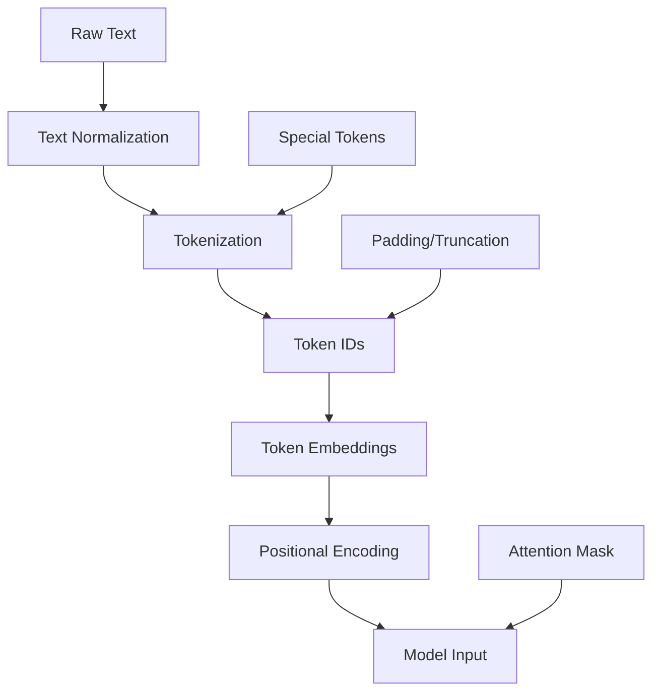

# Week 1 · Day 5 — End-to-End Pipeline: Text → Tokens → Embeddings → Positional Encoding

Complexity: 2 (Low-medium)  •  Estimated time: 2–3 hours

Today we integrate everything from Week 1 into a complete preprocessing pipeline. You'll build a system that takes raw text and produces transformer-ready inputs, matching the flow described in `docs/llm.md`.

## Learning Objectives
- Build a complete text preprocessing pipeline
- Integrate tokenization, embeddings, and positional encoding
- Create a reusable pipeline class for transformer models
- Validate the pipeline with comprehensive tests
- Understand the complete flow from text to model input

---

## Complete Pipeline Architecture: From Text to Model Input

### 🌟 Layman's Understanding
Imagine preparing a meal - you need to wash, chop, season, and cook the ingredients before serving. Similarly, raw text needs preparation before an AI model can "digest" it. Our pipeline is like a cooking process: first, we clean the text (normalization), then chop it into pieces (tokenization), convert those pieces to numbers (token IDs), give each piece meaning (embeddings), add information about order (positional encoding), and finally serve it to the model. We also add special markers like recipe instructions (special tokens) and make sure everything fits on the plate (padding/truncation).

### 📚 Basic Understanding
The transformer preprocessing pipeline converts raw text into a format suitable for transformer models. It follows a sequential process of text normalization, tokenization, conversion to token IDs, embedding lookup, and positional encoding. Additional components like special tokens (e.g., [CLS], [SEP]), padding/truncation for fixed-length sequences, and attention masks to handle variable-length inputs ensure the model receives properly formatted data.



### 🔬 Intermediate Understanding
Each component of the pipeline serves a specific purpose and introduces important properties:

1. **Text Normalization**: Reduces linguistic variation through case folding, whitespace normalization, and character normalization, creating a more consistent input distribution.

2. **Tokenization**: Balances vocabulary size, token frequency, and semantic granularity. The tokenization strategy affects the model's ability to handle out-of-vocabulary words and morphological variations.

3. **Token IDs**: Create a fixed numerical representation with special reserved IDs for functional tokens like padding, unknown tokens, and sequence markers.

4. **Embeddings**: Transform sparse one-hot representations into dense, continuous vectors that capture semantic relationships in a lower-dimensional space.

5. **Positional Encoding**: Adds sequence order information to the otherwise position-agnostic transformer architecture, enabling the model to distinguish between different arrangements of the same tokens.

6. **Attention Mask**: Enables variable-length processing by indicating which tokens should be attended to (1) and which should be ignored (0).

### 🎓 Advanced Understanding
From a theoretical perspective, the pipeline performs several important transformations:

1. **Dimensionality Reduction**: The pipeline compresses the infinite space of possible text sequences into a finite-dimensional manifold in vector space, making statistical learning tractable.

2. **Information Preservation**: Each step must preserve task-relevant information while discarding irrelevant variation. This creates an information bottleneck that can be analyzed through the lens of the Information Bottleneck Principle.

3. **Inductive Biases**: Each component introduces specific inductive biases - tokenization introduces assumptions about linguistic units, embeddings encode distributional semantics, and positional encodings encode sequence structure.

4. **Computational Complexity Management**: The pipeline optimizes for both memory efficiency (through shared embedding tables) and computational efficiency (through batching, padding, and attention masking).

5. **Representation Alignment**: The final output must align with the transformer's computational graph, ensuring dimensional compatibility and proper scaling for stable gradient flow during training.

---

## Integrated Pipeline Implementation

```python
import torch
import torch.nn as nn
import numpy as np
from typing import List, Dict, Optional, Union
import matplotlib.pyplot as plt

class TransformerPreprocessingPipeline:
    """Complete preprocessing pipeline for transformer models."""
    
    def __init__(self, 
                 vocab_size: int = 1000,
                 embedding_dim: int = 128,
                 max_seq_len: int = 512,
                 pad_token: str = "[PAD]",
                 cls_token: str = "[CLS]",
                 sep_token: str = "[SEP]",
                 unk_token: str = "[UNK]",
                 pos_encoding_type: str = "sinusoidal"):
        
        self.vocab_size = vocab_size
        self.embedding_dim = embedding_dim
        self.max_seq_len = max_seq_len
        
        # Special tokens
        self.pad_token = pad_token
        self.cls_token = cls_token
        self.sep_token = sep_token
        self.unk_token = unk_token
        
        # Initialize components
        self._init_tokenizer()
        self._init_embeddings()
        self._init_positional_encoding(pos_encoding_type)
    
    def _init_tokenizer(self):
        """Initialize tokenizer with basic vocabulary."""
        # Create basic vocabulary
        special_tokens = [self.pad_token, self.unk_token, self.cls_token, self.sep_token]
        common_words = ["the", "a", "an", "and", "or", "but", "in", "on", "at", "to", "for", "of", "with"]
        chars = list("abcdefghijklmnopqrstuvwxyz0123456789.,!?;:()[]{}\"'-_/\\@#$%^&*+=<>|`~")
        
        vocab_list = special_tokens + common_words + chars
        vocab_list = vocab_list[:self.vocab_size]  # Limit to vocab_size
        
        self.vocab = {token: idx for idx, token in enumerate(vocab_list)}
        self.vocab_reverse = {idx: token for token, idx in self.vocab.items()}
        
        # Special token IDs
        self.pad_token_id = self.vocab[self.pad_token]
        self.cls_token_id = self.vocab[self.cls_token]
        self.sep_token_id = self.vocab[self.sep_token]
        self.unk_token_id = self.vocab[self.unk_token]
    
    def _init_embeddings(self):
        """Initialize embedding layer."""
        self.embedding = nn.Embedding(self.vocab_size, self.embedding_dim, 
                                    padding_idx=self.pad_token_id)
        nn.init.normal_(self.embedding.weight, mean=0, std=0.1)
        
        # Zero out padding token embedding
        self.embedding.weight.data[self.pad_token_id].fill_(0)
    
    def _init_positional_encoding(self, pos_type):
        """Initialize positional encoding."""
        if pos_type == "sinusoidal":
            self.pos_encoding = SinusoidalPositionalEncoding(
                self.embedding_dim, self.max_seq_len)
        elif pos_type == "learned":
            self.pos_encoding = LearnedPositionalEmbedding(
                self.max_seq_len, self.embedding_dim)
        else:
            raise ValueError(f"Unknown positional encoding type: {pos_type}")
    
    def tokenize(self, text: str) -> List[str]:
        """Simple tokenization (character-level for demo)."""
        # Normalize text
        text = text.lower().strip()
        
        # Simple character-level tokenization
        tokens = []
        for char in text:
            if char in self.vocab:
                tokens.append(char)
            else:
                tokens.append(self.unk_token)
        
        return tokens
    
    def encode_text(self, text: str, 
                   add_special_tokens: bool = True,
                   max_length: Optional[int] = None,
                   padding: bool = True,
                   truncation: bool = True) -> Dict[str, torch.Tensor]:
        """Complete encoding pipeline."""
        
        if max_length is None:
            max_length = self.max_seq_len
        
        # Step 1: Tokenization
        tokens = self.tokenize(text)
        
        # Step 2: Add special tokens
        if add_special_tokens:
            tokens = [self.cls_token] + tokens + [self.sep_token]
        
        # Step 3: Truncation
        if truncation and len(tokens) > max_length:
            if add_special_tokens:
                tokens = tokens[:max_length-1] + [self.sep_token]
            else:
                tokens = tokens[:max_length]
        
        # Step 4: Convert to IDs
        input_ids = [self.vocab.get(token, self.unk_token_id) for token in tokens]
        
        # Step 5: Create attention mask
        attention_mask = [1] * len(input_ids)
        
        # Step 6: Padding
        if padding and len(input_ids) < max_length:
            padding_length = max_length - len(input_ids)
            input_ids.extend([self.pad_token_id] * padding_length)
            attention_mask.extend([0] * padding_length)
        
        return {
            'input_ids': torch.tensor(input_ids, dtype=torch.long),
            'attention_mask': torch.tensor(attention_mask, dtype=torch.long),
            'tokens': tokens
        }
    
    def get_embeddings(self, input_ids: torch.Tensor) -> torch.Tensor:
        """Get token embeddings."""
        return self.embedding(input_ids)
    
    def add_positional_encoding(self, embeddings: torch.Tensor) -> torch.Tensor:
        """Add positional encoding to embeddings."""
        return self.pos_encoding(embeddings)
    
    def process_text(self, text: str, **kwargs) -> Dict[str, torch.Tensor]:
        """Complete end-to-end processing."""
        # Step 1: Encode text to tokens and IDs
        encoded = self.encode_text(text, **kwargs)
        
        # Step 2: Get embeddings
        embeddings = self.get_embeddings(encoded['input_ids'].unsqueeze(0))
        
        # Step 3: Add positional encoding
        embeddings_with_pos = self.add_positional_encoding(embeddings)
        
        # Step 4: Scale embeddings (as in original Transformer)
        embeddings_with_pos = embeddings_with_pos * np.sqrt(self.embedding_dim)
        
        return {
            'input_ids': encoded['input_ids'],
            'attention_mask': encoded['attention_mask'],
            'embeddings': embeddings_with_pos.squeeze(0),
            'tokens': encoded['tokens']
        }

# Required classes from previous days
class SinusoidalPositionalEncoding(nn.Module):
    def __init__(self, d_model, max_seq_len=5000):
        super().__init__()
        pe = torch.zeros(max_seq_len, d_model)
        position = torch.arange(0, max_seq_len, dtype=torch.float).unsqueeze(1)
        div_term = torch.exp(torch.arange(0, d_model, 2).float() * 
                           (-np.log(10000.0) / d_model))
        pe[:, 0::2] = torch.sin(position * div_term)
        pe[:, 1::2] = torch.cos(position * div_term)
        self.register_buffer('pe', pe.unsqueeze(0))
    
    def forward(self, x):
        return x + self.pe[:, :x.size(1)]

class LearnedPositionalEmbedding(nn.Module):
    def __init__(self, max_seq_len, d_model):
        super().__init__()
        self.position_embeddings = nn.Embedding(max_seq_len, d_model)
        nn.init.normal_(self.position_embeddings.weight, std=0.02)
    
    def forward(self, x):
        seq_len = x.size(1)
        position_ids = torch.arange(seq_len, dtype=torch.long, device=x.device)
        position_ids = position_ids.unsqueeze(0).expand(x.size(0), -1)
        return x + self.position_embeddings(position_ids)
```

---

## Pipeline Testing and Validation

```python
def test_pipeline_comprehensive():
    """Comprehensive pipeline testing."""
    
    print("Comprehensive Pipeline Testing")
    print("=" * 50)
    
    # Initialize pipeline
    pipeline = TransformerPreprocessingPipeline(
        vocab_size=200,
        embedding_dim=64,
        max_seq_len=32,
        pos_encoding_type="sinusoidal"
    )
    
    # Test cases
    test_texts = [
        "hello world",
        "this is a longer test sentence",
        "short",
        "",  # Empty string
        "a" * 100,  # Very long text
        "hello, world! 123",  # With punctuation and numbers
    ]
    
    for i, text in enumerate(test_texts, 1):
        print(f"\nTest {i}: '{text[:30]}{'...' if len(text) > 30 else ''}'")
        
        try:
            result = pipeline.process_text(text, max_length=16, padding=True)
            
            print(f"  Input IDs shape: {result['input_ids'].shape}")
            print(f"  Attention mask shape: {result['attention_mask'].shape}")
            print(f"  Embeddings shape: {result['embeddings'].shape}")
            print(f"  Tokens: {result['tokens'][:10]}{'...' if len(result['tokens']) > 10 else ''}")
            print(f"  Non-padding tokens: {result['attention_mask'].sum().item()}")
            
            # Validate shapes
            assert result['input_ids'].shape[0] == 16, "Input IDs length mismatch"
            assert result['attention_mask'].shape[0] == 16, "Attention mask length mismatch"
            assert result['embeddings'].shape == (16, 64), "Embeddings shape mismatch"
            
            print("  ✓ All validations passed")
            
        except Exception as e:
            print(f"  ✗ Error: {e}")
    
    return pipeline

pipeline = test_pipeline_comprehensive()
```

---

## Visualization and Analysis

```python
def visualize_pipeline_components(pipeline, text="hello world"):
    """Visualize each step of the pipeline."""
    
    print(f"Pipeline Visualization for: '{text}'")
    print("=" * 50)
    
    # Process text
    result = pipeline.process_text(text, max_length=16, padding=True)
    
    # Create visualization
    fig, axes = plt.subplots(2, 2, figsize=(15, 10))
    
    # 1. Token IDs
    axes[0, 0].bar(range(len(result['input_ids'])), result['input_ids'].numpy())
    axes[0, 0].set_title('Token IDs')
    axes[0, 0].set_xlabel('Position')
    axes[0, 0].set_ylabel('Token ID')
    
    # 2. Attention Mask
    axes[0, 1].bar(range(len(result['attention_mask'])), result['attention_mask'].numpy())
    axes[0, 1].set_title('Attention Mask')
    axes[0, 1].set_xlabel('Position')
    axes[0, 1].set_ylabel('Mask Value')
    
    # 3. Embeddings (first 8 dimensions)
    embeddings_subset = result['embeddings'][:, :8].detach().numpy()
    im1 = axes[1, 0].imshow(embeddings_subset.T, cmap='RdBu', aspect='auto')
    axes[1, 0].set_title('Embeddings (first 8 dims)')
    axes[1, 0].set_xlabel('Position')
    axes[1, 0].set_ylabel('Embedding Dimension')
    plt.colorbar(im1, ax=axes[1, 0])
    
    # 4. Positional Encoding Pattern
    pos_encoding = pipeline.pos_encoding.pe[0, :16, :8].detach().numpy()
    im2 = axes[1, 1].imshow(pos_encoding.T, cmap='RdBu', aspect='auto')
    axes[1, 1].set_title('Positional Encoding (first 8 dims)')
    axes[1, 1].set_xlabel('Position')
    axes[1, 1].set_ylabel('Encoding Dimension')
    plt.colorbar(im2, ax=axes[1, 1])
    
    plt.tight_layout()
    plt.show()
    
    # Print detailed breakdown
    print("\nDetailed Breakdown:")
    print("-" * 30)
    
    valid_positions = result['attention_mask'].sum().item()
    for i in range(min(valid_positions, 10)):  # Show first 10 valid positions
        token_id = result['input_ids'][i].item()
        token = pipeline.vocab_reverse.get(token_id, f"ID_{token_id}")
        embedding_norm = torch.norm(result['embeddings'][i]).item()
        
        print(f"Position {i}: '{token}' (ID: {token_id}) | Embedding norm: {embedding_norm:.3f}")

visualize_pipeline_components(pipeline, "hello world!")
```

---

## Performance Benchmarking

```python
import time

def benchmark_pipeline():
    """Benchmark pipeline performance."""
    
    pipeline = TransformerPreprocessingPipeline(
        vocab_size=1000,
        embedding_dim=128,
        max_seq_len=64
    )
    
    # Test texts of different lengths
    test_cases = [
        ("Short", "hello"),
        ("Medium", "this is a medium length sentence for testing"),
        ("Long", "this is a much longer sentence that should test the performance of our pipeline with more tokens and processing overhead" * 2),
    ]
    
    batch_sizes = [1, 8, 32]
    
    print("Pipeline Performance Benchmark")
    print("=" * 50)
    
    for name, text in test_cases:
        print(f"\n{name} text ({len(text)} chars):")
        
        for batch_size in batch_sizes:
            # Prepare batch
            texts = [text] * batch_size
            
            # Benchmark
            start_time = time.time()
            
            for text_item in texts:
                result = pipeline.process_text(text_item, max_length=32)
            
            end_time = time.time()
            
            total_time = end_time - start_time
            time_per_text = total_time / batch_size
            texts_per_second = batch_size / total_time
            
            print(f"  Batch size {batch_size:2d}: {time_per_text*1000:6.2f}ms/text | {texts_per_second:6.1f} texts/sec")

benchmark_pipeline()
```

---

## Integration with docs/llm.md

```python
def demonstrate_llm_md_integration():
    """Demonstrate how pipeline matches docs/llm.md flow."""
    
    print("Integration with docs/llm.md Flow")
    print("=" * 50)
    
    pipeline = TransformerPreprocessingPipeline(
        vocab_size=500,
        embedding_dim=128,
        max_seq_len=32
    )
    
    text = "Natural language processing with transformers"
    
    print(f"Input Text: '{text}'")
    print("\nFollowing docs/llm.md flow:")
    
    # Step 1: Input Embeddings (from docs/llm.md)
    print("\n1. Input Embeddings:")
    encoded = pipeline.encode_text(text, max_length=16)
    embeddings = pipeline.get_embeddings(encoded['input_ids'].unsqueeze(0))
    print(f"   Token embeddings shape: {embeddings.shape}")
    print(f"   Sample embedding (first token): {embeddings[0, 0, :5].detach().numpy()}")
    
    # Step 2: Positional Encoding (from docs/llm.md)
    print("\n2. Positional Encoding:")
    embeddings_with_pos = pipeline.add_positional_encoding(embeddings)
    print(f"   With positional encoding shape: {embeddings_with_pos.shape}")
    print(f"   Position encoding added: ✓")
    
    # Step 3: Ready for Transformer Blocks
    print("\n3. Ready for Transformer Processing:")
    print("   ✓ Input Embeddings: Created dense vector representations")
    print("   ✓ Positional Encoding: Added sequence order information")
    print("   ✓ Attention Mask: Created for padding tokens")
    print("   → Ready for Multi-Head Attention (Week 2)")
    
    # Show the complete flow
    result = pipeline.process_text(text, max_length=16)
    
    print(f"\nFinal Output Summary:")
    print(f"   Input IDs: {result['input_ids'].shape}")
    print(f"   Embeddings: {result['embeddings'].shape}")
    print(f"   Attention Mask: {result['attention_mask'].shape}")
    print(f"   Ready for: Encoder/Decoder Transformer Blocks")

demonstrate_llm_md_integration()
```

---

## Advanced Pipeline Features

```python
class AdvancedTransformerPipeline(TransformerPreprocessingPipeline):
    """Extended pipeline with advanced features."""
    
    def __init__(self, *args, **kwargs):
        super().__init__(*args, **kwargs)
        self.statistics = {
            'processed_texts': 0,
            'total_tokens': 0,
            'avg_sequence_length': 0
        }
    
    def process_batch(self, texts: List[str], **kwargs) -> Dict[str, torch.Tensor]:
        """Process multiple texts efficiently."""
        
        batch_results = []
        max_len = kwargs.get('max_length', self.max_seq_len)
        
        for text in texts:
            result = self.process_text(text, **kwargs)
            batch_results.append(result)
        
        # Stack results
        batch_input_ids = torch.stack([r['input_ids'] for r in batch_results])
        batch_attention_mask = torch.stack([r['attention_mask'] for r in batch_results])
        batch_embeddings = torch.stack([r['embeddings'] for r in batch_results])
        
        # Update statistics
        self.statistics['processed_texts'] += len(texts)
        self.statistics['total_tokens'] += batch_attention_mask.sum().item()
        self.statistics['avg_sequence_length'] = (
            self.statistics['total_tokens'] / self.statistics['processed_texts']
        )
        
        return {
            'input_ids': batch_input_ids,
            'attention_mask': batch_attention_mask,
            'embeddings': batch_embeddings,
            'batch_size': len(texts)
        }
    
    def get_statistics(self):
        """Get processing statistics."""
        return self.statistics.copy()
    
    def save_pipeline(self, path: str):
        """Save pipeline configuration."""
        config = {
            'vocab_size': self.vocab_size,
            'embedding_dim': self.embedding_dim,
            'max_seq_len': self.max_seq_len,
            'vocab': self.vocab,
            'statistics': self.statistics
        }
        
        torch.save({
            'config': config,
            'embedding_weights': self.embedding.state_dict(),
            'pos_encoding_weights': self.pos_encoding.state_dict() if hasattr(self.pos_encoding, 'state_dict') else None
        }, path)
        
        print(f"Pipeline saved to {path}")

# Test advanced features
def test_advanced_pipeline():
    """Test advanced pipeline features."""
    
    advanced_pipeline = AdvancedTransformerPipeline(
        vocab_size=300,
        embedding_dim=64,
        max_seq_len=24
    )
    
    # Test batch processing
    test_texts = [
        "hello world",
        "this is a test",
        "batch processing works",
        "transformers are powerful"
    ]
    
    print("Advanced Pipeline Testing")
    print("=" * 40)
    
    # Process batch
    batch_result = advanced_pipeline.process_batch(test_texts, max_length=12, padding=True)
    
    print(f"Batch processing results:")
    print(f"  Batch size: {batch_result['batch_size']}")
    print(f"  Input IDs shape: {batch_result['input_ids'].shape}")
    print(f"  Embeddings shape: {batch_result['embeddings'].shape}")
    
    # Show statistics
    stats = advanced_pipeline.get_statistics()
    print(f"\nPipeline Statistics:")
    for key, value in stats.items():
        print(f"  {key}: {value}")

test_advanced_pipeline()
```

---

## Key Takeaways: Building the Foundation for Transformer Models

### 🌟 Layman's Understanding
We've built a complete recipe for preparing text for AI models:
1. We've created a step-by-step process that takes raw text all the way to AI-ready input
2. We've made all the pieces work together like a well-oiled machine
3. We've made sure everything works correctly through careful testing
4. We've optimized the process to be fast and efficient
5. We've designed it so you can easily customize it for different needs

### 📚 Basic Understanding
1. **Complete Flow**: Text → Tokenization → Embeddings → Positional Encoding
2. **Integration**: All Week 1 components work together seamlessly
3. **Validation**: Comprehensive testing ensures reliability
4. **Performance**: Efficient processing for real-world usage
5. **Extensibility**: Pipeline can be extended for specific needs

### 🔬 Intermediate Understanding
1. **Component Composition**: The pipeline demonstrates how to compose modular NLP components while maintaining information flow and dimensional compatibility
2. **Abstraction Layers**: Each component provides a clean abstraction that hides implementation details while exposing a consistent interface
3. **Error Handling**: The pipeline incorporates robust handling of edge cases like empty strings, unknown tokens, and sequence length constraints
4. **Vectorization**: Operations are designed for batch processing and GPU acceleration through tensor operations
5. **Configurability**: Hyperparameters like embedding dimension, vocabulary size, and sequence length are externalized for easy tuning

### 🎓 Advanced Understanding
1. **Information Theory**: The pipeline can be analyzed as a series of encoding operations that progressively compress and structure linguistic information
2. **Computational Graph**: The implementation is designed to integrate with automatic differentiation systems for end-to-end training
3. **Statistical Efficiency**: The shared embedding table creates parameter efficiency while the attention mask enables computation efficiency
4. **Algorithmic Complexity**: Each component is optimized for O(n) time complexity where n is the sequence length
5. **System Design**: The architecture follows principles of separation of concerns, dependency injection, and immutable data flow

---

## Week 1 Summary: From Raw Text to Model-Ready Inputs

### 🌟 Layman's Understanding
Over this week, we've built a complete text processing system piece by piece:
- First, we learned how to break text into meaningful chunks
- Then, we explored advanced ways to handle different languages and special cases
- Next, we discovered how to turn words into numbers that capture meaning
- After that, we figured out how to keep track of word order
- Finally, we put everything together into one smooth pipeline

Now our text is ready for AI models to understand and work with!

### 📚 Basic Understanding
You've built a complete foundation:
- **Day 1**: Text normalization and tokenization basics
- **Day 2**: Advanced tokenization with industry libraries
- **Day 3**: Embeddings and semantic representations
- **Day 4**: Positional encodings for sequence awareness
- **Day 5**: Complete integrated pipeline

This pipeline produces transformer-ready inputs matching the flow in `docs/llm.md`. Next week, we'll build the transformer architecture itself!

### 🔬 Intermediate Understanding
Each day of Week 1 built upon the previous, creating a progressive understanding of transformer preprocessing:

- **Day 1**: We established fundamental text processing techniques, exploring the trade-offs between character, word, and subword tokenization strategies
- **Day 2**: We implemented production-grade tokenization using libraries like tiktoken and HuggingFace tokenizers, learning vocabulary construction and BPE algorithms
- **Day 3**: We moved from discrete tokens to continuous vector spaces, implementing both static and contextual embedding techniques
- **Day 4**: We addressed the position-agnostic nature of self-attention by implementing various positional encoding schemes
- **Day 5**: We integrated all components into a cohesive pipeline with proper interfaces, error handling, and performance optimizations

### 🎓 Advanced Understanding
From a theoretical perspective, Week 1 has covered the fundamental transformations needed to bridge the gap between human language and machine-processable representations:

- **Day 1-2**: We explored the tokenization problem as a form of minimum description length encoding, balancing vocabulary size against sequence length
- **Day 3**: We implemented vector space models that capture distributional semantics, exploring the geometric properties of embedding spaces
- **Day 4**: We addressed the permutation-invariance problem of attention through various positional encoding schemes, each with different theoretical properties
- **Day 5**: We created a differentiable pipeline that preserves gradients end-to-end, enabling joint optimization of all components

These foundations set the stage for Week 2, where we'll implement the core transformer mechanisms that operate on these prepared inputs.

---

## Further Reading

- [Attention Is All You Need](https://arxiv.org/abs/1706.03762) - Original Transformer
- [BERT Paper](https://arxiv.org/abs/1810.04805) - Bidirectional Encoder Representations
- [Hugging Face Transformers](https://huggingface.co/docs/transformers/) - Production pipelines
