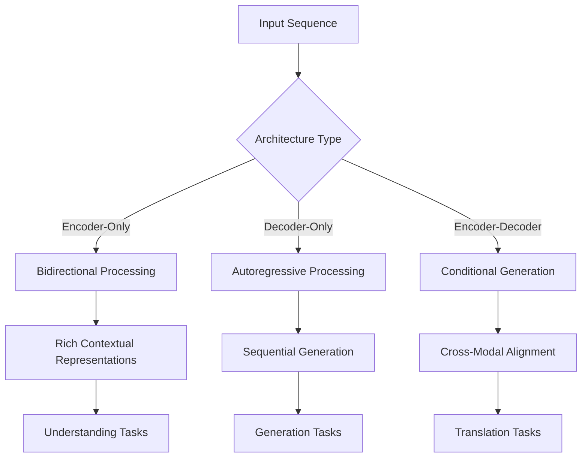
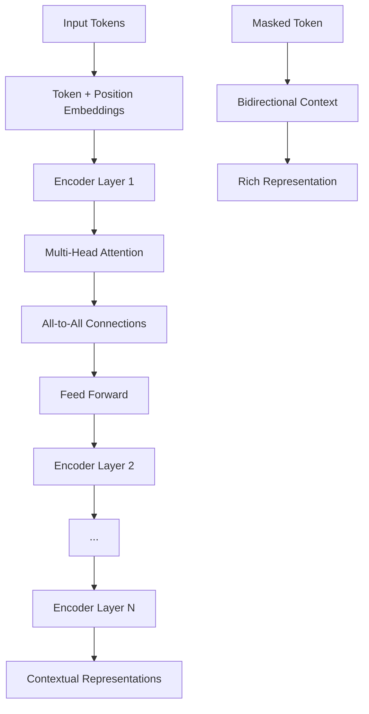
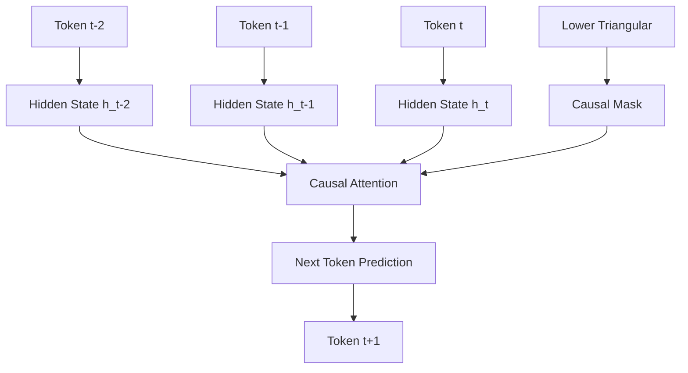

# Week 2 · Day 8 — Transformer Architectures: Encoder-only, Decoder-only, Encoder-Decoder, Masked Attention

Complexity: 3 (Medium)  •  Estimated time: 2–3 hours

Today we explore the three fundamental transformer architectures that have shaped modern NLP. We'll understand the theoretical foundations behind encoder-only (BERT-style), decoder-only (GPT-style), and encoder-decoder (T5-style) models, with deep dives into masked attention mechanisms and architectural design principles.

## Learning Objectives

- Master the theoretical foundations of the three transformer architectures
- Understand the mathematical principles behind masked attention and causal modeling
- Analyze the computational and representational trade-offs between architectures
- Connect architectural choices to task requirements and model capabilities
- Explore the evolution from bidirectional to autoregressive modeling paradigms

---

## Theoretical Foundations of Transformer Architectures

The transformer architecture's flexibility stems from its modular design, allowing three distinct configurations that optimize for different computational patterns and task requirements. Each architecture represents a fundamental approach to sequence modeling:

### Information Flow Patterns



### Mathematical Framework

Each architecture can be understood through its attention computation patterns:

**Encoder-Only (Bidirectional):**

```math
Attention(Q,K,V) = softmax(QK^T/√d_k)V
where Q, K, V can attend to all positions
```

**Decoder-Only (Causal):**

```math
Attention(Q,K,V) = softmax(mask(QK^T/√d_k))V
where mask ensures causality: M_ij = 0 if i < j
```

**Encoder-Decoder (Cross-Attention):**

```math
Self-Attention: softmax(mask(Q_dec K_dec^T/√d_k))V_dec
Cross-Attention: softmax(Q_dec K_enc^T/√d_k)V_enc
```

---

## Architecture 1: Encoder-Only (BERT-Style)

### Theoretical Foundation

The encoder-only architecture represents the purest form of bidirectional sequence modeling. Unlike traditional left-to-right language models, BERT-style encoders can access the full context of a sequence simultaneously, enabling rich bidirectional representations.

#### Mathematical Formulation

For a sequence of length n, the encoder computes:

```math
H^{(l)} = LayerNorm(H^{(l-1)} + MultiHeadAttention(H^{(l-1)}))
H^{(l)} = LayerNorm(H^{(l)} + FeedForward(H^{(l)}))
```

Where the attention mechanism has access to all positions:

```math
Attention_{i,j} = softmax(\frac{q_i k_j^T}{\sqrt{d_k}}) \text{ for all } i,j \in [1,n]
```

#### Information-Theoretic Perspective

The bidirectional nature allows each token to gather information from its entire context, maximizing the mutual information between token representations and their surrounding context:

```math
I(x_i; x_{-i}) = \sum_{j \neq i} \alpha_{i,j} \log \frac{P(x_i|x_j)}{P(x_i)}
```

This leads to representations that capture both local syntactic patterns and global semantic relationships.

#### Architectural Properties

**Representation Power:**

- Each position receives information from all other positions
- No information bottleneck from sequential processing
- Rich contextual embeddings suitable for understanding tasks

**Computational Characteristics:**

- Parallel processing across all positions
- O(n²) attention complexity
- Efficient for fixed-length sequences

**Training Paradigm:**

- Masked Language Modeling (MLM) objective
- Next Sentence Prediction (NSP) for discourse understanding
- Bidirectional context reconstruction



---

## Architecture 2: Decoder-Only (GPT-Style) with Masked Attention

### Theoretical Foundation

The decoder-only architecture represents a paradigm shift toward autoregressive modeling, where each token can only attend to previous positions in the sequence. This causal constraint enables natural language generation while maintaining computational efficiency.

#### Causal Masking Mathematics

The key innovation is the causal attention mask that enforces temporal ordering:

```math
Mask_{i,j} = \begin{cases}
0 & \text{if } i < j \text{ (future positions)} \\
1 & \text{if } i \geq j \text{ (current and past positions)}
\end{cases}
```

This transforms the attention computation to:

```math
Attention_{causal}(Q,K,V) = softmax(\frac{QK^T + M}{\sqrt{d_k}})V
```

Where M is a large negative value (-∞) for masked positions.

#### Information Flow and Causality

The causal constraint creates a specific information flow pattern:

```math
h_i^{(l)} = f(h_1^{(l-1)}, h_2^{(l-1)}, ..., h_i^{(l-1)})
```

This ensures that the representation at position i only depends on positions 1 through i, preserving the autoregressive property essential for generation.

#### Architectural Properties

**Generation Capability:**

- Natural autoregressive generation through left-to-right processing
- Each token prediction conditioned on all previous tokens
- Maintains causal consistency during inference

**Training Efficiency:**

- Teacher forcing enables parallel training across sequence positions
- Causal masking prevents information leakage from future tokens
- Single forward pass computes loss for all positions simultaneously

**Scalability Advantages:**

- Uniform architecture scales to very large models (GPT-3, GPT-4)
- Simple objective function (next token prediction)
- Emergent capabilities with scale (few-shot learning, reasoning)



---

## Architecture 3: Encoder-Decoder (T5-Style)

### Theoretical Foundation

The encoder-decoder architecture combines the representational power of bidirectional encoding with the generation capabilities of autoregressive decoding. This hybrid approach excels at sequence-to-sequence tasks where the input and output have different structures or lengths.

#### Cross-Attention Mechanism

The key innovation is cross-attention, which allows the decoder to attend to encoder representations:

```math
CrossAttention(Q_{dec}, K_{enc}, V_{enc}) = softmax(\frac{Q_{dec}K_{enc}^T}{\sqrt{d_k}})V_{enc}
```

This creates a bridge between the encoder's bidirectional understanding and the decoder's autoregressive generation.

#### Dual Information Processing

The architecture processes information through two distinct pathways:

**Encoder Pathway:**
```math
H_{enc} = Encoder(X_{input}) \text{ (bidirectional processing)}
```

**Decoder Pathway:**
```math
H_{dec} = Decoder(Y_{target}, H_{enc}) \text{ (causal + cross-attention)}
```

#### Architectural Properties

**Representation Flexibility:**

- Encoder captures rich bidirectional context of input
- Decoder maintains causal generation properties
- Cross-attention enables selective information transfer

**Task Adaptability:**

- Variable input/output lengths naturally supported
- Conditional generation based on input context
- Suitable for translation, summarization, and text-to-text tasks

**Training Dynamics:**

- Teacher forcing in decoder during training
- Encoder-decoder attention learns alignment patterns
- Joint optimization of understanding and generation objectives

```mermaid
graph TD
    A[Input Sequence] --> B[Encoder Stack]
    B --> C[Bidirectional Representations]
    
    D[Target Sequence] --> E[Decoder Stack]
    E --> F[Causal Self-Attention]
    F --> G[Cross-Attention]
    C --> G
    G --> H[Feed Forward]
    H --> I[Output Logits]
    
    J[Encoder-Decoder Bridge] --> G
---

## Comparative Analysis of Transformer Architectures

### Computational Complexity Comparison

Each architecture has distinct computational characteristics:

**Memory Complexity:**

```math
\text{Encoder-Only: } O(n^2 \cdot d_{model})
```

```math
\text{Decoder-Only: } O(n^2 \cdot d_{model}) \text{ (with causal masking)}
```

```math
\text{Encoder-Decoder: } O(n^2 \cdot d_{model} + m \cdot n \cdot d_{model})
```

Where n is sequence length, m is target length.

### Task-Architecture Alignment

**Understanding vs Generation Trade-off:**

The choice between architectures reflects a fundamental trade-off between representation richness and generation capability:

**Encoder-Only Advantages:**

- Maximum bidirectional context for each token
- Optimal for classification and understanding tasks
- Parallel processing of entire sequence
- Rich contextual embeddings

**Decoder-Only Advantages:**

- Natural autoregressive generation
- Scalable to very large models
- Unified architecture for diverse tasks
- Emergent capabilities with scale

**Encoder-Decoder Advantages:**

- Optimal for sequence-to-sequence tasks
- Flexible input/output length handling
- Specialized encoding and decoding
- Cross-attention for alignment learning

### Theoretical Implications

**Information Bottleneck Theory:**

Each architecture creates different information bottlenecks:

- **Encoder-Only:** No bottleneck within sequence, but no generation capability
- **Decoder-Only:** Causal bottleneck preserves generation properties
- **Encoder-Decoder:** Cross-attention bottleneck enables selective information transfer

**Representation Learning:**

The architectures learn fundamentally different types of representations:

```math
\text{BERT: } R_{bidirectional}(x_i) = f(x_1, ..., x_n)
```

```math
\text{GPT: } R_{causal}(x_i) = f(x_1, ..., x_i)
```

```math
\text{T5: } R_{conditional}(y_i) = f(x_1, ..., x_n, y_1, ..., y_i)
```

---

## Architecture Decision Framework

### Theoretical Decision Criteria

The choice of transformer architecture should be guided by fundamental task requirements and computational constraints:

#### Task-Architecture Mapping

**Classification and Understanding Tasks:**
- **Optimal Choice:** Encoder-Only (BERT-style)
- **Reasoning:** Bidirectional context maximizes representation quality
- **Examples:** Sentiment analysis, NER, question answering

**Text Generation Tasks:**
- **Optimal Choice:** Decoder-Only (GPT-style)
- **Reasoning:** Causal modeling enables natural generation
- **Examples:** Language modeling, creative writing, code generation

**Sequence-to-Sequence Tasks:**
- **Optimal Choice:** Encoder-Decoder (T5-style)
- **Reasoning:** Separate encoding and decoding optimizes for different input/output structures
- **Examples:** Translation, summarization, text-to-text transformation

#### Computational Considerations

**Memory Scaling:**

```math
\text{Memory} \propto \begin{cases}
O(n^2) & \text{for single sequences} \\
O(n^2 + m \cdot n) & \text{for encoder-decoder with lengths n, m}
\end{cases}
```

**Training Efficiency:**

- **Encoder-Only:** Parallel processing, efficient for fixed-length tasks
- **Decoder-Only:** Teacher forcing enables parallel training despite causal constraints
- **Encoder-Decoder:** Highest memory usage but optimal for seq2seq tasks

### Modern Architecture Evolution

**Scaling Laws and Architecture Choice:**

Recent research shows that decoder-only architectures scale more favorably:

```math
\text{Performance} \propto \text{Parameters}^{\alpha} \cdot \text{Data}^{\beta} \cdot \text{Compute}^{\gamma}
```

Where decoder-only models show better scaling coefficients across all dimensions.

**Emergent Capabilities:**

Large decoder-only models exhibit emergent capabilities not present in smaller models:

- Few-shot learning
- Chain-of-thought reasoning  
- Cross-domain transfer
- Instruction following

---

## Key Takeaways

### Theoretical Insights

1. **Architecture determines information flow patterns** - bidirectional vs causal vs conditional
2. **Attention mechanisms create different representational spaces** - each optimized for specific task types
3. **Computational complexity scales differently** - important for practical deployment
4. **Modern trends favor decoder-only architectures** - due to superior scaling properties

### Practical Guidelines

1. **Start with task requirements** - generation vs understanding vs seq2seq
2. **Consider computational constraints** - memory, training time, inference speed
3. **Evaluate scaling needs** - small models vs large language models
4. **Account for data availability** - different architectures have different data requirements

### Future Directions

The field is moving toward:
- **Unified architectures** that can handle multiple task types
- **Efficient attention mechanisms** that reduce quadratic complexity
- **Mixture of experts** for scaling without proportional compute increase
- **Multimodal extensions** that handle text, images, and other modalities

---

## What's Next (Day 9 Preview)

Tomorrow we'll dive into the supporting components that make transformers work: residual connections, layer normalization, feed-forward networks with GELU activation, and the output layer that converts logits to probabilities.

---

## Further Reading

- [BERT Paper](https://arxiv.org/abs/1810.04805) - Encoder-only architecture
- [GPT Paper](https://cdn.openai.com/research-covers/language-unsupervised/language_understanding_paper.pdf) - Decoder-only architecture  
- [T5 Paper](https://arxiv.org/abs/1910.10683) - Text-to-text transfer transformer
- [Transformer Architecture Comparison](https://jalammar.github.io/illustrated-transformer/)

---

## Key Takeaways

1. **Encoder-Only**: Best for understanding tasks, bidirectional context
2. **Decoder-Only**: Excellent for generation, causal modeling
3. **Encoder-Decoder**: Optimal for sequence-to-sequence tasks
4. **Masked Attention**: Enables causal language modeling
5. **Architecture Choice**: Depends on task requirements and constraints

---

## What's Next (Day 9 Preview)

Tomorrow we'll dive into the supporting components that make transformers work: residual connections, layer normalization, feed-forward networks with GELU activation, and the output layer that converts logits to probabilities.

---

## Further Reading

- [BERT Paper](https://arxiv.org/abs/1810.04805) - Encoder-only architecture
- [GPT Paper](https://cdn.openai.com/research-covers/language-unsupervised/language_understanding_paper.pdf) - Decoder-only architecture  
- [T5 Paper](https://arxiv.org/abs/1910.10683) - Text-to-text transfer transformer
- [Transformer Architecture Comparison](https://jalammar.github.io/illustrated-transformer/)
