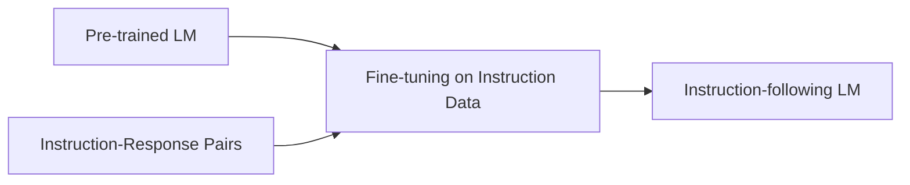
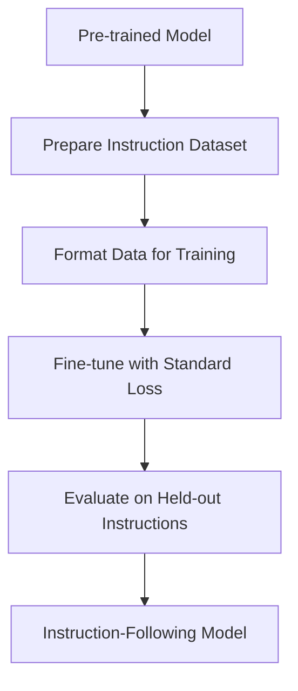

# Day 16: Supervised Fine-Tuning (SFT) Basics

## Overview

Today we'll explore Supervised Fine-Tuning (SFT), the foundational technique for adapting pre-trained language models to follow instructions. We'll cover instruction datasets, the SFT process, and how to implement it effectively.

## Learning Objectives

- Understand what SFT is and why it's important
- Learn about popular instruction datasets
- Implement a basic SFT pipeline
- Fine-tune a small model on instruction data

## Table of Contents

1. [Introduction to SFT](#introduction-to-sft)
2. [Instruction Datasets](#instruction-datasets)
3. [SFT Process](#sft-process)
4. [Implementation Considerations](#implementation-considerations)
5. [Advanced Techniques](#advanced-techniques)

## Introduction to SFT

### Layman's Explanation

Imagine you have a friend who knows a lot of facts but doesn't know how to have a conversation. Supervised Fine-Tuning is like teaching this friend how to respond to questions and follow instructions by showing them examples of good conversations. After seeing enough examples, they learn the pattern and can start having helpful conversations on their own.

### Basic Concept

Supervised Fine-Tuning (SFT) is the process of taking a pre-trained language model (which has learned general language patterns from vast amounts of text) and further training it on a dataset of instructions paired with desired responses. This teaches the model to follow instructions and generate helpful, accurate responses.



### Why SFT Matters

- **Bridges the gap** between general language understanding and task-specific capabilities
- **Teaches models** to follow instructions and maintain conversation format
- **Foundation** for more advanced alignment techniques like RLHF and DPO
- **Relatively simple** compared to other alignment methods

## Instruction Datasets

### Popular Instruction Datasets

1. **Stanford Alpaca**
   - ~52K instruction-following examples
   - Generated using Self-Instruct technique with GPT-3.5/4
   - Open-source alternative to early instruction datasets

2. **Databricks Dolly**
   - ~15K instruction-response pairs
   - Created by Databricks employees (not AI-generated)
   - Commercially permissive license

3. **Google FLAN**
   - Collection of 1.8K+ tasks
   - Includes diverse task formats and domains
   - Demonstrated strong zero-shot generalization

4. **OpenAI's InstructGPT Dataset**
   - Not publicly available
   - Human-written demonstrations and comparisons
   - Set the standard for instruction-following models

### Dataset Formats

Instruction datasets typically follow this structure:

```json
{
  "instruction": "Explain the concept of photosynthesis in simple terms.",
  "input": "",
  "output": "Photosynthesis is how plants make their food. They take sunlight, water, and carbon dioxide from the air and turn it into energy and oxygen. It's like the plant is cooking its own meal using sunlight as the heat source!"
}
```

Or with additional context:

```json
{
  "instruction": "Summarize the following text in one sentence.",
  "input": "Artificial neural networks were inspired by the human brain but function quite differently. While both use interconnected nodes, artificial networks use mathematical operations and backpropagation for learning, whereas the brain uses biological neurons, neurotransmitters, and complex biochemical processes.",
  "output": "Artificial neural networks were inspired by the human brain but use mathematical operations rather than biological processes for learning."
}
```

## SFT Process

### The SFT Pipeline



### Key Steps

1. **Start with a pre-trained model**
   - Typically a decoder-only model like GPT or Llama
   - Already has strong language understanding capabilities

2. **Prepare instruction dataset**
   - Collect instruction-response pairs
   - Clean and normalize the data
   - Split into training and evaluation sets

3. **Format data for training**
   - Convert to model's expected format
   - Apply tokenization
   - Add special tokens if needed (e.g., `<instruction>`, `<response>`)

4. **Fine-tune with standard loss**
   - Use standard language modeling loss (cross-entropy)
   - Lower learning rates than pre-training (typically 1e-5 to 5e-5)
   - Train for fewer steps (1-3 epochs often sufficient)

5. **Evaluate on held-out instructions**
   - Check if model follows instructions correctly
   - Assess response quality and accuracy

## Implementation Considerations

### Training Parameters

- **Learning Rate**: Much lower than pre-training (1e-5 to 5e-5)
- **Batch Size**: As large as memory allows (gradient accumulation helps)
- **Training Steps**: Usually fewer than pre-training (1-3 epochs)
- **Weight Decay**: Often 0.01 to prevent overfitting
- **Warmup Steps**: 5-10% of total steps

### Common Challenges

1. **Overfitting**
   - Models can memorize the training data
   - Solution: Early stopping, validation set monitoring

2. **Prompt Format Sensitivity**
   - Models may be sensitive to exact prompt formatting
   - Solution: Diversify prompt formats in training data

3. **Instruction-Following vs. Knowledge**
   - SFT doesn't add new knowledge, only teaches format
   - Solution: Ensure pre-trained model already has necessary knowledge

4. **Compute Requirements**
   - Full fine-tuning can be expensive for large models
   - Solution: Parameter-efficient fine-tuning (PEFT) methods like LoRA

## Advanced Techniques

### Intermediate Level

1. **Multi-task Instruction Tuning**
   - Fine-tune on diverse instruction types simultaneously
   - Improves generalization to unseen instructions

2. **Chain-of-Thought SFT**
   - Include reasoning steps in training data
   - Helps model learn to reason step-by-step

### Advanced Level

1. **Parameter-Efficient Fine-Tuning (PEFT)**
   - LoRA (Low-Rank Adaptation)
   - QLoRA (Quantized LoRA)
   - Adapter layers

2. **Instruction Backtranslation**
   - Generate new instructions from existing responses
   - Expands dataset size and diversity

3. **Rejection Sampling Fine-Tuning**
   - Generate multiple responses and select best for training
   - Improves quality of training data

## Conclusion

Supervised Fine-Tuning is the crucial first step in aligning language models with human intent. While conceptually simple (training on instruction-response pairs), effective SFT requires careful dataset curation, training parameter selection, and evaluation. SFT models serve as the foundation for more advanced alignment techniques like RLHF and DPO, which we'll explore in the coming days.

## References

1. Ouyang, L., et al. (2022). Training language models to follow instructions with human feedback. NeurIPS.
2. Wang, Y., et al. (2022). Self-Instruct: Aligning Language Models with Self-Generated Instructions. arXiv.
3. Chung, H. W., et al. (2022). Scaling Instruction-Finetuned Language Models. arXiv.
4. Taori, R., et al. (2023). Stanford Alpaca: An Instruction-following LLaMA model. <https://github.com/tatsu-lab/stanford_alpaca>
