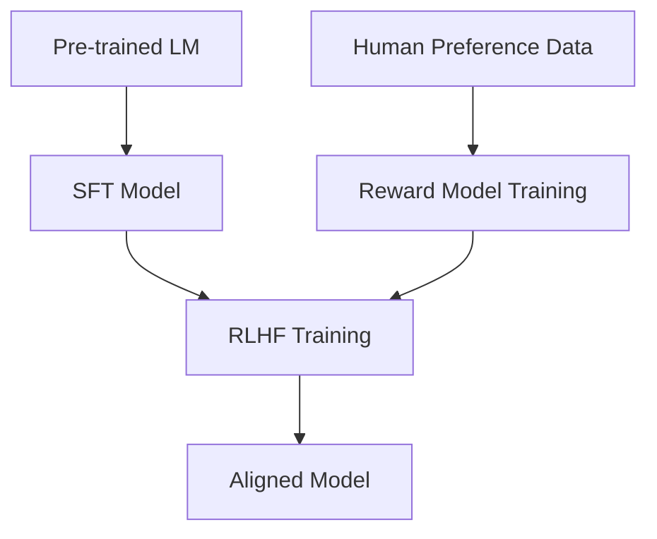
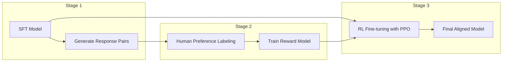
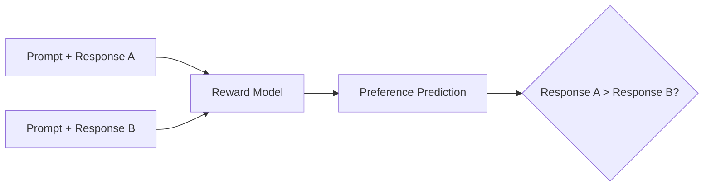
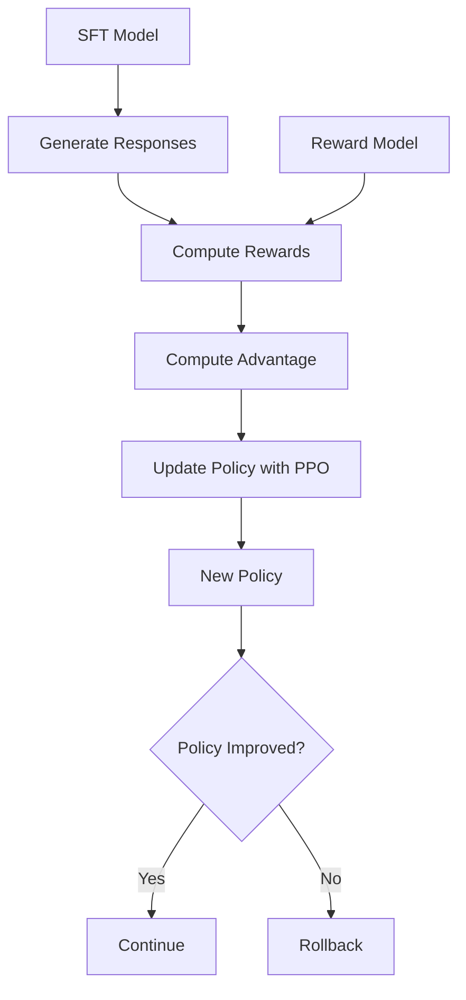

# Day 17: Reinforcement Learning from Human Feedback (RLHF)

## Overview

Today we'll explore Reinforcement Learning from Human Feedback (RLHF), a powerful technique for aligning language models with human preferences. We'll cover the complete RLHF pipeline, including reward modeling, Proximal Policy Optimization (PPO), and how RLHF compares to Supervised Fine-Tuning (SFT).

## Learning Objectives

- Understand the RLHF pipeline and its components
- Learn how reward models are trained
- Explore the PPO algorithm for language models
- Compare RLHF to SFT and understand when to use each

## Table of Contents

1. [Introduction to RLHF](#introduction-to-rlhf)
2. [The RLHF Pipeline](#the-rlhf-pipeline)
3. [Reward Modeling](#reward-modeling)
4. [Proximal Policy Optimization (PPO)](#proximal-policy-optimization-ppo)
5. [Comparison to SFT](#comparison-to-sft)
6. [Implementation Considerations](#implementation-considerations)
7. [Advanced Techniques](#advanced-techniques)

## Introduction to RLHF

### Layman's Explanation

Imagine you're teaching a child to bake cookies. First, you show them a basic recipe (like SFT). Then, you let them try baking on their own, but you taste each batch and give feedback: "These are too sweet," "These are perfect," or "These are undercooked." The child learns from your preferences and adjusts their baking. That's RLHF—the model generates responses, humans provide feedback on which responses they prefer, and the model learns from this feedback to align with human preferences.

### Basic Concept

Reinforcement Learning from Human Feedback (RLHF) is a technique that uses human preferences to fine-tune language models. It goes beyond supervised learning by optimizing for what humans actually prefer rather than just imitating examples. The process involves collecting human preferences between different model outputs, training a reward model to predict these preferences, and then using reinforcement learning to optimize the language model according to this reward.



### Why RLHF Matters

- **Better alignment** with human values and preferences
- **Reduces harmful outputs** by learning from human feedback
- **Improves helpfulness** by optimizing for what humans find useful
- **Addresses limitations** of supervised fine-tuning
- **Enables customization** to specific user preferences or values

## The RLHF Pipeline

The RLHF process consists of three main stages:



### Step 1: Supervised Fine-Tuning (SFT)

- Start with a pre-trained language model
- Fine-tune on high-quality instruction-response pairs
- Creates a baseline model that can follow instructions

### Step 2: Reward Model Training

- Generate multiple responses to the same prompt using the SFT model
- Collect human preferences between these responses
- Train a reward model to predict which response humans would prefer

### Step 3: Reinforcement Learning Optimization

- Use the reward model to provide feedback to the language model
- Apply PPO to optimize the model's policy
- Balance between maximizing reward and staying close to the original model

## Reward Modeling

### What is a Reward Model?

A reward model is a neural network trained to predict human preferences between pairs of model responses. It takes a prompt and a response as input and outputs a scalar reward value representing how well the response aligns with human preferences.



### Training a Reward Model

1. **Data Collection**:
   - Present humans with a prompt and two model responses
   - Humans select which response they prefer
   - Build a dataset of preference pairs

2. **Model Architecture**:
   - Typically uses the same architecture as the language model
   - Takes a prompt and response as input
   - Outputs a scalar reward value

3. **Loss Function**:
   - Bradley-Terry model for pairwise comparisons
   - If humans prefer response A to B, the reward model should assign a higher score to A
   - Loss: -log(sigmoid(r_A - r_B))

4. **Evaluation**:
   - Measure accuracy in predicting human preferences on a held-out set
   - Check for biases and failure modes

### Challenges in Reward Modeling

- **Preference Ambiguity**: Humans may disagree on which response is better
- **Reward Hacking**: Models may find ways to maximize reward without actually improving
- **Distributional Shift**: The reward model may not generalize to new prompts or responses
- **Bias**: The reward model may inherit biases from human labelers

## Proximal Policy Optimization (PPO)

### What is PPO?

Proximal Policy Optimization (PPO) is a reinforcement learning algorithm that optimizes a policy (in this case, a language model) to maximize expected reward while constraining the policy from deviating too far from a reference policy.



### PPO for Language Models

1. **Policy (π)**: The language model we're optimizing
2. **Reference Policy (π_ref)**: The SFT model we start with
3. **Value Function**: Estimates the expected future reward
4. **Advantage**: Difference between actual reward and expected reward
5. **Objective**: Maximize reward while keeping KL divergence from reference policy small

### PPO Algorithm Steps

1. **Rollout**: Generate responses using the current policy
2. **Reward Calculation**: Use the reward model to score responses
3. **Advantage Estimation**: Compute advantage using rewards and value function
4. **Policy Update**: Update policy to maximize reward while staying close to reference
5. **Value Function Update**: Update value function to better predict rewards
6. **Repeat**: Continue until convergence or for a fixed number of iterations

### PPO Objective Function

The PPO objective balances three components:

1. **Policy Improvement**: Maximize expected reward
2. **KL Penalty**: Keep the policy close to the reference policy
3. **Value Function**: Improve reward prediction

Mathematically:

```
L = E[min(r_t * A_t, clip(r_t, 1-ε, 1+ε) * A_t)] - β * KL(π, π_ref) + c * L_VF
```

where:

- r_t is the probability ratio between new and old policies
- A_t is the advantage
- ε is the clip parameter (typically 0.2)
- β is the KL penalty coefficient
- L_VF is the value function loss

## Comparison to SFT

### SFT vs. RLHF: Key Differences

| Aspect | Supervised Fine-Tuning (SFT) | RLHF |
|--------|------------------------------|------|
| **Training Signal** | Direct imitation of examples | Human preferences between outputs |
| **Optimization** | Minimize cross-entropy loss | Maximize expected reward |
| **Data Requirements** | High-quality instruction-response pairs | Preference comparisons between responses |
| **Complexity** | Relatively simple | More complex (3-stage pipeline) |
| **Compute Cost** | Lower | Higher |
| **Alignment Quality** | Good for following instructions | Better for nuanced preferences and safety |
| **Limitations** | Limited by quality of examples | Reward hacking, training instability |

### When to Use Each Approach

**Use SFT when:**

- You have high-quality examples of desired behavior
- Compute resources are limited
- The task is well-defined and doesn't require nuanced judgment
- You need a simpler training pipeline

**Use RLHF when:**

- Human preferences are nuanced and hard to specify directly
- Safety and alignment are critical concerns
- You need to optimize for subjective qualities (helpfulness, harmlessness)
- You have resources for the full pipeline

## Implementation Considerations

### Practical Challenges

1. **Computational Cost**:
   - RLHF requires training multiple models (SFT, reward model, RL policy)
   - PPO training is compute-intensive and requires careful tuning

2. **Data Collection**:
   - Collecting high-quality human preferences is expensive
   - Requires careful design of annotation interfaces and guidelines

3. **Training Stability**:
   - PPO can be unstable for language models
   - Requires careful hyperparameter tuning and monitoring

4. **Reward Hacking**:
   - Models may find ways to maximize reward without improving quality
   - Requires robust reward modeling and constraints

### Best Practices

1. **Start with a strong SFT model**:
   - The better your SFT model, the better your RLHF results

2. **Diverse preference data**:
   - Collect preferences from diverse annotators
   - Cover a wide range of prompts and edge cases

3. **Careful KL management**:
   - Too little KL penalty: model drifts and may degenerate
   - Too much KL penalty: model doesn't learn from rewards

4. **Iterative approach**:
   - Start with a simple reward model and improve iteratively
   - Monitor outputs carefully during training

## Advanced Techniques

### Intermediate Level

1. **Constitutional AI**:
   - Use a set of principles ("constitution") to filter model outputs
   - Combine with RLHF for better alignment

2. **Iterative RLHF**:
   - Multiple rounds of preference collection and optimization
   - Each round addresses issues from the previous round

### Advanced Level

1. **Recursive Reward Modeling**:
   - Train reward models at multiple levels of complexity
   - Higher-level models evaluate lower-level models

2. **Red Teaming for RLHF**:
   - Adversarial testing to find failure modes
   - Use failures to improve preference data

3. **Multi-objective Reward Modeling**:
   - Optimize for multiple objectives simultaneously (helpfulness, harmlessness, honesty)
   - Balance between potentially competing objectives

## Conclusion

RLHF represents a significant advancement in aligning language models with human preferences. While more complex and resource-intensive than SFT, it enables more nuanced alignment and can address many limitations of supervised approaches. The combination of reward modeling and reinforcement learning provides a powerful framework for teaching models not just to follow instructions, but to generate responses that humans genuinely prefer.

As the field advances, we're seeing variations and improvements on the basic RLHF pipeline, including more efficient algorithms and hybrid approaches. Understanding the fundamentals of RLHF is essential for anyone working on alignment of advanced language models.

## References

1. Ouyang, L., et al. (2022). Training language models to follow instructions with human feedback. NeurIPS.
2. Christiano, P. F., et al. (2017). Deep reinforcement learning from human preferences. NeurIPS.
3. Stiennon, N., et al. (2020). Learning to summarize from human feedback. NeurIPS.
4. Schulman, J., et al. (2017). Proximal Policy Optimization Algorithms. arXiv.
5. Bai, Y., et al. (2022). Constitutional AI: Harmlessness from AI Feedback. arXiv.
