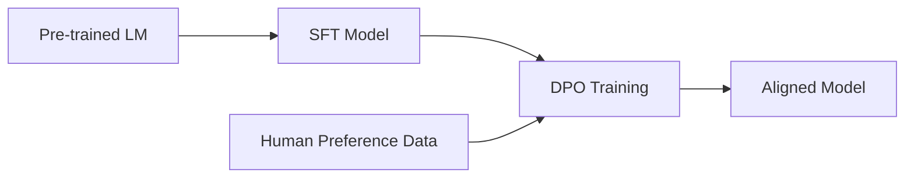
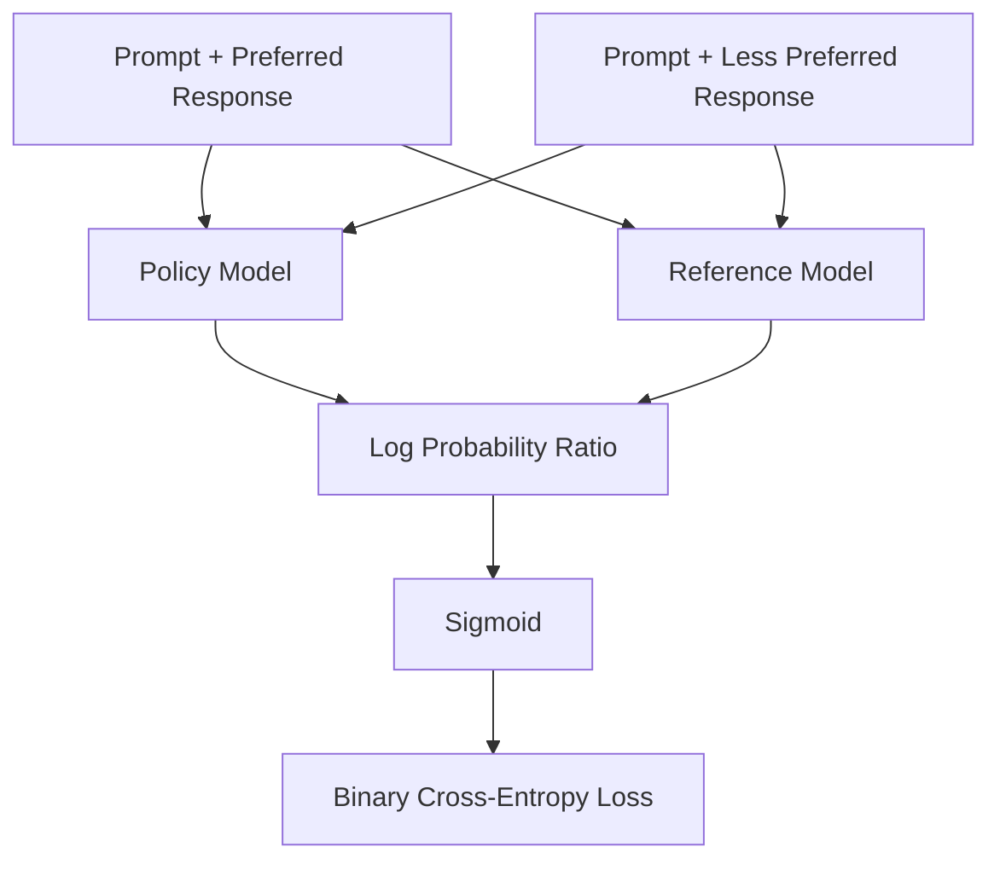
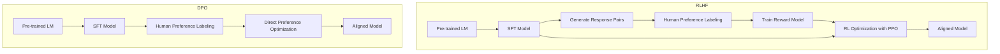

# Day 18: Direct Preference Optimization (DPO)

## Overview

Today we'll explore Direct Preference Optimization (DPO), a more efficient alternative to RLHF for aligning language models with human preferences. We'll cover the theory behind DPO, its advantages over RLHF, and how to implement it in practice.

## Learning Objectives

- Understand the motivation behind DPO and how it simplifies the RLHF pipeline
- Learn the mathematical foundations of DPO
- Compare DPO to RLHF and understand their trade-offs
- Implement a basic DPO training loop

## Table of Contents

1. [Introduction to DPO](#introduction-to-dpo)
2. [Mathematical Foundations](#mathematical-foundations)
3. [DPO vs. RLHF](#dpo-vs-rlhf)
4. [Implementation Considerations](#implementation-considerations)
5. [Advanced Techniques](#advanced-techniques)

## Introduction to DPO

### Layman's Explanation

Imagine you're teaching someone to cook by showing them pairs of dishes and saying which one tastes better. With RLHF, you'd first create a "taste critic" (reward model) who learns your preferences, then have the cook repeatedly make dishes, get feedback from the critic, and adjust their cooking. With DPO, you skip the middleman—the cook directly learns from your comparisons of dishes, figuring out what makes one dish better than another without needing a separate critic.

### Basic Concept

Direct Preference Optimization (DPO) is a technique that simplifies the RLHF pipeline by eliminating the need for a separate reward model and the complex RL optimization step. Instead, DPO directly optimizes a policy to align with human preferences using a simple classification-like objective derived from the same preference data used in RLHF.



### Why DPO Matters

- **Simplifies the alignment pipeline** by eliminating the separate reward modeling step
- **Reduces computational requirements** compared to RLHF
- **More stable training** without the complexities of RL optimization
- **Achieves comparable or better results** than RLHF in many cases
- **Easier to implement and tune** with fewer hyperparameters

## Mathematical Foundations

### The DPO Objective

DPO is derived from the RLHF framework but reformulates the problem to avoid explicitly modeling the reward function. The key insight is that the optimal policy in RLHF can be expressed in terms of the reference policy (SFT model) and the reward function:

$$\pi^*(x|y) \propto \pi_{\text{ref}}(x|y) \exp(\beta r(x, y))$$

Where:

- $\pi^*$ is the optimal policy
- $\pi_{\text{ref}}$ is the reference policy (SFT model)
- $r(x, y)$ is the reward function
- $\beta$ is a temperature parameter

DPO rearranges this to express the reward function in terms of the optimal policy and reference policy:

$$r(x, y) = \frac{1}{\beta} \log \frac{\pi^*(x|y)}{\pi_{\text{ref}}(x|y)} + Z(y)$$

Where $Z(y)$ is a normalization constant that doesn't affect the preference ordering.

Using this relationship, DPO derives a loss function that directly optimizes the policy to match human preferences:

$$\mathcal{L}_{\text{DPO}}(\pi_\theta; \pi_{\text{ref}}) = -\mathbb{E}_{(x, y_w, y_l) \sim \mathcal{D}} \left[ \log \sigma \left( \beta \log \frac{\pi_\theta(y_w|x)}{\pi_{\text{ref}}(y_w|x)} - \beta \log \frac{\pi_\theta(y_l|x)}{\pi_{\text{ref}}(y_l|x)} \right) \right]$$

Where:

- $(x, y_w, y_l)$ is a preference pair with prompt $x$, preferred response $y_w$, and less preferred response $y_l$
- $\pi_\theta$ is the policy being trained
- $\pi_{\text{ref}}$ is the reference policy (SFT model)
- $\beta$ is a hyperparameter controlling the strength of the preference

### Interpreting the DPO Loss

The DPO loss can be understood as a binary classification problem:

- We want the log probability ratio between the preferred and less preferred responses to be positive
- The sigmoid function converts this into a probability
- We maximize this probability through standard gradient descent



## DPO vs. RLHF

### Pipeline Comparison



### Key Differences

| Aspect | RLHF | DPO |
|--------|------|-----|
| **Pipeline Complexity** | 3 stages (SFT → RM → PPO) | 2 stages (SFT → DPO) |
| **Training Components** | SFT model, reward model, policy model | SFT model, policy model |
| **Computational Cost** | Higher (especially PPO) | Lower |
| **Training Stability** | Can be unstable (PPO) | More stable |
| **Hyperparameters** | Many (PPO, KL penalty, etc.) | Few (mainly β) |
| **Data Requirements** | Same preference data | Same preference data |
| **Performance** | Strong but sensitive to tuning | Comparable or better |
| **Implementation Complexity** | High | Medium |

### When to Use Each Approach

**Use RLHF when:**

- You need fine-grained control over the KL divergence from the reference model
- You have expertise in RL optimization and can handle its complexities
- You want to incorporate additional reward components beyond human preferences

**Use DPO when:**

- You want a simpler, more stable training pipeline
- You have limited computational resources
- You're working with standard preference data without complex reward shaping

## Implementation Considerations

### Data Preparation

DPO uses the same preference data format as RLHF:

```json
{
  "prompt": "Explain quantum computing.",
  "chosen": "Quantum computing uses quantum bits or qubits...",
  "rejected": "Quantum computing is about computers that are quantum..."
}
```

### Training Process

1. **Start with an SFT model** as the reference policy
2. **Create a copy** of the SFT model as the initial policy to be optimized
3. **Prepare preference data** with prompts, chosen responses, and rejected responses
4. **Compute log probabilities** for both chosen and rejected responses under both models
5. **Optimize the DPO loss** to increase the probability of chosen responses relative to rejected ones

### Hyperparameters

- **β (beta)**: Controls the strength of the preference signal (typically 0.1-0.5)
- **Learning rate**: Usually lower than for SFT (e.g., 1e-6 to 5e-6)
- **Batch size**: As large as memory allows
- **Training steps**: Often fewer than SFT (1-3 epochs)

### Common Challenges

1. **Reference Model Quality**:
   - DPO performance depends heavily on the quality of the SFT model
   - A better SFT model leads to better DPO results

2. **Preference Data Quality**:
   - Noisy or inconsistent preferences can lead to suboptimal results
   - Diverse preference data covering various scenarios is important

3. **Hyperparameter Sensitivity**:
   - β controls the trade-off between preference optimization and staying close to the reference model
   - Too high: may lead to overfitting or degeneration
   - Too low: may not learn preferences effectively

4. **Evaluation**:
   - Evaluating alignment is challenging and requires multiple metrics
   - Consider both automatic metrics and human evaluation

## Advanced Techniques

### Intermediate Level

1. **Iterative DPO**:
   - Use the output of one DPO round as the reference model for the next
   - Can lead to progressive improvement but risks drift

2. **Hybrid Approaches**:
   - Combine DPO with other techniques like SFT or RLHF
   - For example, use DPO for initial alignment, then fine-tune with RLHF

### Advanced Level

1. **IPO (Inverse Preference Optimization)**:
   - Extension of DPO that better handles the case where the reference model already has some alignment
   - Addresses potential issues with the implicit reward model in DPO

2. **KTO (KL-constrained Preference Optimization)**:
   - Adds an explicit KL constraint to DPO
   - Provides more control over how far the policy can deviate from the reference

3. **Preference Data Augmentation**:
   - Generate synthetic preference pairs to augment human preferences
   - Can help address coverage gaps in the preference data

## Conclusion

Direct Preference Optimization represents a significant advancement in language model alignment, offering a simpler and more efficient alternative to RLHF. By eliminating the need for a separate reward model and complex RL optimization, DPO makes alignment more accessible while achieving comparable or better results.

As the field continues to evolve, we're likely to see further refinements and variations of DPO, as well as hybrid approaches that combine the strengths of different alignment techniques. Understanding the foundations of DPO provides a solid basis for keeping up with these developments and implementing effective alignment strategies.

## References

1. Rafailov, R., et al. (2023). Direct Preference Optimization: Your Language Model is Secretly a Reward Model. arXiv:2305.18290.
2. Ethayarajh, K., et al. (2023). KTO: Model Alignment as Prospect Theoretic Optimization. arXiv:2310.01377.
3. Azar, M. G., et al. (2023). A General Theoretical Paradigm to Understand Learning from Human Preferences. arXiv:2310.12036.
4. Dong, N., et al. (2023). RLHF: Rank Responses to Align Language Models with Human Feedback. arXiv:2307.12950.
