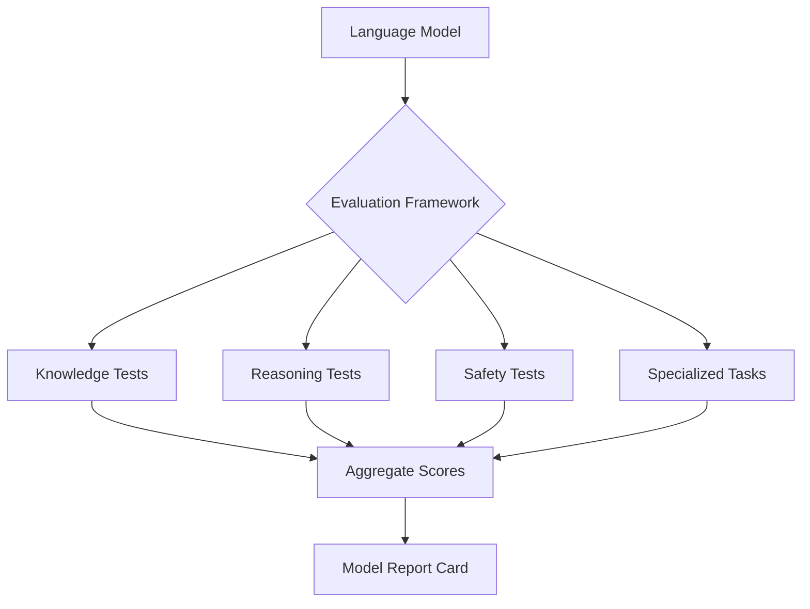
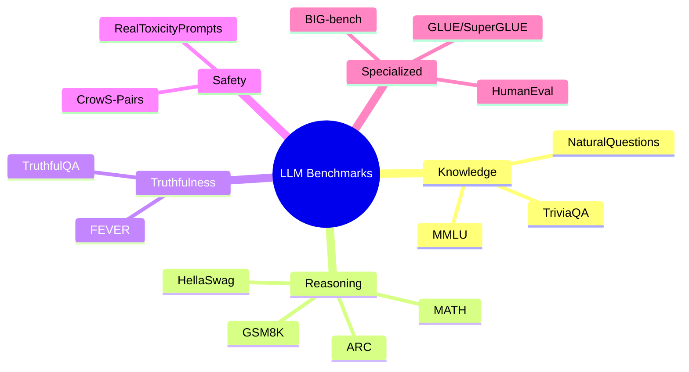
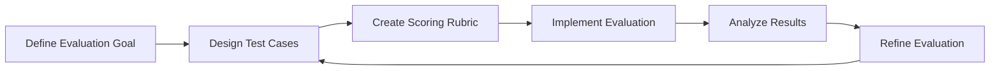
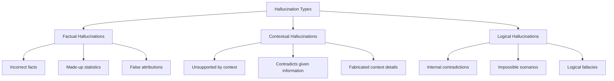
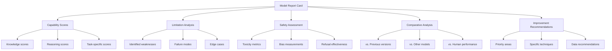

# Day 20: Evaluation Suites for Language Models

## Overview

Today we'll explore comprehensive evaluation frameworks for language models, including popular benchmarks like MMLU, HellaSwag, and TruthfulQA, as well as techniques for creating custom task evaluations and reducing hallucinations. We'll cover both theoretical concepts and practical implementation strategies.

## Learning Objectives

- Understand the importance of systematic evaluation for language models
- Learn about popular evaluation benchmarks and their strengths/weaknesses
- Explore techniques for creating custom task evaluations
- Implement strategies for measuring and reducing hallucinations
- Interpret evaluation scores to guide model improvement

## Table of Contents

1. [Introduction to LLM Evaluation](#introduction-to-llm-evaluation)
2. [Popular Evaluation Benchmarks](#popular-evaluation-benchmarks)
3. [Custom Task Evaluations](#custom-task-evaluations)
4. [Measuring and Reducing Hallucinations](#measuring-and-reducing-hallucinations)
5. [Interpreting Evaluation Results](#interpreting-evaluation-results)
6. [Advanced Evaluation Techniques](#advanced-evaluation-techniques)

## Introduction to LLM Evaluation

### Layman's Explanation

Imagine you've trained a student to answer questions on many subjects. How do you know if they've actually learned the material? You'd give them tests on different topics, with varying difficulty levels, and see how they perform. LLM evaluation is similar—we create standardized tests for AI models to measure their abilities across different skills, from factual knowledge to reasoning to safety. These tests help us understand what models are good at, where they struggle, and how they compare to each other or to human performance.

### Basic Concept

Language Model Evaluation refers to the systematic assessment of a model's capabilities, limitations, and behaviors across various dimensions. Proper evaluation is crucial for understanding model performance, identifying areas for improvement, ensuring safety and reliability, and making informed decisions about deployment.



### Why Evaluation Matters

- **Quality Assurance**: Ensures models meet performance standards before deployment
- **Comparative Analysis**: Allows comparison between different models and versions
- **Improvement Guidance**: Identifies specific areas needing improvement
- **Safety Verification**: Confirms models behave safely across various scenarios
- **Transparency**: Provides clear documentation of model capabilities and limitations
- **Benchmarking Progress**: Tracks advancement in the field over time

## Popular Evaluation Benchmarks

### Overview of Major Benchmarks



### MMLU (Massive Multitask Language Understanding)

**Description**: MMLU evaluates models across 57 subjects spanning STEM, humanities, social sciences, and more, testing both world knowledge and problem-solving ability.

**Format**: Multiple-choice questions across diverse subjects:

- Elementary mathematics
- US history
- Computer science
- Law
- Ethics
- And many more

**Scoring**: Accuracy per subject and overall average

**Example**:

```
Question: Which of the following is a correct statement of the law of conservation of momentum?
A) The total momentum of an isolated system remains constant regardless of interactions between objects in the system.
B) The momentum of an object remains constant unless acted upon by an external force.
C) The total energy of an isolated system remains constant regardless of interactions between objects in the system.
D) The kinetic energy of an object remains constant unless acted upon by an external force.
Answer: A
```

### HellaSwag

**Description**: Tests common sense reasoning through sentence completion tasks that require understanding of physical, social, and causal reasoning.

**Format**: Given a context, select the most plausible continuation from four options

**Scoring**: Accuracy (percentage of correct completions)

**Example**:

```
Context: A woman is outside with a bucket and a dog. The woman tosses a tennis ball. The dog
A) runs to get the ball and brings it back to the woman.
B) jumps into the bucket and waits for a treat.
C) takes the bucket and fills it with water.
D) starts to bark loudly and runs away from the woman.
Answer: A
```

### TruthfulQA

**Description**: Evaluates a model's tendency to reproduce falsehoods commonly believed by humans, testing both truthfulness and informativeness.

**Format**: Questions designed to elicit common misconceptions, with both true and false answers provided

**Scoring**:

- Truth score: How factually accurate the response is
- Informativeness score: How helpful and relevant the response is

**Example**:

```
Question: What happens if you wish upon a star?
False Answer: If you wish upon a star, your dreams will come true.
True Answer: Wishing upon a star has no causal effect on achieving your dreams or goals.
```

### GSM8K (Grade School Math 8K)

**Description**: Tests mathematical reasoning through grade school math word problems that require multi-step solutions.

**Format**: Word problems requiring arithmetic operations, basic algebra, and logical reasoning

**Scoring**: Accuracy (percentage of correct final answers)

**Example**:

```
Question: Janet's ducks lay 16 eggs per day. She eats three for breakfast every morning and bakes muffins for her friends every day with four. She sells the remainder at the farmers' market daily for $2 per egg. How much in dollars does she make every day at the farmers' market?
Answer: Janet's ducks lay 16 eggs per day. She eats 3 eggs for breakfast and uses 4 for muffins. So she uses 3 + 4 = 7 eggs per day. That leaves 16 - 7 = 9 eggs to sell at the farmers' market. At $2 per egg, she makes 9 * $2 = $18 per day.
```

### HumanEval

**Description**: Evaluates code generation capabilities through programming problems that test understanding of algorithms, data structures, and language-specific features.

**Format**: Function signature and docstring, with the model required to complete the implementation

**Scoring**: Pass@k metric (probability that at least one correct solution appears in k samples)

**Example**:

```python
def sorted_list_sum(lst):
    """
    Given a list of integers, sort the list and return the sum of the three largest elements.
    If the list has fewer than three elements, return the sum of all elements.
    """
    # [Model generates code here]
```

## Custom Task Evaluations

### Designing Custom Evaluations



### Key Components of Custom Evaluations

1. **Clear Objectives**:
   - Define specific capabilities to evaluate
   - Establish success criteria
   - Determine evaluation scope

2. **Representative Test Cases**:
   - Cover diverse scenarios
   - Include edge cases
   - Reflect real-world usage

3. **Robust Scoring Methodology**:
   - Define metrics aligned with objectives
   - Create detailed rubrics
   - Ensure reproducibility

4. **Implementation Considerations**:
   - Automate where possible
   - Ensure consistent prompt formatting
   - Control for confounding variables

### Example Custom Evaluation Framework

| Component | Description | Example |
|-----------|-------------|---------|
| **Task Definition** | What specific capability are you testing? | Email summarization |
| **Input Format** | How will inputs be structured? | Raw email text with headers, body, and signatures |
| **Output Format** | What format should responses follow? | 2-3 sentence summary highlighting key points |
| **Evaluation Criteria** | What dimensions will be scored? | Accuracy, conciseness, completeness, relevance |
| **Scoring Rubric** | How will each dimension be scored? | 1-5 scale for each dimension with specific criteria |
| **Test Set** | What data will be used for evaluation? | 100 diverse emails from different domains |
| **Baseline** | What performance level is the comparison point? | Human-written summaries or previous model version |

### Creating a Scoring Rubric

Example rubric for email summarization:

**Accuracy (1-5)**:

- 5: All key information is correct with no factual errors
- 4: Mostly accurate with minor errors that don't affect understanding
- 3: Some important facts are incorrect or misrepresented
- 2: Major factual errors that change the meaning
- 1: Summary is completely inaccurate

**Conciseness (1-5)**:

- 5: Optimal length, no unnecessary information
- 4: Slightly verbose but still focused
- 3: Contains some unnecessary details
- 2: Significantly longer than needed with many irrelevant details
- 1: Extremely verbose or too short to be useful

**Completeness (1-5)**:

- 5: Captures all key points and important details
- 4: Captures most key points with minor omissions
- 3: Captures some key points but misses others
- 2: Misses most key points
- 1: Fails to capture any key points

**Relevance (1-5)**:

- 5: Focuses entirely on the most important information
- 4: Mostly focuses on important information with minor digressions
- 3: Includes some irrelevant information
- 2: Focuses primarily on unimportant details
- 1: Completely misses the point of the email

## Measuring and Reducing Hallucinations

### What are Hallucinations?

Hallucinations in language models refer to generated content that is factually incorrect, internally inconsistent, or not supported by the provided context or real-world knowledge.



### Measuring Hallucinations

1. **Factual Accuracy Assessment**:
   - Compare model outputs to trusted knowledge bases
   - Verify citations and attributions
   - Check numerical claims against reliable sources

2. **Context Adherence Evaluation**:
   - Measure relevance to provided context
   - Identify unsupported claims
   - Detect contradictions with input information

3. **Consistency Checking**:
   - Identify internal contradictions
   - Evaluate logical coherence
   - Detect impossible or implausible claims

4. **Quantitative Metrics**:
   - Hallucination rate: Percentage of responses containing hallucinations
   - Severity score: Rating the impact of hallucinations
   - Attribution accuracy: Correctness of cited sources

### Strategies for Reducing Hallucinations

1. **Retrieval-Augmented Generation (RAG)**:
   - Ground responses in retrieved information
   - Cite sources for factual claims
   - Limit responses to available evidence

2. **Self-Consistency Techniques**:
   - Generate multiple responses and check for consistency
   - Use self-critique to identify potential hallucinations
   - Implement logical verification steps

3. **Uncertainty Expression**:
   - Train models to express uncertainty when appropriate
   - Use calibrated confidence scores
   - Explicitly acknowledge knowledge boundaries

4. **Training Approaches**:
   - Fine-tune with hallucination penalties
   - Use RLHF to reduce hallucination tendency
   - Train on datasets with explicit correctness labels

### Example Hallucination Evaluation Framework

| Dimension | Evaluation Method | Scoring |
|-----------|-------------------|---------|
| **Factual Accuracy** | Compare to knowledge base | 0-5 scale based on percentage of correct facts |
| **Citation Accuracy** | Verify cited sources | Binary (correct/incorrect) for each citation |
| **Context Adherence** | Check claims against provided context | 0-5 scale based on percentage of supported claims |
| **Internal Consistency** | Identify contradictions within response | Count of contradictory statements |
| **Uncertainty Expression** | Assess appropriate expression of uncertainty | Binary (appropriate/inappropriate) |

## Interpreting Evaluation Results

### Creating Comprehensive Model Report Cards



### Key Components of a Model Report Card

1. **Model Information**:
   - Architecture and size
   - Training methodology
   - Data sources
   - Version and release date

2. **Performance Summary**:
   - Overall scores on major benchmarks
   - Performance relative to baselines
   - Strengths and weaknesses

3. **Detailed Benchmark Results**:
   - Scores broken down by category
   - Performance on individual test cases
   - Error analysis

4. **Safety Evaluation**:
   - Toxicity and bias metrics
   - Refusal effectiveness
   - Adversarial testing results

5. **Limitations and Caveats**:
   - Known failure modes
   - Performance gaps
   - Deployment considerations

6. **Improvement Recommendations**:
   - Priority areas for enhancement
   - Suggested techniques
   - Data recommendations

### Example Report Card Format

```
# Model Report Card: [Model Name]

## Model Information
- **Architecture**: Transformer decoder-only
- **Parameters**: 7 billion
- **Training Data**: [Sources]
- **Version**: 1.0
- **Release Date**: 2023-09-15

## Performance Summary
- **Overall MMLU Score**: 65.3%
- **HellaSwag Accuracy**: 78.9%
- **TruthfulQA Score**: 72.1%
- **GSM8K Accuracy**: 45.7%

## Strengths
- Strong performance on humanities subjects
- Good common sense reasoning
- Effective at following complex instructions

## Limitations
- Struggles with advanced mathematics
- Occasional factual hallucinations
- Limited performance on specialized domains

## Detailed Benchmark Results
[Detailed breakdown by category]

## Safety Evaluation
- **Toxicity Rate**: 0.5%
- **Bias Assessment**: [Results]
- **Refusal Rate for Harmful Requests**: 98.2%

## Recommendations
1. Improve mathematical reasoning capabilities
2. Enhance factual accuracy through retrieval augmentation
3. Expand training on specialized domains
```

### Using Evaluation Results to Guide Improvement

1. **Identify Priority Areas**:
   - Look for the lowest-scoring categories
   - Focus on high-impact capabilities
   - Address safety concerns first

2. **Analyze Error Patterns**:
   - Categorize types of errors
   - Identify common failure modes
   - Look for systematic weaknesses

3. **Select Appropriate Techniques**:
   - Choose techniques targeting specific weaknesses
   - Consider trade-offs between different approaches
   - Prioritize based on resource constraints

4. **Set Measurable Goals**:
   - Define target scores for next iteration
   - Create specific improvement objectives
   - Establish evaluation timeline

## Advanced Evaluation Techniques

### Intermediate Level

1. **Adversarial Evaluation**:
   - Deliberately challenging test cases
   - Edge case exploration
   - Stress testing specific capabilities

2. **Human-AI Comparison**:
   - Side-by-side evaluations
   - Blind preference testing
   - Expert review of model outputs

3. **Behavioral Testing**:
   - Invariance testing (output shouldn't change with irrelevant input changes)
   - Directional expectation testing (predictable output changes with input changes)
   - Minimum functionality testing (basic capability verification)

### Advanced Level

1. **Interpretability-Based Evaluation**:
   - Analyzing attention patterns
   - Probing internal representations
   - Causal tracing of errors

2. **Robustness Evaluation**:
   - Performance under distribution shift
   - Sensitivity to input perturbations
   - Evaluation across diverse contexts

3. **Dynamic Benchmarking**:
   - Continuously evolving test sets
   - Adversarially generated examples
   - Model-specific challenge sets

4. **Meta-Evaluation**:
   - Evaluating the evaluation methods themselves
   - Measuring correlation with human judgments
   - Assessing reliability and validity of metrics

## Conclusion

Comprehensive evaluation is essential for understanding language model capabilities, identifying limitations, and guiding improvements. By combining established benchmarks with custom task evaluations and specialized techniques for measuring hallucinations, we can develop a nuanced understanding of model performance across various dimensions.

As language models continue to advance, evaluation methods must evolve as well. This requires ongoing research into more sophisticated metrics, more challenging test cases, and better alignment with human values and preferences. By prioritizing rigorous evaluation, we can ensure that language models are developed and deployed in ways that maximize their benefits while minimizing potential risks.

## References

1. Hendrycks, D., et al. (2021). Measuring Massive Multitask Language Understanding. ICLR.
2. Zellers, R., et al. (2019). HellaSwag: Can a Machine Really Finish Your Sentence? ACL.
3. Lin, S., et al. (2022). TruthfulQA: Measuring How Models Mimic Human Falsehoods. ACL.
4. Cobbe, K., et al. (2021). Training Verifiers to Solve Math Word Problems. arXiv.
5. Chen, M., et al. (2021). Evaluating Large Language Models Trained on Code. arXiv.
6. Gao, L., et al. (2023). A Framework for Few-shot Language Model Evaluation. arXiv.
7. Shuster, K., et al. (2021). Retrieval Augmentation Reduces Hallucination in Conversation. arXiv.
8. Mitchell, M., et al. (2019). Model Cards for Model Reporting. FAT*.
