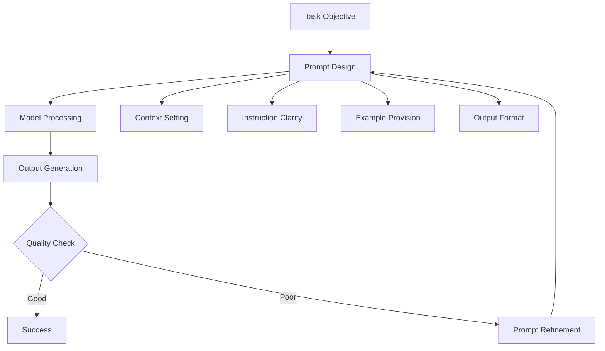
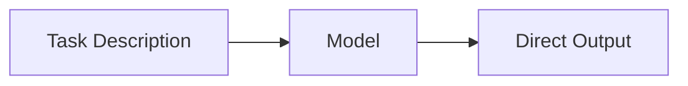
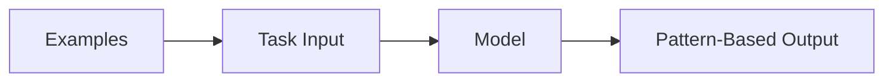
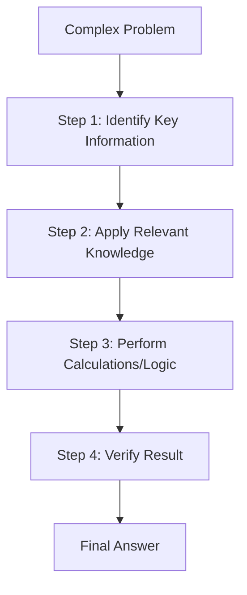
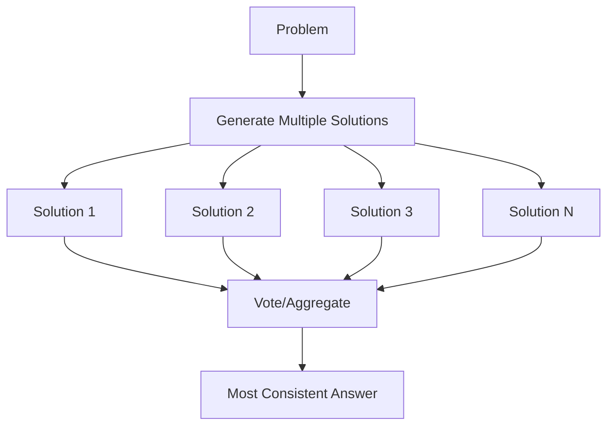
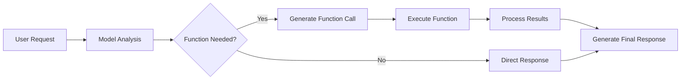
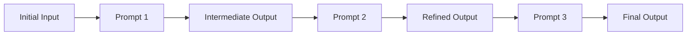

# Day 21: Prompt Engineering Patterns and Function Calling

## Overview

Today we'll explore advanced prompt engineering techniques that can significantly improve language model performance. We'll cover zero-shot and few-shot prompting, chain-of-thought reasoning, self-consistency methods, and function calling with JSON schemas.

## Learning Objectives

- Master different prompting patterns and when to use them
- Implement chain-of-thought (CoT) reasoning for complex problems
- Use self-consistency to improve answer reliability
- Build robust function calling systems with JSON schemas
- Understand prompt optimization strategies

## Table of Contents

1. [Introduction to Prompt Engineering](#introduction-to-prompt-engineering)
2. [Zero-Shot and Few-Shot Prompting](#zero-shot-and-few-shot-prompting)
3. [Chain-of-Thought Reasoning](#chain-of-thought-reasoning)
4. [Self-Consistency Methods](#self-consistency-methods)
5. [Function Calling and Tool Use](#function-calling-and-tool-use)
6. [Advanced Prompting Strategies](#advanced-prompting-strategies)

## Introduction to Prompt Engineering

### Layman's Explanation

Imagine you're asking a very knowledgeable friend for help, but they can only understand you through written notes. How you write those notes—the words you choose, the examples you give, the way you structure your request—dramatically affects the quality of help you get. Prompt engineering is the art and science of crafting these "notes" (prompts) to get the best possible responses from AI models. Just like how asking "Can you help me with math?" gets a different response than "Can you solve this calculus problem step-by-step: [specific problem]?", the way we structure prompts makes all the difference.

### Basic Concept

Prompt engineering is the practice of designing and optimizing input prompts to elicit desired behaviors and outputs from language models. It involves understanding how models interpret instructions, providing appropriate context, and structuring requests to maximize performance on specific tasks.



### Why Prompt Engineering Matters

- **Performance Optimization**: Well-crafted prompts can dramatically improve model accuracy and relevance
- **Cost Efficiency**: Better prompts reduce the need for multiple attempts or fine-tuning
- **Consistency**: Structured prompts lead to more predictable and reliable outputs
- **Task Adaptation**: Allows models to perform specialized tasks without retraining
- **Error Reduction**: Clear instructions minimize misunderstandings and hallucinations

## Zero-Shot and Few-Shot Prompting

### Zero-Shot Prompting

Zero-shot prompting involves asking the model to perform a task without providing any examples. The model relies entirely on its pre-training knowledge and the instructions in the prompt.



**Structure:**

```
[Task Description]
[Clear Instructions]
[Input Data]
[Output Format Specification]
```

**Example:**

```
Classify the sentiment of the following text as positive, negative, or neutral.

Text: "I love this new restaurant! The food was amazing and the service was excellent."

Sentiment:
```

### Few-Shot Prompting

Few-shot prompting provides the model with a few examples of the desired input-output pattern before presenting the actual task.



**Structure:**

```
[Task Description]
[Example 1: Input → Output]
[Example 2: Input → Output]
[Example 3: Input → Output]
[Actual Input]
[Output Placeholder]
```

**Example:**

```
Classify the sentiment of the following texts:

Text: "This movie was terrible. I hated every minute of it."
Sentiment: negative

Text: "The weather is okay today, nothing special."
Sentiment: neutral

Text: "I'm so excited about my vacation next week!"
Sentiment: positive

Text: "The new software update has some interesting features."
Sentiment:
```

### When to Use Each Approach

| Scenario | Zero-Shot | Few-Shot |
|----------|-----------|----------|
| **Simple, well-defined tasks** | ✅ Preferred | ⚠️ May be overkill |
| **Complex or ambiguous tasks** | ⚠️ May struggle | ✅ Recommended |
| **Domain-specific tasks** | ❌ Often insufficient | ✅ Essential |
| **Novel task formats** | ❌ Poor performance | ✅ Shows pattern |
| **Limited context window** | ✅ More efficient | ⚠️ Uses more tokens |
| **Consistent formatting needed** | ⚠️ Variable results | ✅ Better consistency |

## Chain-of-Thought Reasoning

### Basic Chain-of-Thought (CoT)

Chain-of-thought prompting encourages the model to break down complex problems into step-by-step reasoning processes, similar to showing your work in mathematics.



**Structure:**

```
[Problem Statement]
Let's think step by step:
[Step-by-step reasoning]
[Final answer]
```

**Example:**

```
Problem: A store has 24 apples. They sell 1/3 of them in the morning and 1/4 of the remaining apples in the afternoon. How many apples are left?

Let's think step by step:
1. First, I need to find how many apples were sold in the morning
2. Then calculate how many remained after the morning sales
3. Next, find how many were sold in the afternoon
4. Finally, calculate how many are left

Step 1: Morning sales = 1/3 × 24 = 8 apples
Step 2: Remaining after morning = 24 - 8 = 16 apples
Step 3: Afternoon sales = 1/4 × 16 = 4 apples
Step 4: Final remaining = 16 - 4 = 12 apples

Therefore, 12 apples are left.
```

### Zero-Shot Chain-of-Thought

Simply adding "Let's think step by step" to prompts can trigger chain-of-thought reasoning without providing examples.

**Example:**

```
Question: If a train travels 60 miles per hour for 2.5 hours, how far does it travel?

Let's think step by step:
```

### Few-Shot Chain-of-Thought

Providing examples of step-by-step reasoning helps the model understand the expected reasoning pattern.

**Example:**

```
Question: A recipe calls for 2 cups of flour to make 12 cookies. How much flour is needed for 18 cookies?
Answer: Let's think step by step:
1. First, I'll find the flour per cookie: 2 cups ÷ 12 cookies = 1/6 cup per cookie
2. Then multiply by 18 cookies: 1/6 × 18 = 3 cups
Therefore, 3 cups of flour are needed.

Question: A car uses 1 gallon of gas to travel 25 miles. How many gallons are needed for a 150-mile trip?
Answer: Let's think step by step:
```

## Self-Consistency Methods

### Basic Self-Consistency

Self-consistency involves generating multiple reasoning paths for the same problem and selecting the most frequent answer. This helps reduce errors from individual reasoning mistakes.



**Process:**

1. Generate multiple independent reasoning chains
2. Extract the final answer from each chain
3. Select the answer that appears most frequently
4. Optionally, provide confidence based on agreement level

**Example Implementation:**

```
Problem: [Same problem presented multiple times with different reasoning approaches]

Attempt 1: [Reasoning path 1] → Answer: X
Attempt 2: [Reasoning path 2] → Answer: X  
Attempt 3: [Reasoning path 3] → Answer: Y
Attempt 4: [Reasoning path 4] → Answer: X
Attempt 5: [Reasoning path 5] → Answer: X

Final Answer: X (appears in 4/5 attempts, confidence: 80%)
```

### Temperature-Based Self-Consistency

Using different temperature settings to generate diverse reasoning paths:

- **Low temperature (0.1-0.3)**: More deterministic, focused reasoning
- **Medium temperature (0.5-0.7)**: Balanced exploration and exploitation
- **High temperature (0.8-1.0)**: More creative, diverse approaches

## Function Calling and Tool Use

### Introduction to Function Calling

Function calling allows language models to interact with external tools, APIs, and systems by generating structured function calls based on user requests.



### JSON Schema for Function Definitions

Functions are defined using JSON schemas that specify:

- Function name and description
- Parameter names, types, and descriptions
- Required vs. optional parameters
- Return value format

**Example Function Schema:**

```json
{
  "name": "calculate_tip",
  "description": "Calculate tip amount and total bill including tip",
  "parameters": {
    "type": "object",
    "properties": {
      "bill_amount": {
        "type": "number",
        "description": "The original bill amount in dollars"
      },
      "tip_percentage": {
        "type": "number",
        "description": "The tip percentage (e.g., 15 for 15%)",
        "default": 15
      },
      "split_ways": {
        "type": "integer",
        "description": "Number of people to split the bill among",
        "default": 1
      }
    },
    "required": ["bill_amount"]
  }
}
```

### Function Calling Patterns

1. **Single Function Call**:

   ```
   User: "What's the weather like in New York?"
   Model: get_weather(location="New York, NY")
   ```

2. **Multiple Function Calls**:

   ```
   User: "Compare the weather in New York and Los Angeles"
   Model: 
   - get_weather(location="New York, NY")
   - get_weather(location="Los Angeles, CA")
   ```

3. **Sequential Function Calls**:

   ```
   User: "Find a restaurant in Paris and make a reservation"
   Model:
   1. search_restaurants(location="Paris", cuisine="any")
   2. make_reservation(restaurant_id="123", date="2024-01-15", time="19:00", party_size=2)
   ```

### Best Practices for Function Calling

1. **Clear Function Descriptions**: Make function purposes obvious
2. **Comprehensive Parameter Documentation**: Include types, constraints, and examples
3. **Error Handling**: Define what happens when functions fail
4. **Security Considerations**: Validate all parameters and limit function scope
5. **Fallback Strategies**: Provide alternatives when functions aren't available

## Advanced Prompting Strategies

### Prompt Chaining

Breaking complex tasks into a series of simpler prompts, where the output of one becomes the input of the next.



**Example:**

```
Chain 1: "Summarize this article in 3 sentences"
Chain 2: "Identify the main argument from this summary: [summary]"
Chain 3: "List evidence supporting this argument: [main argument]"
```

### Role-Based Prompting

Assigning specific roles or personas to the model to leverage domain expertise.

**Examples:**

```
"You are an expert data scientist. Analyze this dataset and recommend the best machine learning approach..."

"Act as a professional editor. Review this text for clarity, grammar, and style..."

"You are a financial advisor. Given this client's situation, what investment strategy would you recommend..."
```

### Constraint-Based Prompting

Adding specific constraints to guide model behavior and output format.

**Types of Constraints:**

- **Length**: "Respond in exactly 50 words"
- **Format**: "Provide your answer as a numbered list"
- **Style**: "Write in a formal academic tone"
- **Content**: "Only use information from the provided context"
- **Structure**: "Follow the STAR method (Situation, Task, Action, Result)"

### Prompt Optimization Techniques

1. **A/B Testing**: Compare different prompt versions
2. **Iterative Refinement**: Gradually improve prompts based on outputs
3. **Template Creation**: Develop reusable prompt templates
4. **Context Management**: Optimize context window usage
5. **Error Analysis**: Identify and fix common failure modes

### Common Pitfalls and Solutions

| Pitfall | Problem | Solution |
|---------|---------|----------|
| **Ambiguous Instructions** | Model interprets task differently | Use specific, clear language |
| **Insufficient Context** | Model lacks necessary information | Provide relevant background |
| **Over-Prompting** | Too many instructions confuse model | Keep prompts focused and concise |
| **Inconsistent Formatting** | Outputs vary in structure | Use templates and examples |
| **Leading Questions** | Prompts bias the response | Use neutral, open-ended phrasing |

## Conclusion

Effective prompt engineering is both an art and a science that requires understanding model capabilities, task requirements, and user needs. By mastering these patterns and techniques, you can significantly improve the performance and reliability of language model applications.

Key takeaways:

- Choose the right prompting strategy based on task complexity and available examples
- Use chain-of-thought reasoning for complex problems requiring step-by-step analysis
- Implement self-consistency to improve answer reliability
- Design clear, comprehensive function schemas for tool integration
- Iterate and optimize prompts based on performance feedback

## References

1. Wei, J., et al. (2022). Chain-of-Thought Prompting Elicits Reasoning in Large Language Models. NeurIPS.
2. Wang, X., et al. (2022). Self-Consistency Improves Chain of Thought Reasoning in Language Models. ICLR.
3. Brown, T., et al. (2020). Language Models are Few-Shot Learners. NeurIPS.
4. Kojima, T., et al. (2022). Large Language Models are Zero-Shot Reasoners. NeurIPS.
5. OpenAI. (2023). Function Calling and Tools Documentation.
6. Liu, P., et al. (2023). Pre-train, Prompt, and Predict: A Systematic Survey of Prompting Methods. ACM Computing Surveys.
