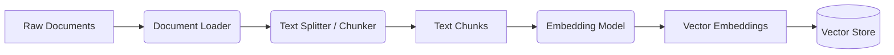
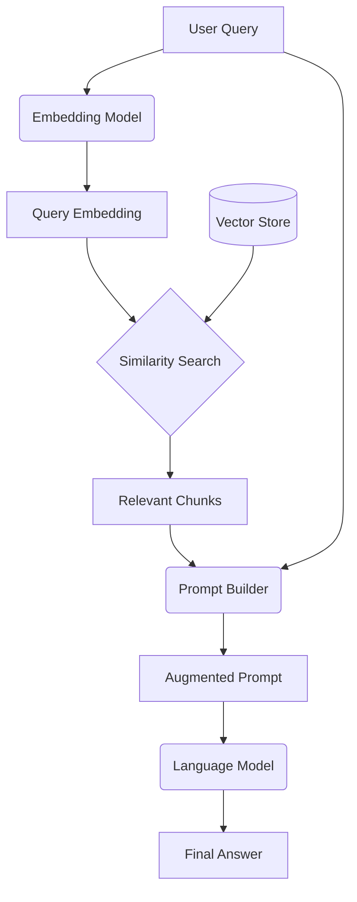
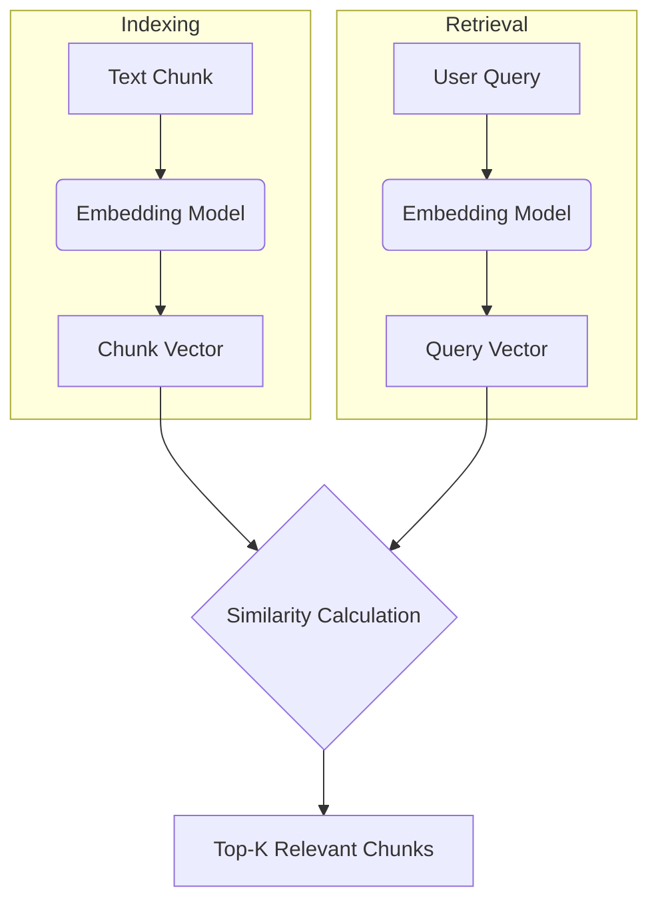

# Day 22: RAG Architecture, Chunking, and Embeddings

## Overview

Today, we'll dive into the architecture of Retrieval-Augmented Generation (RAG), a powerful technique for grounding language models in external knowledge. We'll cover the core components of a RAG system, including document chunking, text embeddings, and vector stores.

## Learning Objectives

- Understand the end-to-end RAG architecture
- Learn different strategies for chunking documents
- Explore popular text embedding models (SBERT, OpenAI, Cohere, E5)
- Understand the role of vector stores in RAG
- Build a basic RAG pipeline with a local vector DB

## Table of Contents

1. [Introduction to Retrieval-Augmented Generation (RAG)](#introduction-to-retrieval-augmented-generation-rag)
2. [The RAG Architecture](#the-rag-architecture)
3. [Document Chunking Strategies](#document-chunking-strategies)
4. [Text Embeddings](#text-embeddings)
5. [Vector Stores](#vector-stores)
6. [Building a Basic RAG Pipeline](#building-a-basic-rag-pipeline)

## Introduction to Retrieval-Augmented Generation (RAG)

### Layman's Explanation

Imagine you ask a very smart person a question about a specific, private document they've never seen. Instead of guessing, they first find the most relevant pages in that document, read them carefully, and then use that information to give you a precise answer. That's exactly what RAG does for a language model. It's like giving the model an "open book" for its exam, ensuring its answers are based on facts from the provided material, not just its general knowledge.

### Basic Concept

Retrieval-Augmented Generation (RAG) is a technique that enhances the capabilities of large language models by grounding them in external, up-to-date, or private knowledge bases. Instead of relying solely on its internal, static training data, the model first retrieves relevant information from a specified data source and then uses that information to generate a more accurate and context-aware response.

### Why RAG Matters

- **Reduces Hallucinations**: By grounding responses in factual data, RAG minimizes the model's tendency to make up information.
- **Access to Current Information**: Allows models to answer questions about events and data that occurred after their training cutoff.
- **Domain-Specific Knowledge**: Enables models to become experts on private or specialized documents without expensive fine-tuning.
- **Transparency and Trust**: Responses can be traced back to the source documents, providing verifiability and building user trust.
- **Cost-Effective**: Cheaper and faster than fine-tuning a model for every new piece of information.

## The RAG Architecture

A typical RAG pipeline consists of two main stages: **Indexing** and **Retrieval & Generation**.

### 1. Indexing Stage (Offline)

This is the preparatory stage where the knowledge base is processed and stored for efficient retrieval.

- **Document Loader**: Ingests documents from various sources (PDFs, websites, databases).
- **Text Splitter / Chunker**: Breaks down large documents into smaller, manageable chunks.
- **Embedding Model**: Converts each text chunk into a numerical vector (embedding) that captures its semantic meaning.
- **Vector Store**: An index (database) that stores the chunks and their corresponding embeddings, optimized for fast similarity search.

### 2. Retrieval & Generation Stage (Online)

This is the real-time stage where a user query is processed to generate an answer.

- **Embedding Model**: The user's query is converted into an embedding using the same model from the indexing stage.
- **Similarity Search**: The query embedding is used to search the vector store for the most similar (i.e., most relevant) text chunk embeddings.
- **Prompt Builder**: The retrieved text chunks are combined with the original user query to create an "augmented prompt."
- **Language Model**: The LLM receives the augmented prompt and generates an answer based on both the user's question and the provided context.

## Document Chunking Strategies

Chunking is a critical step. The size and quality of chunks directly impact retrieval accuracy and the context provided to the LLM.

### Fixed-Size Chunking

The simplest method. Text is split into chunks of a fixed number of characters or tokens.

- **Pros**: Easy to implement.
- **Cons**: Can split sentences or ideas in the middle, losing semantic context.
- **Overlap**: A common technique is to overlap chunks (e.g., by 10-20%) to ensure semantic context isn't lost at the boundaries.

```mermaid
gantt
    title Fixed-Size Chunking with Overlap
    dateFormat X
    axisFormat %s

    section Document
    Chunk 1: 0, 100
    Chunk 2: 80, 180
    Chunk 3: 160, 260
```

### Content-Aware Chunking

This method splits text based on its semantic structure.

- **Recursive Character Splitting**: Splits text recursively using a list of separators (e.g., `\n\n`, `\n`, `.`, ` `). It tries to keep paragraphs, then sentences, then words together.
- **Language-Specific Splitting**: Uses libraries aware of sentence boundaries for specific languages (e.g., NLTK, spaCy).
- **Document-Specific Splitting**: Splits based on document structure, like Markdown headers, HTML tags, or code sections.

### Chunking Best Practices

- **Chunk Size**: Depends on the embedding model's context window and the complexity of the data. A common range is 256-1024 tokens.
- **Overlap**: A small overlap (e.g., 50-100 tokens) is generally beneficial.
- **Metadata**: Store metadata (e.g., source document, page number) with each chunk to enable citations.
- **Experimentation**: The optimal strategy depends on the specific documents and use case. It's crucial to experiment and evaluate.

## Text Embeddings

Text embeddings are vector representations of text where semantically similar text fragments are close to each other in the vector space.

### Popular Embedding Models

| Model | Developer | Key Features | Typical Use Case |
|---|---|---|---|
| **SBERT (Sentence-BERT)** | UKPLab | Lightweight, fast, and performs well on sentence similarity tasks. Runs locally. | General-purpose, local RAG systems. |
| **OpenAI `text-embedding-ada-002`** | OpenAI | High-performance, large context window (8191 tokens), industry standard. API-based. | High-accuracy RAG systems where API cost is acceptable. |
| **Cohere `embed-english-v3.0`** | Cohere | State-of-the-art performance, offers different types for retrieval vs. classification. API-based. | Enterprise-grade search and retrieval applications. |
| **E5 (Embeddings from Bidirectional Encoder Representations)** | Microsoft | Strong performance on the MTEB benchmark, often outperforming larger models. Runs locally. | High-performance local RAG where quality is critical. |

### How Embeddings Work in RAG

1. During **indexing**, each text chunk is passed through the embedding model to get a vector.
2. During **retrieval**, the user query is passed through the *same* embedding model.
3. The system then calculates the **cosine similarity** (or another distance metric) between the query vector and all chunk vectors to find the most relevant ones.

## Vector Stores

A vector store (or vector database) is a specialized database designed to store and efficiently search high-dimensional vectors like text embeddings.

### Key Features of a Vector Store

- **Efficient Similarity Search**: Uses algorithms like HNSW (Hierarchical Navigable Small World) or IVF (Inverted File) to perform approximate nearest neighbor (ANN) search much faster than exact search.
- **Scalability**: Can handle billions of vectors.
- **Metadata Storage**: Allows storing text chunks and other metadata alongside the vectors.
- **Filtering**: Supports filtering results based on metadata (e.g., `source = 'document_A.pdf'`).

### Popular Vector Stores

| Vector Store | Type | Key Features |
|---|---|---|
| **FAISS** | Library | Developed by Facebook AI. Highly efficient, runs in-memory. Good for local or small-scale projects. |
| **ChromaDB** | Database | Open-source, designed to be simple to use. Can run in-memory or as a client-server DB. |
| **Pinecone** | Managed Service | Fully managed, cloud-native vector database. High scalability and performance. |
| **Weaviate** | Database | Open-source, supports hybrid search (keyword + vector) and complex data models. |
| **Postgres (with `pgvector`)** | Extension | Adds vector similarity search capabilities to a standard PostgreSQL database. |

## Building a Basic RAG Pipeline

In the accompanying notebook, we will implement a simple RAG pipeline from scratch, covering:

1. Loading and chunking a document.
2. Generating embeddings using a sentence-transformer model.
3. Setting up an in-memory vector store with FAISS.
4. Performing a retrieval and generation step to answer a question.

This hands-on exercise will solidify the concepts covered today and prepare you for building more advanced RAG systems.

## Conclusion

Retrieval-Augmented Generation is a cornerstone of modern LLM applications. By understanding its architecture—from chunking and embeddings to vector stores and retrieval—you can build systems that are more factual, trustworthy, and capable. Today, we've laid the theoretical groundwork, and in the notebook, we'll put it into practice.

## References

1. Lewis, P., et al. (2020). Retrieval-Augmented Generation for Knowledge-Intensive NLP Tasks. NeurIPS.
2. LlamaIndex Documentation. [https://www.llamaindex.ai/](https://www.llamaindex.ai/)
3. LangChain Documentation. [https://www.langchain.com/](https://www.langchain.com/)
4. Pinecone Learning Center. [https://www.pinecone.io/learn/](https://www.pinecone.io/learn/)
