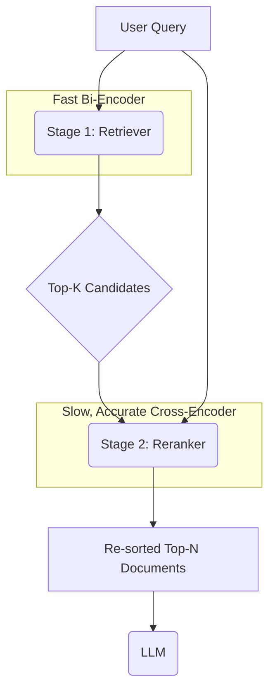
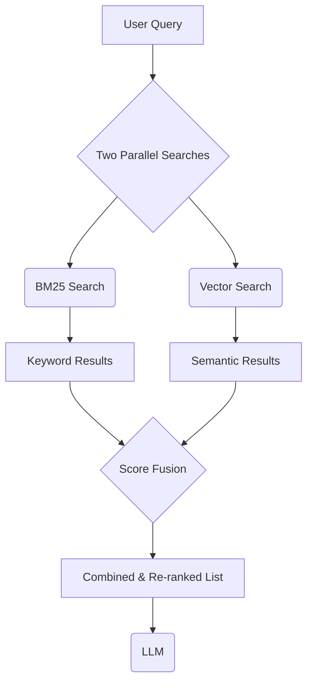
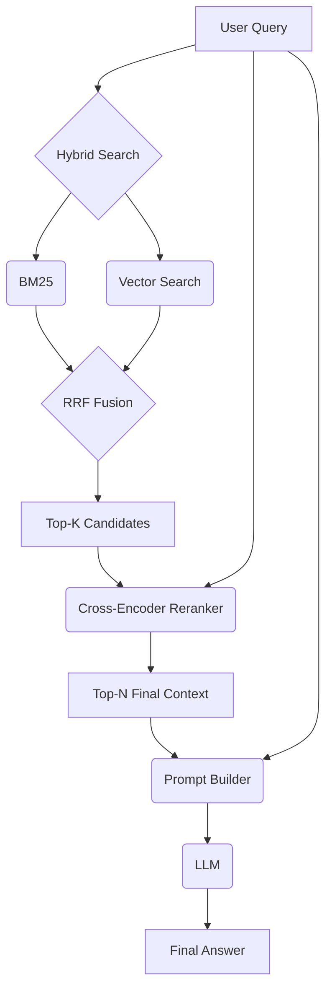

# Day 23: Improving Retrieval Quality with Reranking and Hybrid Search

## Overview

Today, we'll focus on a critical aspect of Retrieval-Augmented Generation (RAG): the quality of the retrieval itself. We'll learn how to measure retrieval performance using standard metrics and explore advanced techniques like reranking and hybrid search to improve the relevance of the documents provided to the language model.

## Learning Objectives

- Understand how to evaluate retrieval quality using metrics like Recall@k and Mean Reciprocal Rank (MRR).
- Learn what rerankers are and how they improve retrieval precision.
- Implement a two-stage retrieval pipeline with a Cross-Encoder reranker.
- Understand the concept of hybrid search and how it combines the strengths of keyword and semantic search.
- Implement a basic hybrid search system using BM25 and dense vectors.

## Table of Contents

1. [Evaluating Retrieval Quality](#evaluating-retrieval-quality)
2. [Reranking for Precision](#reranking-for-precision)
3. [Hybrid Search for Robustness](#hybrid-search-for-robustness)
4. [Putting It All Together: An Advanced RAG Pipeline](#putting-it-all-together-an-advanced-rag-pipeline)

## Evaluating Retrieval Quality

Before we can improve our retrieval system, we need to know how to measure its performance. "Garbage in, garbage out" applies here: if the retriever provides irrelevant documents, the LLM cannot generate a good answer.

### Key Evaluation Metrics

To evaluate, we need a dataset of `(query, relevant_document_id)` pairs.

#### 1. Recall@k

**What it is:** Recall@k measures whether the known relevant document is present in the top `k` documents retrieved by the system.

- **How it works:** For each query, you check if the `relevant_document_id` is in the list of the top `k` retrieved document IDs.
- **Formula:** `Recall@k = (Number of queries where the relevant document was in the top k) / (Total number of queries)`
- **Interpretation:** A high Recall@k means your system is good at finding the necessary information within a reasonable number of results.

**Example:** If we retrieve `k=5` documents and the correct one is among them, it's a hit. If not, it's a miss.

#### 2. Mean Reciprocal Rank (MRR)

**What it is:** MRR measures how high up in the ranking the correct document appears. It heavily rewards systems that place the correct document at the very top.

- **How it works:** For each query, you find the rank `r` of the first correct document. The reciprocal rank is `1/r`. If the correct document is not found, the reciprocal rank is 0.
- **Formula:** `MRR = (1/N) * Σ(1 / rank_i)` for all queries `i` from 1 to `N`.
- **Interpretation:** A high MRR (closer to 1) means your system is not only finding the relevant document but also ranking it highly, saving the LLM from processing irrelevant context first.

**Example:**

- Query 1: Correct doc is at rank 2. Reciprocal Rank = 1/2.
- Query 2: Correct doc is at rank 1. Reciprocal Rank = 1/1.
- Query 3: Correct doc is at rank 5. Reciprocal Rank = 1/5.
- MRR = `(1/2 + 1/1 + 1/5) / 3`

## Reranking for Precision

Standard retrieval (using a bi-encoder like SBERT) is fast but sometimes imprecise. It's optimized for casting a wide net (high recall). A **reranker** is a second, more powerful model that re-orders the initial set of retrieved documents to improve precision (put the *most* relevant one at the top).

### The Two-Stage Retrieval Pipeline

1. **Stage 1: Retrieval (Candidate Generation)**: A fast bi-encoder retrieves a large number of potentially relevant documents (e.g., `k=50`). This stage prioritizes **recall**.
2. **Stage 2: Reranking**: A more computationally expensive but accurate **cross-encoder** model takes the user query and *each* of the `k` candidate documents, computing a detailed relevance score. It then re-sorts the candidates based on this score. This stage prioritizes **precision**.

### Cross-Encoders vs. Bi-Encoders

- **Bi-Encoder (used in retrieval)**: Encodes the query and documents *independently*. Fast, because document embeddings can be pre-computed.
  - `score = similarity(embed(query), embed(document))`
- **Cross-Encoder (used in reranking)**: Processes the query and a document *together* in a single pass. This allows for much deeper, token-level interaction and attention between the query and the document. It's slow but highly accurate.
  - `score = cross_encoder([query, document])`

| Feature | Bi-Encoder | Cross-Encoder |
|---|---|---|
| **Speed** | Very Fast | Slow |
| **Accuracy** | Good | Excellent |
| **Input** | Query and Docs are separate | `(Query, Document)` pair |
| **Use Case** | First-pass retrieval from millions of docs | Reranking a small set of candidates (e.g., 20-100) |

## Hybrid Search for Robustness

Semantic (vector) search is powerful, but it can sometimes miss documents that contain exact keywords, acronyms, or product codes, especially if those terms are rare in the training data. Keyword search excels at this.

**Hybrid search** combines the best of both worlds: the keyword-matching strength of traditional search (like **BM25**) and the semantic understanding of dense vector search.

### What is BM25?

BM25 (Best Match 25) is a popular keyword-based ranking function. It scores documents based on:

- **Term Frequency (TF)**: How often a query term appears in a document.
- **Inverse Document Frequency (IDF)**: How rare or common a term is across all documents. Rare terms get a higher weight.

### The Hybrid Search Pipeline

1. **Parallel Search**: The user query is sent to both a keyword index (BM25) and a vector store simultaneously.
2. **Score Fusion**: The results from both searches are combined. A common method is **Reciprocal Rank Fusion (RRF)**, which combines ranked lists based on rank position rather than raw scores, making it robust to the different scaling of BM25 and vector similarity scores.
3. **Final List**: A single, unified list of documents is produced, benefiting from both keyword and semantic relevance.

### Why Use Hybrid Search?

- **Robustness**: Catches relevant documents that one method might miss.
- **Keyword Precision**: Excels at finding documents with specific identifiers, names, or jargon.
- **Semantic Nuance**: Captures the meaning and intent behind a query, even if the exact words aren't present.

**Example Scenario:**

- **Query**: "troubleshooting guide for XG-500 router"
- **Vector Search might find**: "manual for network hardware setup", "fixing internet connection issues".
- **BM25 will find**: Documents that explicitly contain the term "XG-500".
- **Hybrid Search gives you both**, ensuring the most relevant document is found.

## Putting It All Together: An Advanced RAG Pipeline

By combining these techniques, we can build a state-of-the-art RAG system.

This pipeline ensures that we retrieve a broad but relevant set of initial candidates (hybrid search) and then precisely rank them to feed the most relevant context to the LLM (reranking).

## Conclusion

Improving retrieval is one of the highest-leverage ways to enhance the performance of a RAG system. By measuring performance with metrics like **Recall@k** and **MRR**, and implementing advanced techniques like **reranking with cross-encoders** and **hybrid search**, you can build more accurate, reliable, and trustworthy AI applications.

## References

1. Thakur, N., et al. (2021). BEIR: A Heterogeneous Benchmark for Zero-shot Evaluation of Information Retrieval Models. NeurIPS.
2. Nogueira, R., et al. (2019). Passage Re-ranking with BERT. arXiv.
3. Okapi BM25 - Wikipedia. [https://en.wikipedia.org/wiki/Okapi_BM25](https://en.wikipedia.org/wiki/Okapi_BM25)
4. Cormack, G. V., et al. (2009). Reciprocal Rank Fusion Outperforms Condorcet and Individual Rank Learning Methods. CIKM.
