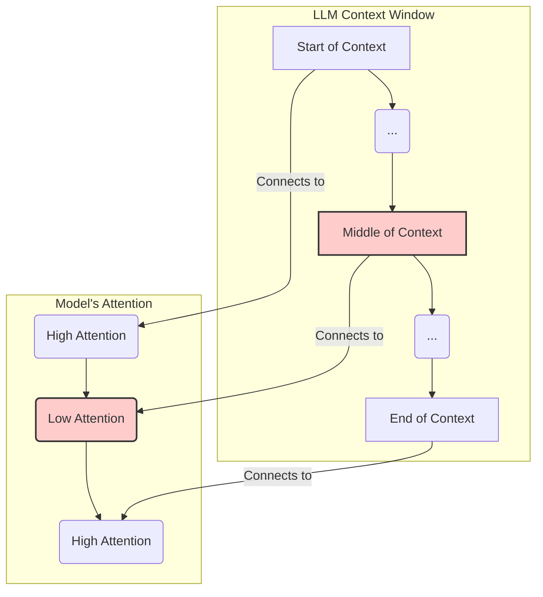
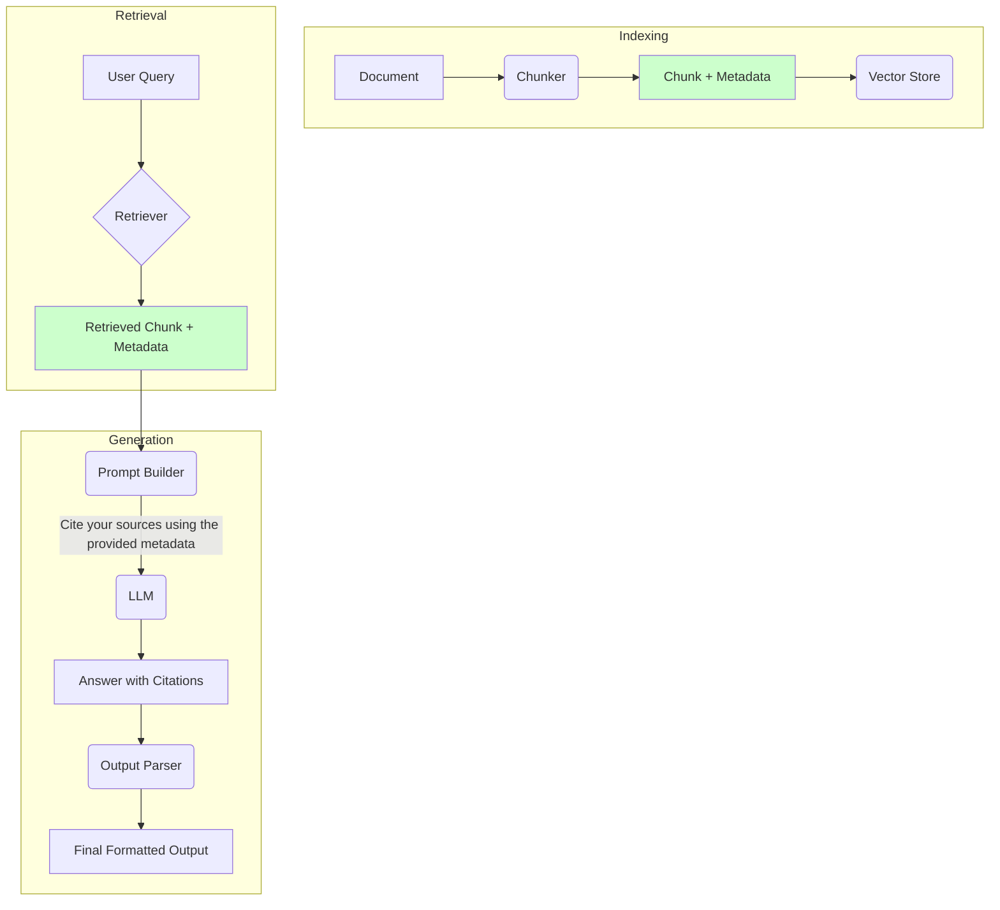

# Day 24: Advanced RAG Prompting and Optimization

## Overview

Now that we have a high-quality retrieval system, the final step is to effectively present the retrieved context to the language model. Today, we'll focus on advanced prompting strategies for Retrieval-Augmented Generation (RAG), managing the LLM's context window, filtering for relevance, and adding citations to build more factual and trustworthy systems.

## Learning Objectives

- Craft effective prompts that instruct the LLM on how to use retrieved context.
- Understand and mitigate the "lost in the middle" problem in long context windows.
- Implement relevance filtering to remove noise from the context.
- Build a RAG pipeline that provides citations for its answers, increasing traceability.

## Table of Contents

1. [Crafting the RAG Prompt](#crafting-the-rag-prompt)
2. [Managing the Context Window: The "Lost in the Middle" Problem](#managing-the-context-window-the-lost-in-the-middle-problem)
3. [Relevance Filtering: Reducing Noise](#relevance-filtering-reducing-noise)
4. [Implementing Citations for Traceability](#implementing-citations-for-traceability)

## Crafting the RAG Prompt

The way you structure the prompt that combines the user's query and the retrieved context is critical. A well-designed prompt guides the model to generate answers that are faithful to the provided information.

### Basic RAG Prompt Structure

A standard RAG prompt template looks like this:

```
Based on the following context, please answer the question.

Context:
---
{retrieved_context}
---

Question: {user_query}

Answer:
```

### Advanced Instructional Prompting

To make the model more reliable, you should add explicit instructions on how to behave, especially for cases where the answer isn't in the context.

**Example of a more robust prompt:**

```
You are a helpful assistant. Your task is to answer the user's question based *only* on the provided context.

Read the context below carefully. The context consists of one or more documents, separated by '---'.

Context:
---
{retrieved_context}
---

Question: {user_query}

Follow these rules:
1.  If the context contains the answer, provide a clear and concise answer based directly on the information in the context.
2.  If the answer cannot be found in the context, you *must* respond with "I'm sorry, but the provided context does not contain the information needed to answer this question."
3.  Do not use any of your own prior knowledge. Your response must be grounded in the provided text.

Answer:
```

This instructional approach forces the model to be more factual and helps prevent it from hallucinating an answer when the retrieved documents are not relevant.

## Managing the Context Window: The "Lost in the Middle" Problem

Language models don't pay equal attention to all parts of a long context. Research has shown that information presented at the **beginning** and the **end** of the context window is recalled much more accurately than information placed in the **middle**.

### The "Lost in the Middle" Phenomenon



This means that if you simply stuff a long list of retrieved documents into the prompt, the most relevant ones might get lost in the middle and be ignored by the model.

### Strategies to Mitigate the Problem

1. **Strategic Re-ordering**: After retrieving and reranking your documents, don't just pass them to the LLM in that order. Instead, place the most important documents at the beginning and end of the context.
    - **Process**: Take your top `k` reranked documents. Put the #1 document at the beginning of the context, the #2 document at the end, the #3 document after the first one, the #4 document before the last one, and so on.
    - **Example with 4 docs**: `[Doc 1, Doc 3, Doc 4, Doc 2]`

2. **Context Compression**: Use a smaller, powerful LLM to read through the retrieved documents and summarize them or extract only the sentences directly relevant to the query. This creates a shorter, denser context for the final generation model.

3. **Fewer, Better Documents**: Focus on improving retrieval and reranking (Day 23) to retrieve fewer documents (`k=3` to `5`) that are highly relevant, reducing the chance of important information getting lost.

## Relevance Filtering: Reducing Noise

Sometimes, even with a good retriever, some of the retrieved documents are not actually relevant to the user's query. Including this "noise" in the context can confuse the LLM and degrade the quality of the answer.

**Relevance filtering** is the process of removing irrelevant documents *before* they are added to the prompt.

### Methods for Relevance Filtering

1. **Score-Based Thresholding**: If you are using a reranker (like a Cross-Encoder), you can set a threshold for the relevance score. Any document that scores below this threshold is discarded.

    ```python
    # Pseudocode
    reranked_docs = reranker.predict(query, candidate_docs)
    relevance_threshold = 0.5
    final_docs = [doc for doc in reranked_docs if doc.score >= relevance_threshold]
    ```

2. **LLM-as-a-Judge**: Use a fast, cheap LLM to perform a quick relevance check on each document.

    ```mermaid
    flowchart TD
        A[Retrieved Document] --> B{LLM-as-a-Judge Prompt}
        A -- Query --> B
        B --> C{Is this doc relevant?}
        C -->|Yes| D[Keep for Context]
        C -->|No| E[Discard]
    end

    subgraph Prompt Template
        B[Given the query: `...`\nIs the following document relevant?\nDocument: `...`\nAnswer YES or NO.]
    end
    ```

## Implementing Citations for Traceability

To build trust and allow users to verify information, it's crucial to cite the sources used to generate an answer. This transforms the RAG system from a "black box" into a transparent and verifiable tool.

### The Citation Workflow



1. **Store Metadata**: During indexing, store metadata alongside each chunk. This should include the source document name, page number, URL, or any other identifier.

    ```json
    {
      "text": "The planet Zoltar is a marvel of the Andromeda galaxy...",
      "metadata": {
        "source": "Galactic_Encyclopedia_Vol42.pdf",
        "page": 137
      }
    }
    ```

2. **Pass Metadata in the Prompt**: When building the augmented prompt, include the metadata for each chunk in a structured way.

    **Example Prompt with Citations:**

    ```
    Based on the following documents, answer the question. Cite the sources for each part of your answer using the format [Source: ...].

    --- Document 1 ---
    Source: Galactic_Encyclopedia_Vol42.pdf, Page: 137
    Content: The planet Zoltar is a marvel of the Andromeda galaxy, known for its twin suns, Helios Prime and Helios Beta...

    --- Document 2 ---
    Source: Zoltarian_Biology_Primer.txt
    Content: Zoltarians communicate through a complex series of light patterns, a language known as 'Luminar'.

    Question: How do Zoltarians communicate?

    Answer:
    ```

3. **Instruct the Model to Cite**: Explicitly tell the model in the prompt to use the provided source information to create citations for its claims.

4. **Parse the Output (Optional but Recommended)**: The model will generate text like `"Zoltarians communicate using light patterns [Source: Zoltarian_Biology_Primer.txt]."` You can write a simple parser to turn this into a more user-friendly format, like a clickable link or a footnote.

## Conclusion

Prompting is the final, crucial link in the RAG chain. By carefully crafting prompts, managing the context window to play to the LLM's strengths, filtering out noise, and demanding citations, you can dramatically increase the factuality, reliability, and trustworthiness of your RAG system. These techniques move beyond simple retrieval and generation, enabling the creation of sophisticated, transparent, and genuinely helpful AI applications.

## References

1. Liu, N. F., et al. (2023). Lost in the Middle: How Language Models Use Long Contexts. arXiv.
2. LlamaIndex Documentation on Prompting. [https://docs.llamaindex.ai/en/stable/module_guides/querying/prompts/root.html](https://docs.llamaindex.ai/en/stable/module_guides/querying/prompts/root.html)
3. Gao, Y., et al. (2023). Enabling Large Language Models to Generate Text with Citations. arXiv.
