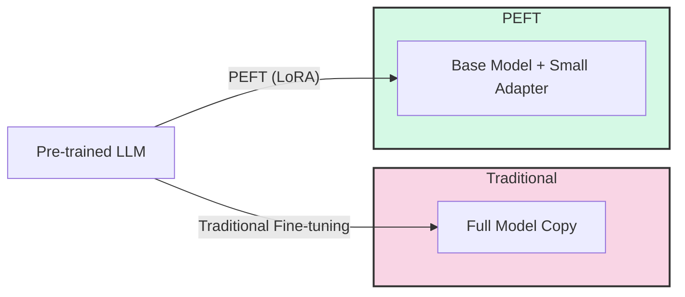
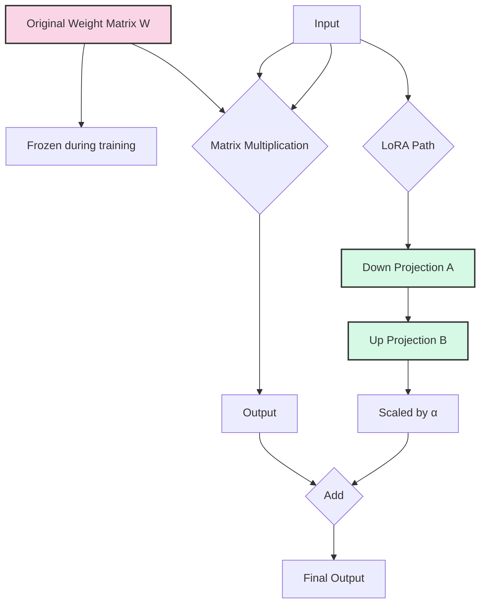
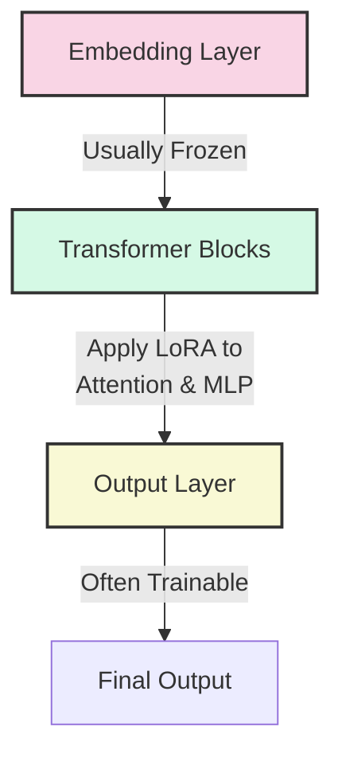

# Day 26: Parameter-Efficient Fine-Tuning (PEFT) with LoRA

Parameter-Efficient Fine-Tuning (PEFT) has revolutionized how we adapt large language models to specific tasks. Today, we'll focus on Low-Rank Adaptation (LoRA), one of the most popular PEFT techniques.

## Learning Objectives

- Understand the challenges of traditional fine-tuning
- Learn the theory behind Parameter-Efficient Fine-Tuning (PEFT)
- Master the mechanics of Low-Rank Adaptation (LoRA)
- Implement LoRA fine-tuning on a pre-trained model
- Determine which layers to freeze during adaptation

## 1. The Challenge of Traditional Fine-Tuning

Traditional fine-tuning faces several challenges:

- **Resource Intensive**: Requires updating all parameters (often billions) of the model
- **Storage Overhead**: Each fine-tuned version needs a full copy of the model
- **Deployment Complexity**: Managing multiple large model variants is cumbersome
- **Catastrophic Forgetting**: The model may lose its general capabilities when fine-tuned on specific tasks

## 2. Parameter-Efficient Fine-Tuning (PEFT)

PEFT techniques address these challenges by:

- **Updating only a small subset of parameters** (often <1% of the total)
- **Maintaining the pre-trained model weights** (frozen)
- **Creating small, task-specific adapters** that can be swapped or combined

Popular PEFT methods include:

| Method | Approach | Parameters | Advantages |
|--------|----------|------------|------------|
| **LoRA** | Low-rank decomposition of weight updates | ~0.1-1% | Efficient, no inference latency when merged |
| **Adapters** | Bottleneck layers inserted in transformer blocks | ~1-5% | Modular, can be stacked |
| **Prefix Tuning** | Optimizable prefixes added to inputs | ~0.1-1% | Works well for generation tasks |
| **P-Tuning** | Continuous prompts with trainable embeddings | <0.1% | Minimal parameter count |

## 3. Low-Rank Adaptation (LoRA) Explained

LoRA is based on a key insight: **weight updates during fine-tuning have low intrinsic rank**.

### LoRA Mathematics

For a pre-trained weight matrix $W \in \mathbb{R}^{d \times k}$, LoRA approximates the weight update $\Delta W$ using:

$$\Delta W = BA$$

Where:

- $B \in \mathbb{R}^{d \times r}$ (up-projection)
- $A \in \mathbb{R}^{r \times k}$ (down-projection)
- $r \ll \min(d, k)$ (low rank)

The forward pass becomes:

$$h = Wx + \frac{\alpha}{r}BAx$$

Where:

- $W$ is frozen
- Only $A$ and $B$ are trained
- $\alpha$ is a scaling factor
- $r$ is the rank (typically 4, 8, 16, or 32)

### Key Benefits of LoRA

1. **Efficiency**: Trains only $(d + k) \times r$ parameters instead of $d \times k$
2. **No Inference Latency**: LoRA weights can be merged with the base model after training
3. **Composability**: Multiple LoRA adapters can be combined
4. **Modularity**: Swap adapters without changing the base model

## 4. Choosing Which Layers to Freeze

Not all layers in a model contribute equally to task adaptation. Strategic freezing can improve efficiency and performance:

### Common Freezing Strategies

1. **Attention-Only**: Apply LoRA only to query, key, value projection matrices in attention layers
   - Good for: Adapting to new domains while preserving general knowledge
   - Example: `target_modules=["q_proj", "k_proj", "v_proj"]`

2. **Attention + MLP**: Apply LoRA to attention and feed-forward layers
   - Good for: More comprehensive adaptation with reasonable parameter count
   - Example: `target_modules=["q_proj", "k_proj", "v_proj", "fc1", "fc2"]`

3. **Late Layers Focus**: Apply LoRA primarily to later transformer blocks
   - Good for: Task-specific adaptation (later layers encode more task-specific features)
   - Implementation: Custom layer targeting in PEFT configuration

## 5. Practical Considerations

### Hyperparameters

- **Rank (r)**: Controls capacity vs. efficiency tradeoff (typically 4-32)
- **Alpha (α)**: Scaling factor for LoRA contribution (typically 16-32)
- **Learning Rate**: Often higher than full fine-tuning (e.g., 1e-4 to 1e-3)
- **Dropout**: Can be applied to LoRA layers for regularization

### When to Use LoRA

- **Limited Compute Resources**: Fine-tune large models on consumer hardware
- **Multiple Tasks**: Maintain one base model with multiple small adapters
- **Incremental Updates**: Add capabilities without full retraining
- **Deployment Constraints**: Reduce storage and serving requirements

## Conclusion

LoRA represents a significant advancement in making large language model adaptation more accessible and efficient. By focusing on low-rank updates to key parameters while keeping most of the model frozen, we can achieve comparable performance to full fine-tuning at a fraction of the computational and storage cost.

In the next part, we'll implement LoRA fine-tuning on a pre-trained model for a specific task.

## References

1. Hu, E. J., et al. (2021). LoRA: Low-Rank Adaptation of Large Language Models. [arXiv:2106.09685](https://arxiv.org/abs/2106.09685)
2. PEFT Library: [Hugging Face PEFT](https://github.com/huggingface/peft)
3. Dettmers, T., et al. (2023). QLoRA: Efficient Finetuning of Quantized LLMs. [arXiv:2305.14314](https://arxiv.org/abs/2305.14314)
