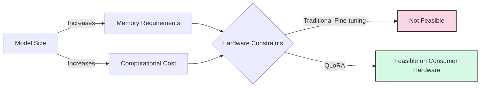
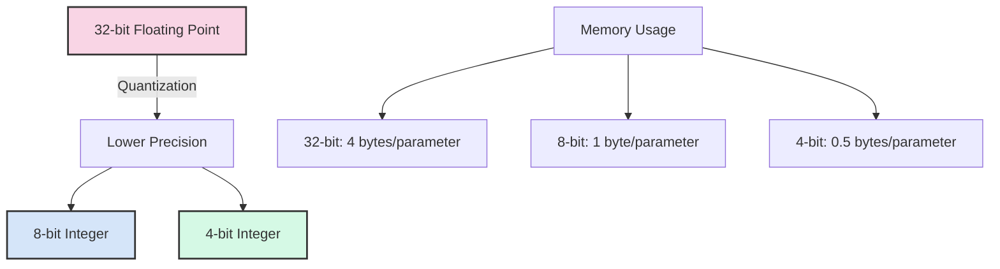
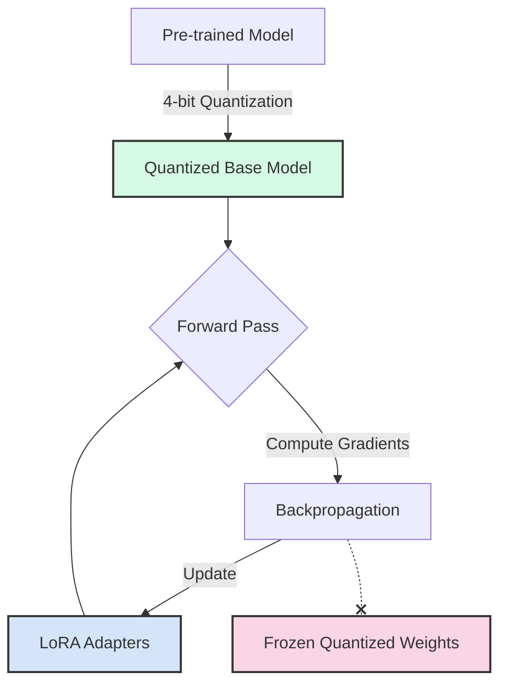
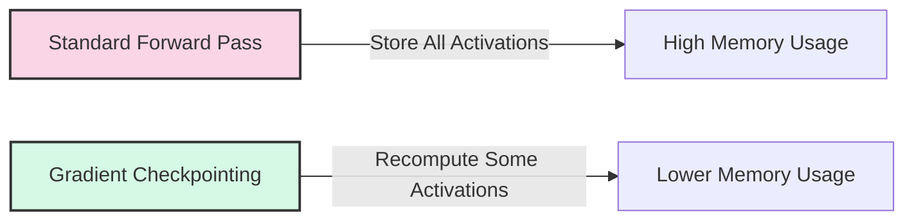

# Day 27: QLoRA - Quantized Low-Rank Adaptation

QLoRA (Quantized Low-Rank Adaptation) is an extension of LoRA that enables fine-tuning of even larger language models on consumer hardware through quantization techniques. Today, we'll explore how QLoRA works and how to implement it.

## Learning Objectives

- Understand the principles of model quantization
- Learn how QLoRA combines quantization with LoRA for efficient fine-tuning
- Explore 4-bit and 8-bit quantization techniques
- Implement QLoRA fine-tuning on a large language model
- Apply gradient checkpointing and other memory optimization techniques

## 1. The Challenge of Fine-Tuning Large Models

As language models grow in size, traditional fine-tuning becomes increasingly challenging:

Even with LoRA, models with tens of billions of parameters (like Llama 2 70B or Falcon 40B) require significant GPU memory just to load the model weights, making them inaccessible for most researchers and developers.

## 2. Understanding Quantization

Quantization is the process of reducing the precision of model weights from 32-bit or 16-bit floating-point to lower precision formats like 8-bit integers or 4-bit integers.

### Types of Quantization

1. **Post-Training Quantization (PTQ)**: Applied after training is complete
   - Simpler to implement
   - May result in accuracy degradation

2. **Quantization-Aware Training (QAT)**: Incorporates quantization during training
   - Better accuracy preservation
   - More complex to implement

3. **Dynamic Quantization**: Quantizes weights statically but activations dynamically
   - Balance between performance and accuracy

### Quantization Formats

| Format | Bits | Memory Savings | Precision Loss | Use Case |
|--------|------|---------------|---------------|----------|
| FP32 | 32 | Baseline | None | Training |
| FP16 | 16 | 50% | Minimal | Training/Inference |
| INT8 | 8 | 75% | Moderate | Inference |
| INT4 | 4 | 87.5% | Significant | QLoRA |

## 3. QLoRA: Combining Quantization with LoRA

QLoRA introduces several innovations to make fine-tuning extremely large models possible on consumer hardware:

### Key Components of QLoRA

1. **4-bit NormalFloat (NF4)**: A new data type optimized for normally distributed weights
   - Better preserves model quality than uniform quantization
   - Designed specifically for weight distributions in neural networks

2. **Double Quantization**: Quantizing the quantization constants themselves
   - Further reduces memory footprint
   - Minimal impact on model quality

3. **Paged Optimizers**: Memory management technique that offloads optimizer states to CPU
   - Reduces GPU memory usage during training
   - Enables training of larger models

4. **Frozen, Quantized Base Model**: Only the LoRA adapters are trained in full precision
   - Base model remains in 4-bit precision
   - Dramatically reduces memory requirements

## 4. Memory Optimization Techniques

QLoRA employs several memory optimization techniques to enable fine-tuning on consumer hardware:

### Gradient Checkpointing

- Trades computation for memory by recomputing activations during backward pass
- Reduces memory usage at the cost of increased computation time
- Critical for training large models on limited hardware

### Memory Efficient Attention

- Optimized implementation of attention mechanism
- Reduces peak memory usage during attention computation
- Particularly important for models with long context windows

### Activation Offloading

- Temporarily moves activations to CPU memory when not in use
- Reduces GPU memory requirements
- Introduces some latency but enables training of larger models

## 5. QLoRA vs. Standard LoRA

| Aspect | Standard LoRA | QLoRA |
|--------|--------------|-------|
| Base Model Precision | FP16/FP32 | INT4/INT8 |
| Memory Footprint | Medium | Very Low |
| Hardware Requirements | Mid-range GPU | Consumer GPU |
| Training Speed | Faster | Slower |
| Model Quality | High | Comparable |
| Maximum Model Size | Limited by GPU memory | Much larger models possible |

## 6. When to Use QLoRA

QLoRA is particularly useful in these scenarios:

1. **Limited Hardware Resources**: When you only have access to consumer GPUs
2. **Very Large Models**: When working with models that have tens of billions of parameters
3. **Multiple Fine-tuning Experiments**: When you need to run many experiments with different hyperparameters
4. **Instruction Tuning**: When adapting foundation models to follow instructions

## 7. Practical Considerations

### Hyperparameters for QLoRA

- **Quantization Bits**: 4-bit is standard for QLoRA, but 8-bit can be used for better quality
- **LoRA Rank (r)**: Higher ranks (16-64) often work better with QLoRA
- **LoRA Alpha**: Typically 16-32, may need adjustment for quantized models
- **Learning Rate**: Often lower than standard LoRA (1e-5 to 5e-5)
- **Batch Size**: Smaller batch sizes to fit in memory

### Limitations

- **Training Speed**: QLoRA is slower than standard LoRA due to quantization overhead
- **Quantization Artifacts**: Some tasks may be sensitive to quantization errors
- **Limited to Fine-tuning**: Not suitable for pre-training from scratch

## Conclusion

QLoRA represents a significant advancement in democratizing access to large language model fine-tuning. By combining the parameter efficiency of LoRA with aggressive quantization techniques, QLoRA enables researchers and developers with limited computational resources to work with state-of-the-art models.

In the next part, we'll implement QLoRA to fine-tune a large language model on a single consumer GPU.

## References

1. Dettmers, T., et al. (2023). QLoRA: Efficient Finetuning of Quantized LLMs. [arXiv:2305.14314](https://arxiv.org/abs/2305.14314)
2. PEFT Library: [Hugging Face PEFT](https://github.com/huggingface/peft)
3. BitsAndBytes Library: [BitsAndBytes](https://github.com/TimDettmers/bitsandbytes)
4. Hu, E. J., et al. (2021). LoRA: Low-Rank Adaptation of Large Language Models. [arXiv:2106.09685](https://arxiv.org/abs/2106.09685)
