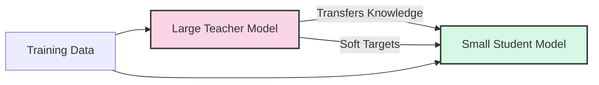
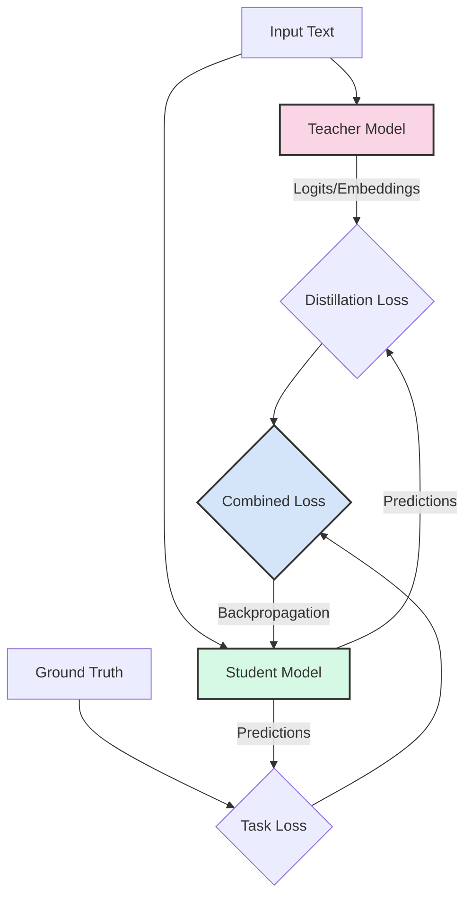
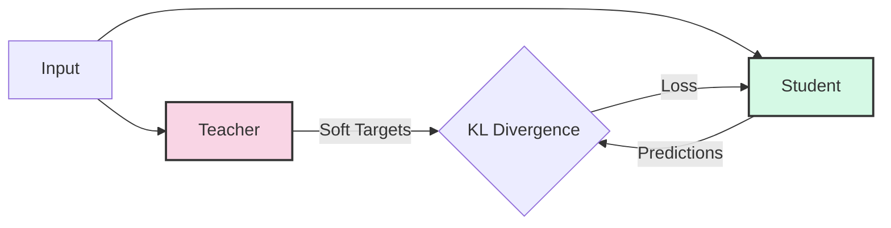
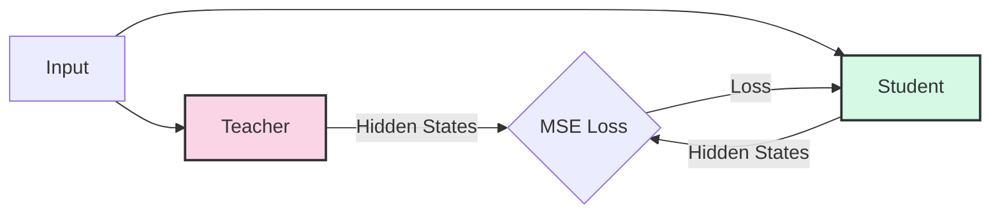
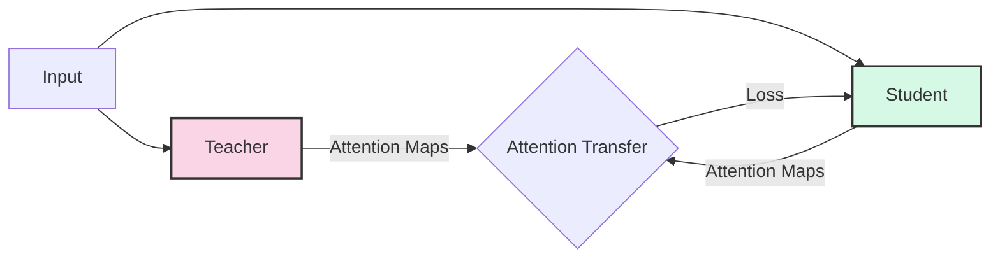
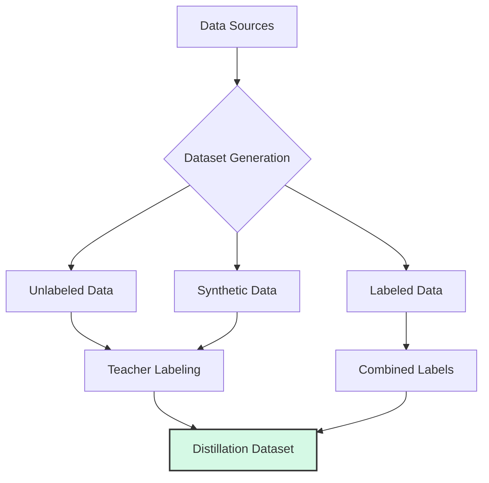
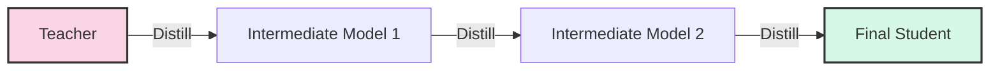
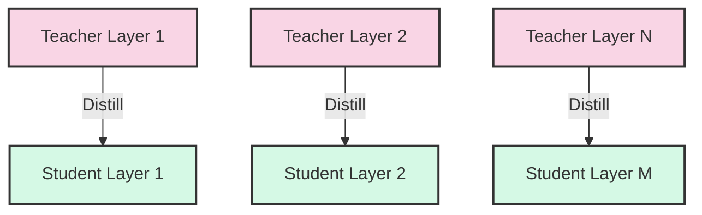
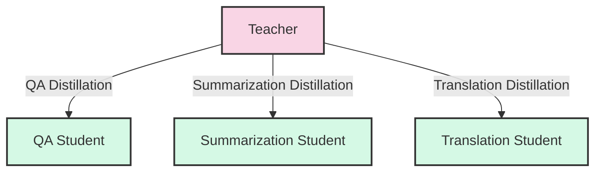

# Day 28: Knowledge Distillation for LLMs

Knowledge distillation is a powerful technique for creating smaller, more efficient models that retain much of the performance of larger models. Today, we'll explore how to apply knowledge distillation to large language models.

## Learning Objectives

- Understand the principles of knowledge distillation
- Learn about teacher-student model architectures
- Explore different distillation objectives (logits, soft targets, etc.)
- Implement knowledge distillation for language models
- Generate high-quality datasets for distillation

## 1. Introduction to Knowledge Distillation

Knowledge distillation is a model compression technique where a smaller model (the student) is trained to mimic the behavior of a larger model (the teacher).

### Why Distill Language Models?

1. **Deployment Efficiency**: Smaller models require less memory and compute
2. **Inference Speed**: Faster response times for real-time applications
3. **Resource Accessibility**: Run models on edge devices or consumer hardware
4. **Cost Reduction**: Lower computational costs for serving predictions

## 2. The Knowledge Distillation Framework

### The Teacher-Student Architecture

### Key Components

1. **Teacher Model**: A large, high-performing pre-trained model
2. **Student Model**: A smaller model with fewer parameters
3. **Distillation Loss**: Measures how well the student mimics the teacher
4. **Task Loss**: Ensures the student performs well on the original task
5. **Temperature Parameter**: Controls the softness of probability distributions

## 3. Types of Knowledge Distillation

### Response-Based Distillation

The student learns from the final outputs (logits or probabilities) of the teacher.

### Feature-Based Distillation

The student learns to mimic the internal representations (embeddings, hidden states) of the teacher.

### Relation-Based Distillation

The student learns the relationships between different inputs or tokens as captured by the teacher.

## 4. Distillation Objectives

### Temperature Scaling

Temperature scaling controls the "softness" of the probability distribution:

$$q_i = \frac{\exp(z_i/T)}{\sum_j \exp(z_j/T)}$$

Where:
- $q_i$ is the softened probability
- $z_i$ is the logit
- $T$ is the temperature (higher values produce softer distributions)

### Kullback-Leibler Divergence Loss

The KL divergence measures how different the student's distribution is from the teacher's:

$$L_{KL} = T^2 \sum_i p_i \log\frac{p_i}{q_i}$$

Where:
- $p_i$ is the teacher's probability for class $i$
- $q_i$ is the student's probability for class $i$
- $T$ is the temperature

### Combined Loss

The final loss is typically a combination of distillation loss and task loss:

$$L = \alpha L_{task} + (1-\alpha) L_{distill}$$

Where:
- $L_{task}$ is the standard task loss (e.g., cross-entropy with hard labels)
- $L_{distill}$ is the distillation loss (e.g., KL divergence)
- $\alpha$ is a weighting parameter

## 5. Dataset Generation for Distillation

Creating a high-quality dataset is crucial for effective distillation.

### Approaches to Dataset Creation

1. **Teacher Labeling**: Use the teacher model to generate soft labels for unlabeled data
2. **Data Augmentation**: Create variations of existing examples
3. **Synthetic Data Generation**: Use the teacher to generate entirely new examples
4. **Active Learning**: Select the most informative examples for distillation
5. **Domain-Specific Data**: Focus on data relevant to the target application

## 6. Distillation Strategies for LLMs

### Progressive Distillation

Train the student in stages, gradually increasing complexity:

### Layer-wise Distillation

Distill knowledge from specific layers of the teacher to corresponding layers of the student:

### Task-Specific Distillation

Focus distillation on specific tasks or capabilities:

## 7. Architectural Considerations for Student Models

### Student Architecture Options

1. **Same Architecture, Fewer Layers**: Reduce depth (e.g., 24 layers → 6 layers)
2. **Same Architecture, Smaller Hidden Size**: Reduce width (e.g., 1024 dims → 512 dims)
3. **Different Architecture**: Use a more efficient architecture (e.g., MobileBERT, DistilBERT)
4. **Quantized Models**: Combine distillation with quantization
5. **Pruned Models**: Remove less important weights or attention heads

### Initialization Strategies

1. **Random Initialization**: Start with a randomly initialized student
2. **Layer Selection**: Initialize with selected layers from the teacher
3. **Parameter Averaging**: Initialize with averaged parameters from teacher layers
4. **Pre-trained Initialization**: Start with a smaller pre-trained model

## 8. Evaluating Distilled Models

### Key Metrics

| Metric | Description | Goal |
|--------|-------------|------|
| **Task Performance** | Accuracy, F1, BLEU, etc. on downstream tasks | Minimize gap with teacher |
| **Inference Speed** | Time to generate predictions | Significant improvement over teacher |
| **Memory Usage** | RAM required for model weights and activations | Significant reduction from teacher |
| **Model Size** | Number of parameters or disk space | Significant reduction from teacher |

### Evaluation Strategies

1. **Task Benchmarks**: Evaluate on standard NLP benchmarks (GLUE, SuperGLUE, etc.)
2. **Generalization Tests**: Test on out-of-distribution data
3. **Ablation Studies**: Analyze the impact of different distillation components
4. **Efficiency Profiling**: Measure throughput, latency, and memory usage

## 9. Successful Distilled LLMs

Several successful distilled language models have been developed:

| Model | Teacher | Size Reduction | Performance Retention |
|-------|---------|----------------|------------------------|
| **DistilBERT** | BERT | 40% fewer parameters | 97% of BERT performance |
| **TinyBERT** | BERT | 7.5x smaller | 96% of BERT performance |
| **MobileBERT** | BERT | 4.3x smaller | Matches BERT performance |
| **DistilGPT2** | GPT-2 | 2x smaller | Strong generation capabilities |
| **Distil-RoBERTa** | RoBERTa | 2x smaller | 95% of RoBERTa performance |

## Conclusion

Knowledge distillation is a powerful technique for creating smaller, more efficient language models without sacrificing too much performance. By carefully designing the teacher-student architecture, distillation objectives, and training data, we can create models that are practical for deployment in resource-constrained environments.

In the next part, we'll implement knowledge distillation for a language model and evaluate its performance.

## References

1. Hinton, G., Vinyals, O., & Dean, J. (2015). Distilling the Knowledge in a Neural Network. [arXiv:1503.02531](https://arxiv.org/abs/1503.02531)
2. Sanh, V., et al. (2019). DistilBERT, a distilled version of BERT: smaller, faster, cheaper and lighter. [arXiv:1910.01108](https://arxiv.org/abs/1910.01108)
3. Jiao, X., et al. (2019). TinyBERT: Distilling BERT for Natural Language Understanding. [arXiv:1909.10351](https://arxiv.org/abs/1909.10351)
4. Sun, S., et al. (2020). MobileBERT: a Compact Task-Agnostic BERT for Resource-Limited Devices. [arXiv:2004.02984](https://arxiv.org/abs/2004.02984)
