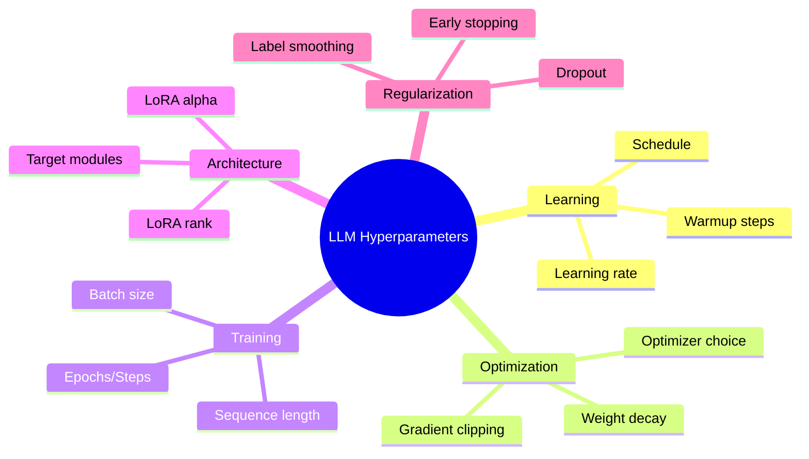
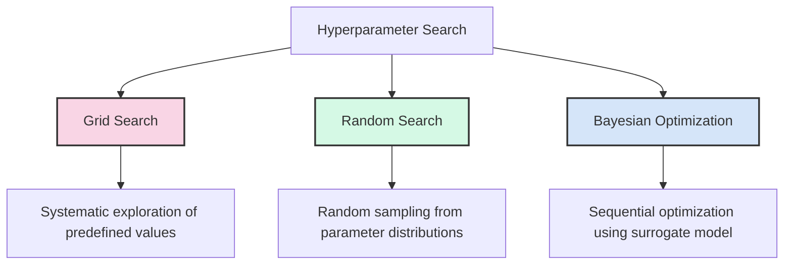
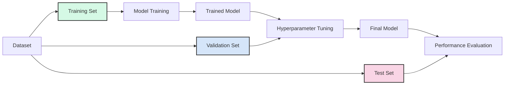
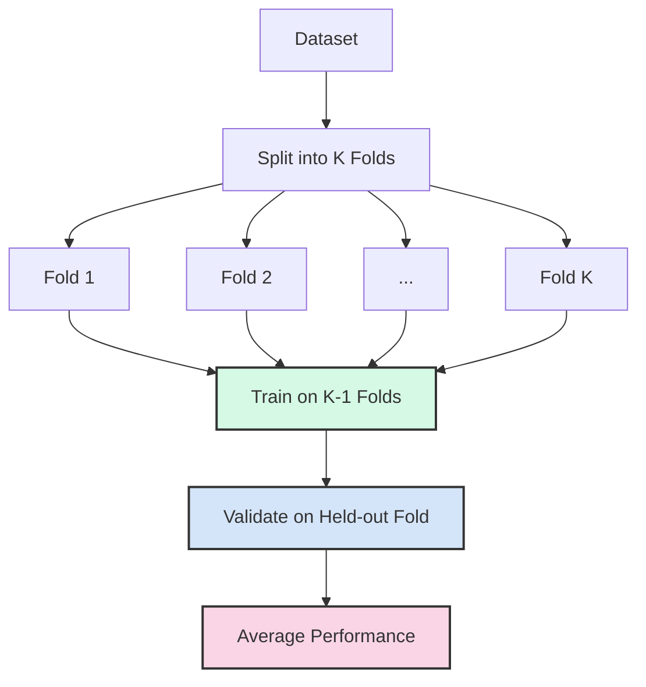
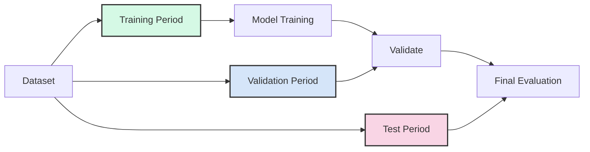
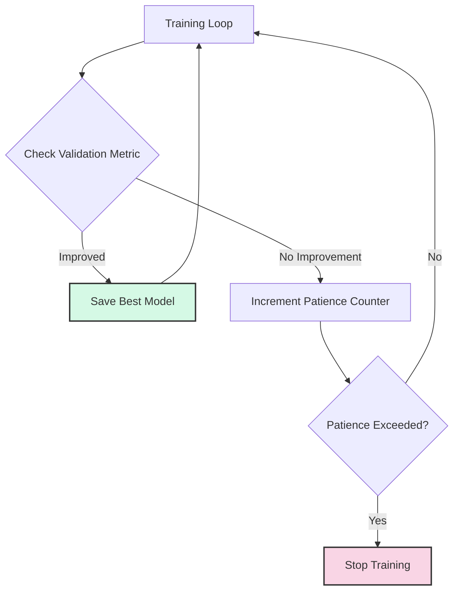
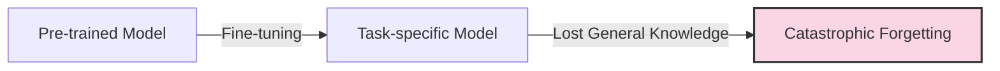
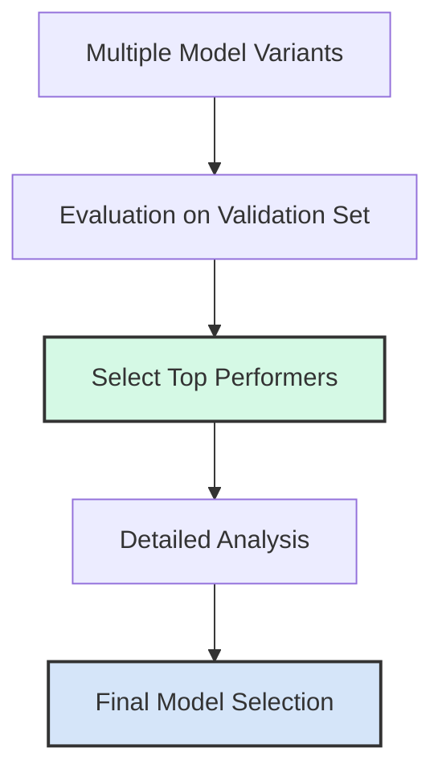
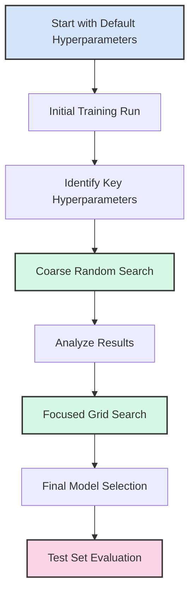

# Day 29: Hyperparameter Optimization and Fine-Tuning Strategies

Effective fine-tuning of large language models requires careful selection of hyperparameters and training strategies. Today, we'll explore techniques for optimizing hyperparameters, implementing validation strategies, and preventing issues like catastrophic forgetting.

## Learning Objectives

- Understand the importance of hyperparameter optimization for LLMs
- Learn systematic approaches to hyperparameter search
- Implement effective validation strategies
- Apply early stopping to prevent overfitting
- Mitigate catastrophic forgetting during fine-tuning
- Compare model variants to select the best performing model

## 1. The Hyperparameter Landscape for LLMs

Fine-tuning large language models involves numerous hyperparameters that significantly impact performance:

### Key Hyperparameters for LLM Fine-tuning

| Hyperparameter | Typical Range | Impact |
|----------------|---------------|--------|
| Learning rate | 1e-5 to 5e-4 | Controls update step size; critical for convergence |
| Batch size | 1 to 128 | Affects gradient stability and memory usage |
| LoRA rank (r) | 4 to 256 | Controls adapter capacity; higher values = more parameters |
| LoRA alpha | 8 to 64 | Scales the LoRA contribution; affects learning dynamics |
| Weight decay | 0 to 0.1 | Regularizes weights; prevents overfitting |
| Epochs/Steps | Task-dependent | Determines training duration; affects convergence |
| Warmup steps | 0% to 10% of steps | Stabilizes early training; prevents divergence |

## 2. Systematic Hyperparameter Search

### Grid Search vs. Random Search

**Grid Search**:

- Systematically evaluates all combinations of predefined hyperparameter values
- Comprehensive but computationally expensive
- Inefficient for high-dimensional spaces

**Random Search**:

- Randomly samples hyperparameter values from specified distributions
- More efficient than grid search for high-dimensional spaces
- May miss optimal combinations in sparse spaces

**Bayesian Optimization**:

- Uses a surrogate model to guide the search
- Balances exploration and exploitation
- More efficient for expensive evaluations

### Practical Approach for LLMs

Given the computational cost of fine-tuning LLMs, a practical approach is:

1. **Start with established defaults** from papers or libraries
2. **Perform coarse random search** on key hyperparameters
3. **Refine with focused grid search** around promising values
4. **Apply Bayesian optimization** for final tuning if resources permit

## 3. Validation Strategies

Proper validation is crucial for evaluating model performance and preventing overfitting.

### K-Fold Cross-Validation

For smaller datasets, K-fold cross-validation provides more robust evaluation:

### Time-Based Validation

For sequential data or when temporal effects matter:

## 4. Early Stopping

Early stopping prevents overfitting by monitoring validation performance and stopping training when performance plateaus or degrades.

### Implementing Early Stopping

Key parameters for early stopping:

- **Patience**: Number of evaluations with no improvement before stopping
- **Evaluation Frequency**: How often to evaluate on the validation set
- **Delta**: Minimum change to qualify as an improvement
- **Metric**: Which validation metric to monitor (accuracy, loss, F1, etc.)

## 5. Catastrophic Forgetting

Catastrophic forgetting occurs when a model loses previously learned knowledge during fine-tuning on a new task.

### Strategies to Mitigate Catastrophic Forgetting

1. **Regularization-based Methods**:
   - **Weight Decay**: Penalizes large weight updates
   - **Elastic Weight Consolidation (EWC)**: Constrains important weights from changing
   - **Knowledge Distillation**: Preserves original model behavior

2. **Architecture-based Methods**:
   - **Parameter-Efficient Fine-Tuning (PEFT)**: Updates only a small subset of parameters
   - **Adapter Modules**: Adds task-specific modules while freezing base model

3. **Data-based Methods**:
   - **Replay**: Mix in samples from original pre-training data
   - **Continual Pre-training**: Include diverse data during fine-tuning

### Measuring Catastrophic Forgetting

To quantify catastrophic forgetting, evaluate the model on:

1. **Original pre-training tasks** before and after fine-tuning
2. **General language understanding benchmarks** (e.g., GLUE, SuperGLUE)
3. **Zero-shot performance** on tasks not seen during fine-tuning

## 6. Comparing Model Variants

After training multiple model variants with different hyperparameters, systematic comparison is essential.

### Evaluation Metrics

Choose metrics appropriate for your task:

| Task Type | Primary Metrics | Secondary Metrics |
|-----------|----------------|-------------------|
| Classification | Accuracy, F1, AUC | Precision, Recall, Confusion Matrix |
| Generation | BLEU, ROUGE, BERTScore | Perplexity, Diversity, Human Evaluation |
| Question Answering | Exact Match, F1 | Answer Relevance, Factual Accuracy |
| Ranking | MRR, NDCG | Precision@k, Recall@k |

### Statistical Significance

When comparing models with similar performance, use statistical significance tests:

- **Paired t-test**: For comparing means of two related samples
- **McNemar's test**: For comparing binary classification errors
- **Bootstrap resampling**: For estimating confidence intervals

### Beyond Metrics: Qualitative Evaluation

Numerical metrics don't tell the whole story. Also consider:

- **Error analysis**: Identify patterns in model mistakes
- **Fairness and bias**: Check for disparate performance across groups
- **Robustness**: Test on out-of-distribution examples
- **Human evaluation**: Gather expert or user feedback

## 7. Practical Hyperparameter Optimization Workflow

### Step-by-Step Process

1. **Start with established defaults** from papers or libraries
2. **Run a baseline model** to understand task difficulty and performance range
3. **Identify key hyperparameters** with the most impact on your specific task
4. **Perform coarse random search** on these key hyperparameters
5. **Analyze results** to identify promising regions of the hyperparameter space
6. **Conduct focused grid search** around promising values
7. **Select the best model** based on validation performance
8. **Evaluate on the test set** only once, at the very end

## Conclusion

Effective hyperparameter optimization and fine-tuning strategies are essential for getting the most out of large language models. By implementing systematic search approaches, robust validation strategies, early stopping, and techniques to prevent catastrophic forgetting, you can develop high-performing models tailored to your specific tasks.

In the next part, we'll implement these techniques to optimize a LoRA fine-tuning process and compare different model variants.

## References

1. Dodge, J., et al. (2020). Fine-Tuning Pretrained Language Models: Weight Initializations, Data Orders, and Early Stopping. [arXiv:2002.06305](https://arxiv.org/abs/2002.06305)
2. Zhang, J., et al. (2021). Why Does Hyperparameter Optimization Matter for Language Models? [arXiv:2106.00570](https://arxiv.org/abs/2106.00570)
3. Kirkpatrick, J., et al. (2017). Overcoming catastrophic forgetting in neural networks. [PNAS](https://www.pnas.org/content/114/13/3521)
4. Bergstra, J., & Bengio, Y. (2012). Random Search for Hyper-Parameter Optimization. [JMLR](https://www.jmlr.org/papers/v13/bergstra12a.html)
