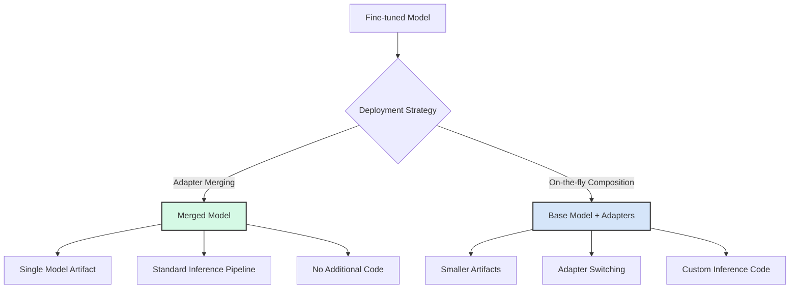
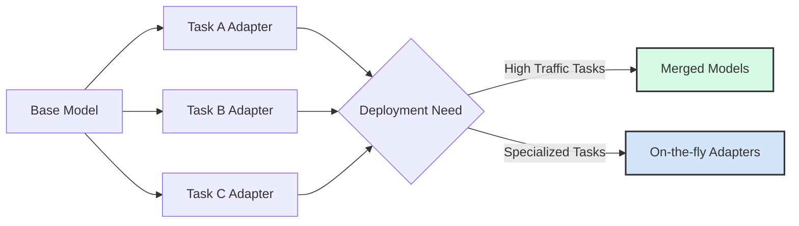
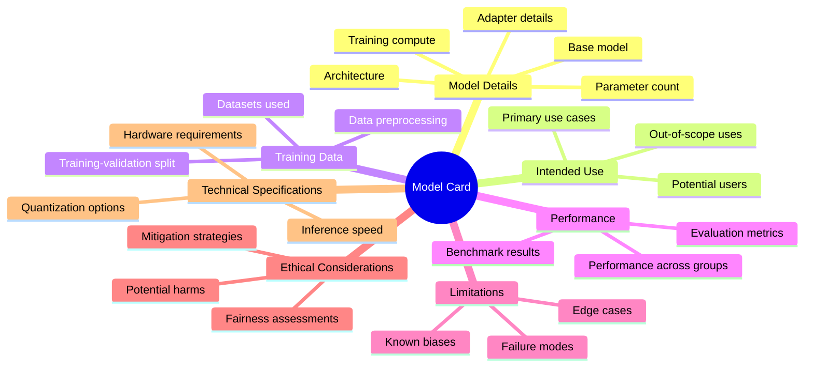
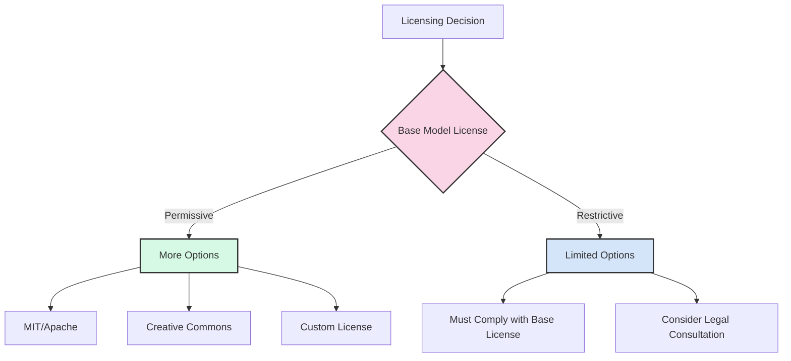
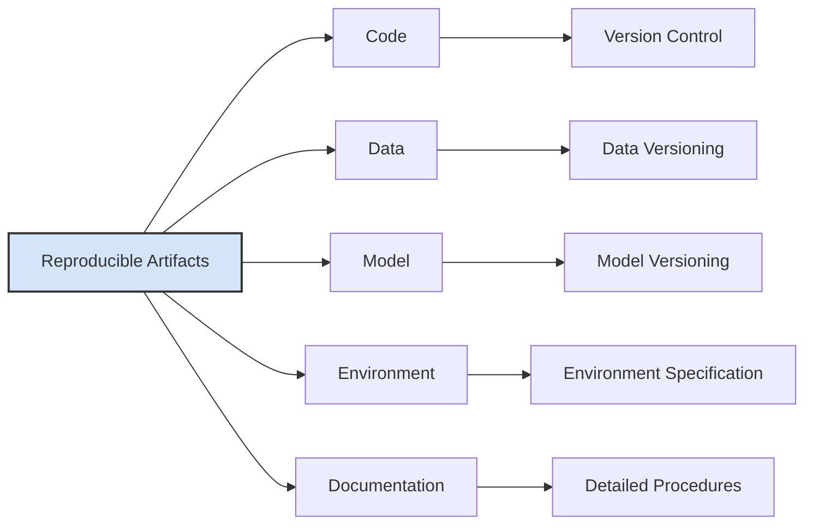
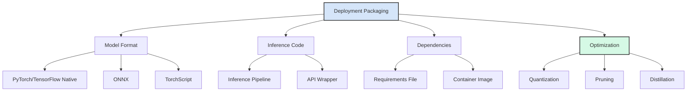

# Day 30: Model Packaging, Adapter Management, and Documentation

After fine-tuning a large language model, proper packaging, adapter management, and documentation are crucial for deployment, reproducibility, and responsible use. Today, we'll explore best practices for preparing your fine-tuned models for distribution and use.

## Learning Objectives

- Understand different approaches to adapter management (merging vs. on-the-fly)
- Learn how to create comprehensive model cards and documentation
- Explore licensing considerations for fine-tuned models
- Implement reproducible artifacts and versioning
- Package models for efficient deployment

## 1. Adapter Management Strategies

When working with parameter-efficient fine-tuning methods like LoRA, you have two main options for deployment:



### 1.1 Adapter Merging

Adapter merging involves combining the weights of the base model and the adapter(s) into a single model.

**Advantages:**
- Standard inference pipelines work without modification
- No additional code needed at inference time
- Often faster inference (no adapter overhead)

**Disadvantages:**
- Results in a full-sized model
- Cannot switch adapters dynamically
- Loses the modularity benefits of adapters

### 1.2 On-the-fly Adapter Composition

On-the-fly composition keeps the base model and adapters separate, applying the adapters during inference.

**Advantages:**
- Smaller artifacts to distribute
- Can switch or combine adapters dynamically
- Maintains modularity for multi-task scenarios

**Disadvantages:**
- Requires custom inference code
- Slightly higher computational overhead
- More complex deployment architecture

### 1.3 Hybrid Approaches

For complex scenarios, you can use hybrid approaches:



- Merge adapters for high-traffic tasks where performance is critical
- Keep adapters separate for specialized or less frequent tasks
- Use a combination based on deployment constraints

## 2. Model Cards and Documentation

Comprehensive documentation is essential for responsible model sharing and use.

### 2.1 Model Card Structure

A good model card should include:



### 2.2 Example Model Card Template

```markdown
# Model Card: [Model Name]

## Model Details
- **Developer:** [Your name/organization]
- **Model type:** [Architecture, e.g., "LoRA-tuned RoBERTa-base"]
- **Language(s):** [Languages supported]
- **Base model:** [Link to base model]
- **License:** [License information]
- **Last updated:** [Date]

## Intended Use
- **Primary intended uses:** [Description of primary use cases]
- **Primary intended users:** [Target users]
- **Out-of-scope use cases:** [Uses the model is not suitable for]

## Training Data
- **Training dataset:** [Dataset description and source]
- **Preprocessing:** [Data cleaning and preprocessing steps]
- **Training-validation split:** [How data was split]

## Performance and Limitations
- **Performance measures:** [Key metrics and results]
- **Benchmarks:** [Benchmark results]
- **Known limitations:** [Known issues or limitations]
- **Ethical considerations and risks:** [Potential risks and mitigations]

## Technical Specifications
- **Hardware requirements:** [Minimum/recommended hardware]
- **Inference speed:** [Inference benchmarks]
- **Model size:** [Size of model artifacts]

## How to Use
- **Installation:** [Installation instructions]
- **Inference examples:** [Code examples]
- **Fine-tuning examples:** [If applicable]

## Citation and Contact
- **Citation:** [How to cite the model]
- **Contact:** [Contact information]
```

## 3. Licensing Considerations

Choosing the right license for your fine-tuned model is crucial.



### 3.1 License Types

| License Type | Description | Examples | Considerations |
|--------------|-------------|----------|----------------|
| **Permissive** | Few restrictions, allows commercial use | MIT, Apache 2.0 | Good for wide adoption |
| **Copyleft** | Derivative works must use same license | GPL, AGPL | Ensures openness of derivatives |
| **Limited Use** | Restricts certain uses | CC BY-NC | Prevents commercial exploitation |
| **Custom** | Tailored to specific needs | OpenAI License | Can address specific concerns |

### 3.2 License Compatibility

When fine-tuning a pre-trained model, your license must be compatible with the base model's license:

- If the base model has a permissive license (e.g., MIT, Apache), you have more flexibility
- If the base model has a restrictive license (e.g., GPL, custom), your model must comply with those restrictions
- Some models have specific clauses about fine-tuned versions

### 3.3 Best Practices

1. **Clearly state the license** in your model card and repository
2. **Understand the base model's license** and ensure compliance
3. **Consider your goals** (wide adoption, commercial protection, etc.)
4. **Consult legal expertise** for complex or commercial cases

## 4. Reproducible Artifacts

Creating reproducible artifacts ensures others can verify and build upon your work.



### 4.1 Code Versioning

- Use Git for version control
- Tag releases with semantic versioning
- Include all training and evaluation scripts
- Document any non-deterministic elements

### 4.2 Data Versioning

- Use data versioning tools (DVC, Weights & Biases, etc.)
- Document data sources and preprocessing steps
- Include data splits and sampling procedures
- Consider privacy and licensing of training data

### 4.3 Model Versioning

- Use model registry systems (Hugging Face Hub, MLflow, etc.)
- Save checkpoints during training
- Version both adapters and merged models
- Include evaluation metrics with each version

### 4.4 Environment Specification

- Use Docker containers or environment files
- Specify exact package versions
- Document hardware requirements
- Include seed values for reproducibility

## 5. Packaging for Deployment

Proper packaging ensures your model can be easily deployed in various environments.



### 5.1 Model Format Options

| Format | Advantages | Disadvantages | Best For |
|--------|------------|---------------|----------|
| **Native Format** | Full flexibility | Framework-specific | Development |
| **ONNX** | Framework-independent | Conversion overhead | Cross-framework deployment |
| **TorchScript** | Optimized for production | Less flexible | PyTorch production |
| **TensorFlow SavedModel** | Integrated with TF Serving | TF ecosystem only | TensorFlow production |

### 5.2 Optimization Techniques

1. **Quantization**: Reduce precision (FP32 → FP16/INT8)
2. **Pruning**: Remove unnecessary weights
3. **Distillation**: Create smaller student models
4. **Graph Optimization**: Fuse operations for efficiency

### 5.3 Deployment Checklist

- [ ] Model in appropriate format for target environment
- [ ] Inference code with proper error handling
- [ ] Clear dependency specification
- [ ] Performance benchmarks on target hardware
- [ ] Monitoring and logging integration
- [ ] Versioning and rollback strategy
- [ ] Documentation for deployment engineers

## 6. Practical Considerations for Different Scenarios

### 6.1 Research Release

For research-oriented releases, prioritize:
- Comprehensive methodology documentation
- Reproducibility of experiments
- Detailed ablation studies
- Code for replicating results

### 6.2 Production Deployment

For production deployments, prioritize:
- Optimized inference performance
- Robust error handling
- Monitoring and logging
- A/B testing infrastructure
- Versioning and rollback mechanisms

### 6.3 Community Model

For community-oriented releases, prioritize:
- Ease of use and clear examples
- Comprehensive model card
- Permissive licensing (if possible)
- Active maintenance plan

## Conclusion

Proper packaging, documentation, and licensing are as important as the model training itself. By following these best practices, you ensure your fine-tuned models are:

1. **Usable**: Others can easily deploy and use your model
2. **Reproducible**: Results can be verified and built upon
3. **Responsible**: Limitations and ethical considerations are clear
4. **Maintainable**: The model can evolve over time

In the next part, we'll implement these practices for our fine-tuned models, creating proper documentation and packaging for deployment.

## References

1. Mitchell, M., et al. (2019). Model Cards for Model Reporting. [arXiv:1810.03993](https://arxiv.org/abs/1810.03993)
2. Gebru, T., et al. (2018). Datasheets for Datasets. [arXiv:1803.09010](https://arxiv.org/abs/1803.09010)
3. Hugging Face Model Card Guidelines: [Model Card Documentation](https://huggingface.co/docs/hub/model-cards)
4. Responsible AI Licenses: [RAI Licenses](https://www.licenses.ai/)
5. MLOps Best Practices: [MLOps Guide](https://ml-ops.org/)
