# Day 31: Model Quantization Techniques

Model quantization is a crucial optimization technique for deploying large language models in resource-constrained environments. Today, we'll explore various quantization methods, their trade-offs, and how to implement them effectively.

## Learning Objectives

- Understand the principles of model quantization
- Compare different quantization techniques (INT8, INT4, AWQ, GPTQ)
- Evaluate the trade-offs between model quality and efficiency
- Implement quantization on pre-trained models
- Measure and analyze the impact on latency and quality

## 1. Introduction to Quantization

Quantization reduces the precision of model weights and activations from higher precision (typically FP32 or FP16) to lower precision formats (INT8, INT4, or even lower).

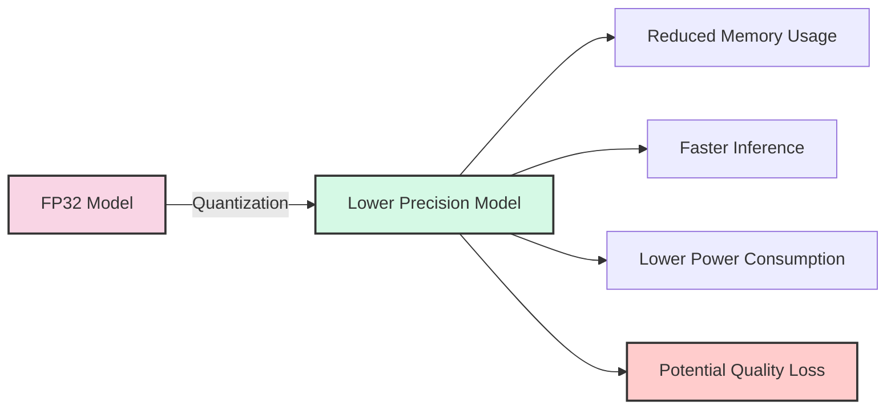

### Why Quantize?

1. **Memory Efficiency**: Lower precision = smaller model size
2. **Inference Speed**: Integer operations are faster than floating-point
3. **Energy Efficiency**: Less computation = less power consumption
4. **Deployment Flexibility**: Run models on hardware with limited capabilities

### The Quantization Process

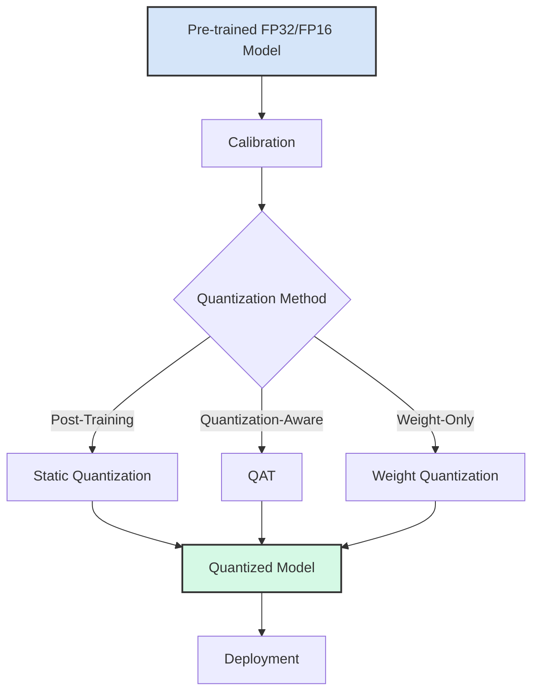

## 2. Quantization Techniques

### 2.1 Precision Formats

| Format | Bits | Range | Use Case |
|--------|------|-------|----------|
| FP32 | 32 | Wide | Training, high-precision inference |
| FP16 | 16 | Medium | Mixed-precision training, inference |
| BF16 | 16 | Wide | Alternative to FP16 with better numerical stability |
| INT8 | 8 | -128 to 127 | Standard quantized inference |
| INT4 | 4 | -8 to 7 | Highly optimized inference |
| UINT4 | 4 | 0 to 15 | Alternative to INT4 |
| INT2 | 2 | -2 to 1 | Extreme compression (with significant quality loss) |

### 2.2 Quantization Methods

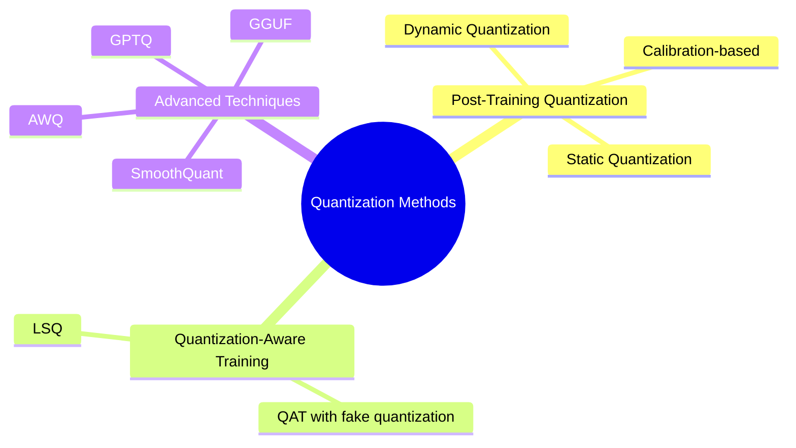

#### Post-Training Quantization (PTQ)

Applies quantization to an already trained model without retraining:

- **Static Quantization**: Pre-computes quantization parameters using a calibration dataset
- **Dynamic Quantization**: Computes quantization parameters on-the-fly during inference
- **Weight-Only Quantization**: Only quantizes weights, keeping activations in higher precision

#### Quantization-Aware Training (QAT)

Incorporates quantization effects during the training process:

- Simulates quantization in the forward pass
- Uses full precision in the backward pass
- Results in better accuracy than PTQ but requires retraining

#### Advanced Techniques

- **GPTQ (Generative Pre-trained Transformer Quantization)**: Layer-by-layer quantization with error correction
- **AWQ (Activation-aware Weight Quantization)**: Preserves important weights based on activation patterns
- **SmoothQuant**: Balances the quantization difficulty between activations and weights
- **GGUF (GPT-Generated Unified Format)**: Successor to GGML, optimized for efficient inference

## 3. INT8 and INT4 Quantization

### 3.1 INT8 Quantization

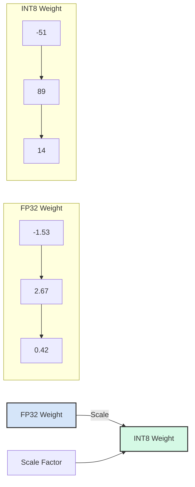

INT8 quantization maps floating-point values to the range [-128, 127] using a scale factor:

```
int_value = round(float_value / scale)
```

Where `scale` is determined to minimize quantization error across the weight distribution.

#### Advantages of INT8

- Good balance between compression and accuracy
- Widely supported in hardware (CPUs, GPUs, specialized accelerators)
- Minimal quality degradation for many models

#### Implementation Approaches

- **Per-tensor quantization**: One scale factor for the entire tensor
- **Per-channel quantization**: Different scale factors for each output channel
- **Mixed-precision**: INT8 for most layers, higher precision for sensitive layers

### 3.2 INT4 Quantization

INT4 quantization further reduces precision to 4 bits, with values in the range [-8, 7]:

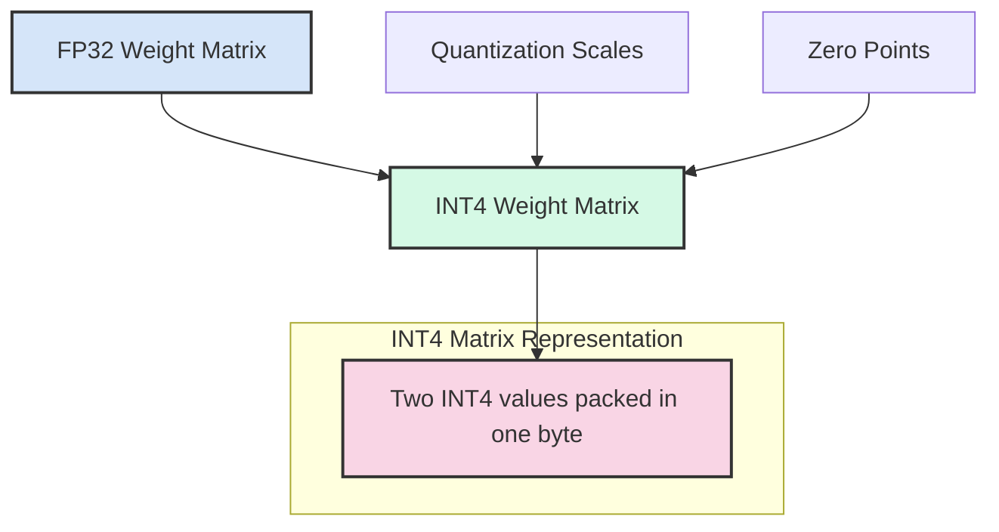

#### Challenges with INT4

- Significant reduction in representational capacity
- Higher quantization error
- More sensitive to outlier values
- Often requires more sophisticated techniques

#### Mitigations

- **Group-wise quantization**: Apply different scales to groups of channels
- **Outlier handling**: Special treatment for extreme values
- **Mixed precision**: Keep sensitive layers or weights in higher precision

## 4. Advanced Quantization Methods: AWQ and GPTQ

### 4.1 AWQ (Activation-aware Weight Quantization)

AWQ is an advanced technique that focuses on preserving the weights that have the most impact on activations:

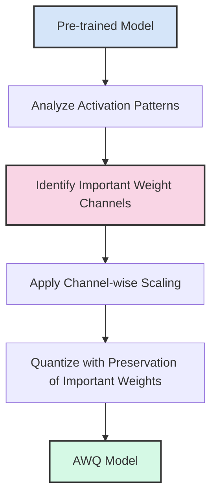

#### Key Features of AWQ

- Analyzes the impact of weights on activations
- Applies per-channel scaling to preserve important weights
- Achieves INT4 quantization with minimal accuracy loss
- No need for retraining or fine-tuning

### 4.2 GPTQ (Generative Pre-trained Transformer Quantization)

GPTQ is a one-shot weight quantization method specifically designed for large language models:

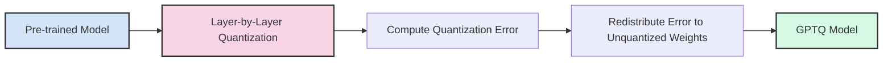

#### Key Features of GPTQ

- Quantizes one layer at a time
- Uses second-order information to minimize quantization error
- Redistributes quantization errors to unquantized weights
- Achieves high compression rates with minimal quality degradation

## 5. Quantization Trade-offs

### 5.1 Quality vs. Efficiency

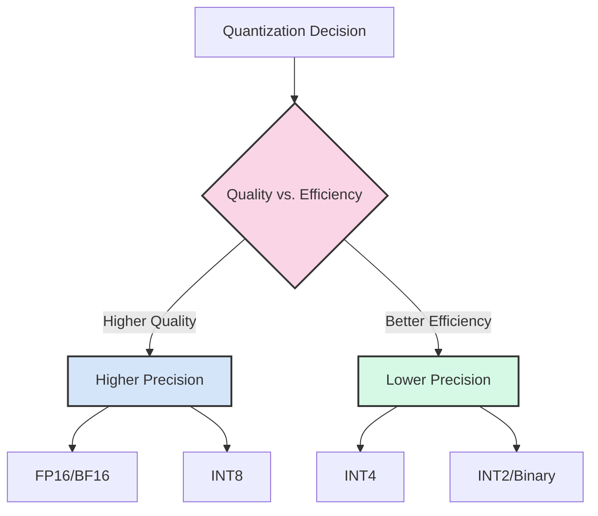

### 5.2 Quantization Impact by Layer Type

Different layers in a model respond differently to quantization:

| Layer Type | Sensitivity to Quantization | Recommended Precision |
|------------|------------------------------|------------------------|
| Embedding | Low | INT8/INT4 |
| Self-attention | Medium | INT8 |
| Feed-forward | High | INT8/FP16 |
| Layer norm | Very high | FP16/BF16 |
| Output head | High | FP16 |

### 5.3 Model Size Considerations

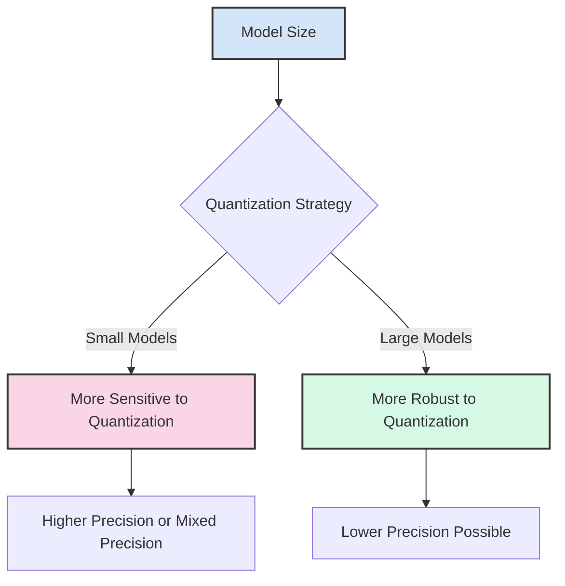

- Larger models (>7B parameters) tend to be more robust to quantization
- Smaller models may require higher precision or more sophisticated techniques
- Model architecture affects quantization robustness

## 6. Measuring Quantization Impact

### 6.1 Key Metrics

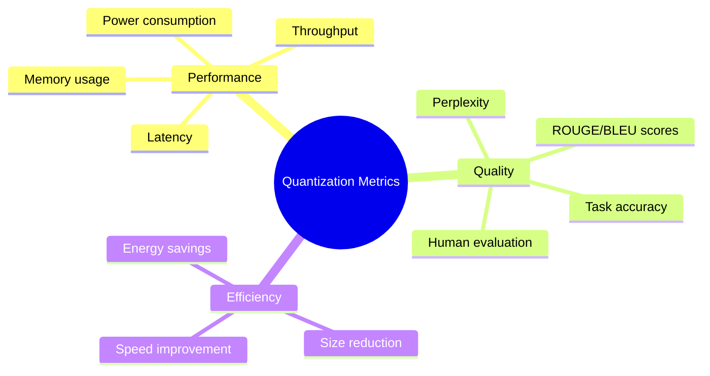

### 6.2 Evaluation Framework

When evaluating quantized models, consider:

1. **Intrinsic Metrics**: Perplexity, next-token prediction accuracy
2. **Task-Specific Metrics**: Performance on downstream tasks
3. **Efficiency Gains**: Memory reduction, inference speedup
4. **Hardware Compatibility**: Performance on target hardware
5. **Deployment Constraints**: Latency requirements, memory limits

## 7. Practical Considerations

### 7.1 Hardware Support

Different hardware platforms have varying support for quantization:

| Hardware | INT8 Support | INT4 Support | Notes |
|----------|-------------|-------------|-------|
| NVIDIA GPUs | Excellent | Good (Ampere+) | Tensor Cores accelerate INT8/INT4 |
| AMD GPUs | Good | Limited | ROCm support improving |
| Intel CPUs | Good | Limited | AVX-512 instructions help |
| Apple Silicon | Good | Limited | Neural Engine acceleration |
| Mobile SoCs | Varies | Limited | Dedicated NPUs help |

### 7.2 Framework Support

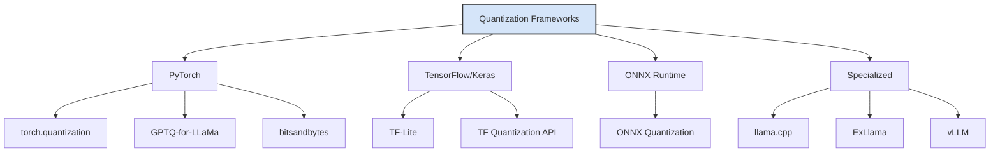

## 8. Best Practices for Quantization

1. **Start with higher precision** and gradually reduce until quality degradation is unacceptable
2. **Use mixed precision** for sensitive layers or operations
3. **Calibrate on representative data** that matches your deployment scenario
4. **Benchmark on target hardware** to ensure expected performance gains
5. **Consider task-specific requirements** when choosing quantization methods
6. **Test edge cases** where quantization might cause issues
7. **Monitor quality metrics** after deployment

## Conclusion

Quantization is a powerful technique for optimizing LLM inference, offering significant efficiency gains with manageable quality trade-offs. By understanding the various quantization methods and their impacts, you can make informed decisions about how to deploy models efficiently while maintaining acceptable quality.

In the next part, we'll implement different quantization techniques and measure their impact on model performance and quality.

## References

1. Dettmers, T., et al. (2022). LLM.int8(): 8-bit Matrix Multiplication for Transformers at Scale. [arXiv:2208.07339](https://arxiv.org/abs/2208.07339)
2. Frantar, E., et al. (2022). GPTQ: Accurate Post-Training Quantization for Generative Pre-trained Transformers. [arXiv:2210.17323](https://arxiv.org/abs/2210.17323)
3. Lin, J., et al. (2023). AWQ: Activation-aware Weight Quantization for LLM Compression and Acceleration. [arXiv:2306.00978](https://arxiv.org/abs/2306.00978)
4. Xiao, G., et al. (2023). SmoothQuant: Accurate and Efficient Post-Training Quantization for Large Language Models. [arXiv:2211.10438](https://arxiv.org/abs/2211.10438)
