# Day 32: KV Caching, Paged Attention, and Batching Optimizations

Efficient inference is critical for deploying large language models in production environments. Today, we'll explore advanced techniques for optimizing LLM inference, focusing on KV caching, paged attention, FlashAttention, and batching/scheduling strategies.

## Learning Objectives

- Understand the principles of KV caching and its impact on inference efficiency
- Explore paged attention mechanisms for memory optimization
- Learn about FlashAttention and other attention optimization algorithms
- Implement batching and scheduling techniques for improved throughput
- Measure and analyze the performance gains from these optimizations

## 1. Understanding KV Caching

Key-Value (KV) caching is a fundamental optimization technique for autoregressive language models that significantly reduces the computational cost of generating sequences.

### 1.1 The Problem: Redundant Computation

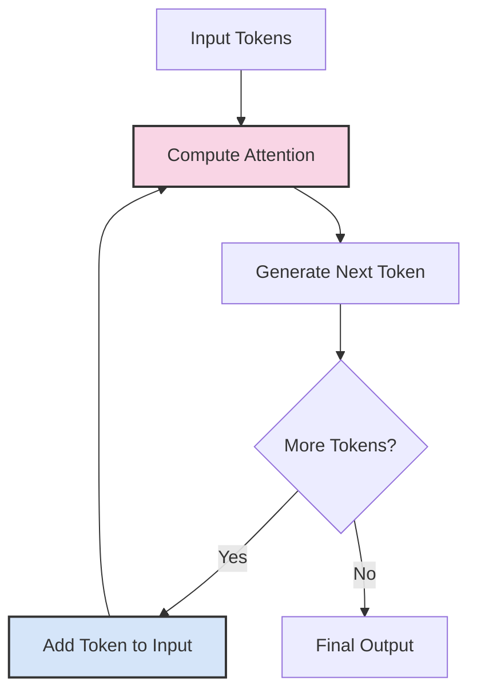

Without KV caching, each time we generate a new token, we recompute the key (K) and value (V) matrices for all tokens in the sequence, leading to redundant computation.

### 1.2 The Solution: KV Caching

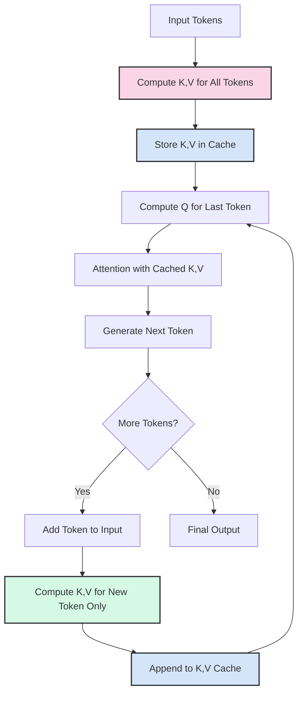

With KV caching:
1. We compute and store the key (K) and value (V) matrices for all tokens in the initial input
2. For each new token, we only compute K and V for that token and append to the cache
3. We reuse the cached K and V values for all previous tokens
4. This reduces the computational complexity from O(n²) to O(n) for sequence generation

### 1.3 Memory-Computation Trade-off

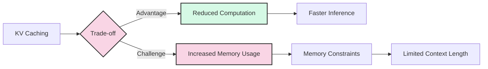

KV caching trades memory for computation:
- **Advantages**: Significantly reduces computation, leading to faster inference
- **Challenges**: Increases memory usage, potentially limiting the maximum context length

### 1.4 KV Cache Size Analysis

The size of the KV cache depends on several factors:

| Factor | Formula | Example |
|--------|---------|---------|
| Sequence Length | L | 2048 tokens |
| Hidden Size | H | 4096 dimensions |
| Number of Layers | N | 32 layers |
| Number of Attention Heads | A | 32 heads |
| Data Type | D | 2 bytes (FP16) |
| KV Cache Size | 2 × N × L × H × D | 2 × 32 × 2048 × 4096 × 2 = 1.07 GB |

For larger models like GPT-4, the KV cache can easily exceed 10GB for long contexts, making memory management critical.

## 2. Paged Attention

Paged Attention is an innovative technique introduced by vLLM that addresses the memory management challenges of KV caching.

### 2.1 The Problem: Contiguous Memory Allocation

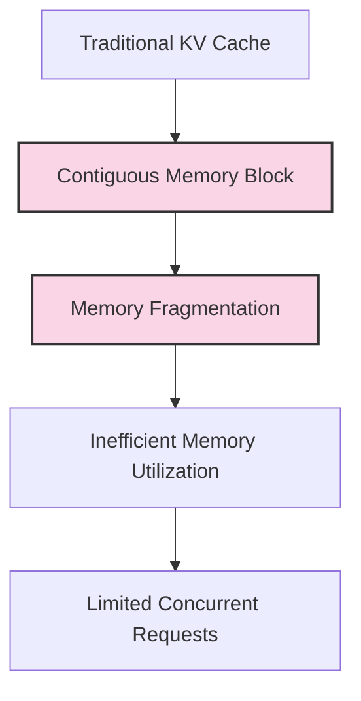

Traditional KV caching allocates contiguous memory blocks for each sequence, leading to:
- Memory fragmentation
- Inefficient memory utilization
- Limited number of concurrent requests

### 2.2 The Solution: Paged Memory


Paged Attention applies virtual memory concepts to KV caching:
1. Divides the KV cache into fixed-size blocks or "pages"
2. Allocates pages non-contiguously in physical memory
3. Uses a block table to map logical positions to physical memory locations
4. Enables flexible memory management and sharing across requests

### 2.3 Benefits of Paged Attention

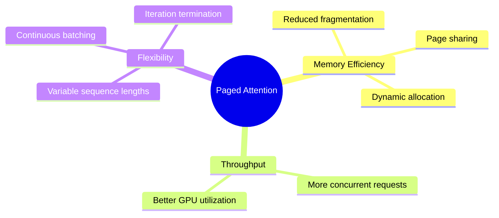

Key advantages:
- **Memory Efficiency**: Reduces fragmentation, enables dynamic allocation and sharing
- **Increased Throughput**: Supports more concurrent requests and better GPU utilization
- **Flexibility**: Handles variable sequence lengths and enables continuous batching

### 2.4 Implementation Considerations

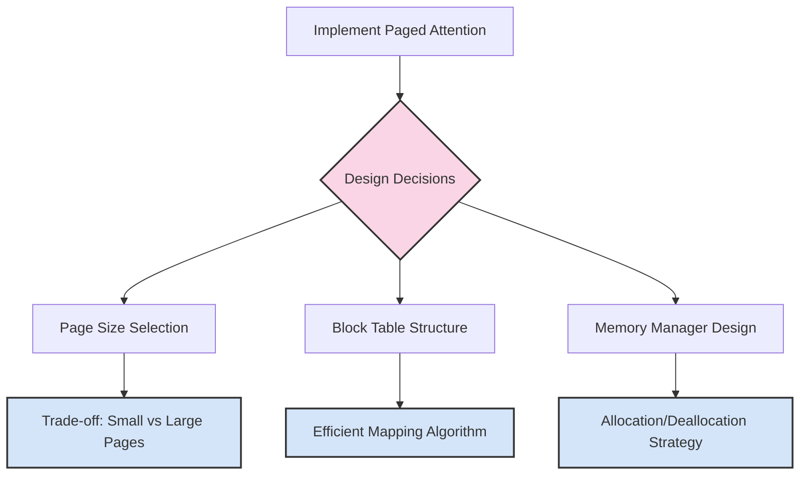

When implementing paged attention:
- **Page Size**: Balance between flexibility (small pages) and overhead (large pages)
- **Block Table**: Design efficient mapping from logical to physical addresses
- **Memory Manager**: Implement efficient allocation and deallocation strategies

## 3. FlashAttention and Attention Optimizations

FlashAttention and similar algorithms optimize the attention mechanism itself, reducing both memory usage and computation time.

### 3.1 Standard Attention Computation

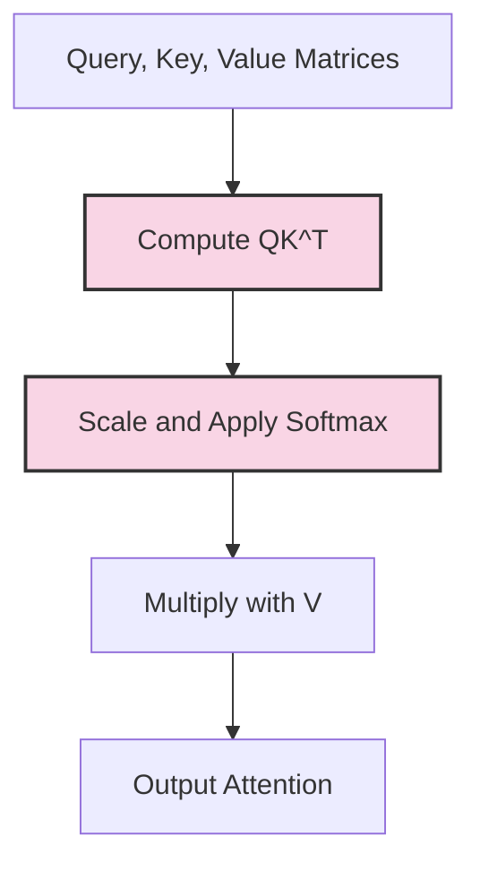

Standard attention computation faces two main challenges:
1. **Memory Bottleneck**: Storing the full attention matrix (N×N) in high-precision
2. **I/O Bound**: Multiple reads/writes to high-bandwidth memory (HBM)

### 3.2 FlashAttention Algorithm

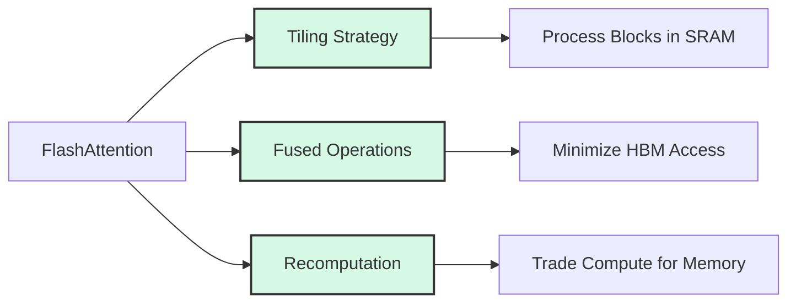

FlashAttention optimizes attention computation through:
1. **Block-wise Processing**: Divides matrices into blocks that fit in fast SRAM
2. **Operation Fusion**: Combines multiple operations to reduce memory access
3. **Recomputation**: Trades additional computation for reduced memory usage

### 3.3 FlashAttention-2 Improvements

FlashAttention-2 further optimizes the algorithm with:
- Improved tiling strategies for different GPU architectures
- Online softmax algorithm for better numerical stability
- Optimized memory access patterns
- Support for different attention mask patterns

### 3.4 Performance Comparison

```mermaid
flowchart TD
    A[Attention Implementations] --> B[Standard Attention]
    A --> C[Memory-Efficient Attention]
    A --> D[FlashAttention]
    A --> E[FlashAttention-2]
    
    B --> F[Memory: O(N²)]
    C --> G[Memory: O(N)]
    D --> H[Memory: O(N)]
    E --> I[Memory: O(N)]
    
    F --> J[Speed: Baseline]
    G --> K[Speed: 1-2x]
    H --> L[Speed: 2-4x]
    I --> M[Speed: 3-5x]
    
    style F fill:#f9d5e5,stroke:#333,stroke-width:2px
    style L fill:#d5f9e5,stroke:#333,stroke-width:2px
    style M fill:#d5f9e5,stroke:#333,stroke-width:2px
```

FlashAttention and its variants significantly outperform standard attention implementations in both memory efficiency and speed.

## 4. Batching and Scheduling Strategies

Effective batching and scheduling are crucial for maximizing throughput in production LLM deployments.

### 4.1 Static vs. Dynamic Batching

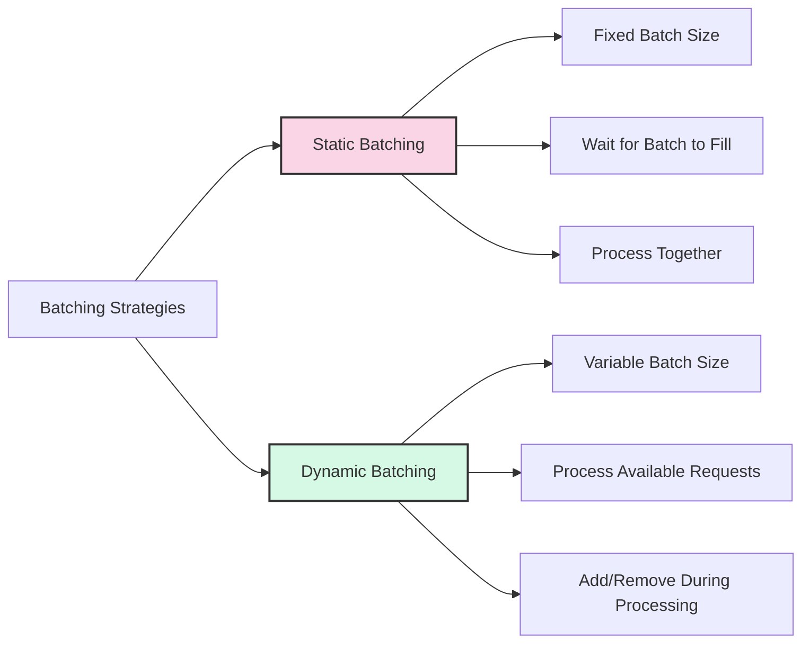

**Static Batching**:
- Fixed batch size
- Waits for batch to fill before processing
- All sequences processed together until completion

**Dynamic Batching**:
- Variable batch size
- Processes available requests immediately
- Can add or remove sequences during processing

### 4.2 Continuous Batching

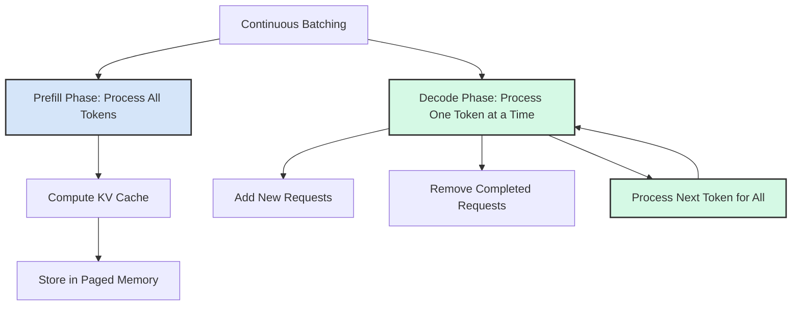

Continuous batching optimizes throughput by:
1. **Prefill Phase**: Processing all tokens in the prompt at once
2. **Decode Phase**: Processing one token at a time for all active requests
3. **Dynamic Request Management**: Adding new requests and removing completed ones on-the-fly

### 4.3 Iteration-level Scheduling

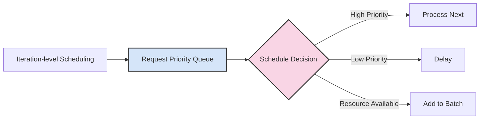

Advanced scheduling strategies include:
- **Priority-based Scheduling**: Prioritize certain requests based on criteria
- **Fair Sharing**: Ensure resources are distributed fairly among users
- **Preemption**: Pause lower-priority requests to handle higher-priority ones
- **Resource-aware Scheduling**: Consider memory and compute constraints

### 4.4 Throughput vs. Latency Trade-offs

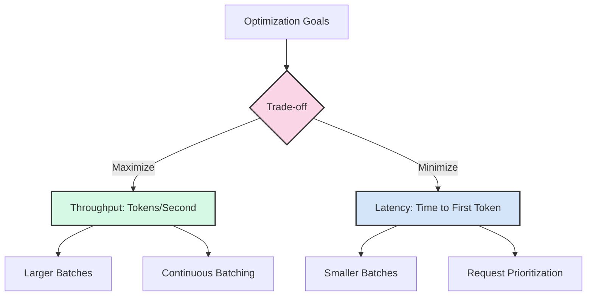

Different applications have different requirements:
- **Throughput-oriented**: Maximize total tokens generated per second (e.g., batch processing)
- **Latency-oriented**: Minimize time to first token (e.g., interactive applications)
- **Balanced**: Find optimal trade-off based on application needs

## 5. Implementation Considerations

### 5.1 Memory Management

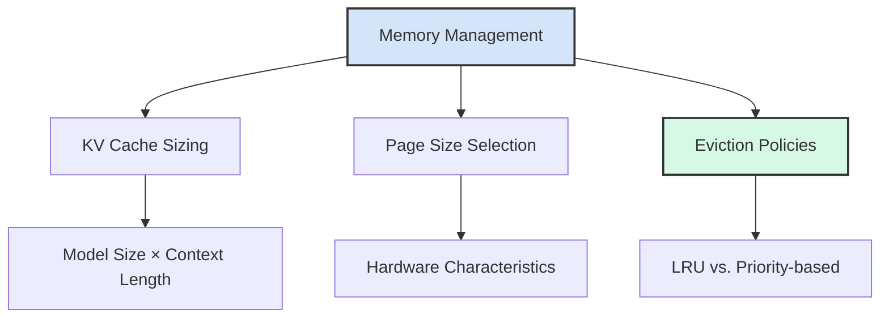

Effective memory management requires:
- **Careful KV Cache Sizing**: Based on model size, context length, and available memory
- **Optimal Page Size**: Aligned with hardware characteristics
- **Smart Eviction Policies**: When to remove entries from the cache

### 5.2 Hardware Considerations

Different hardware accelerators have different optimization requirements:

| Hardware | Key Optimizations | Considerations |
|----------|-------------------|----------------|
| NVIDIA GPUs | CUDA kernels, Tensor Cores | SM count, memory bandwidth |
| AMD GPUs | ROCm optimizations | CU count, memory hierarchy |
| Intel GPUs | oneAPI optimizations | Xe cores, shared memory |
| Custom ASICs | Hardware-specific kernels | Memory architecture |

### 5.3 Software Frameworks

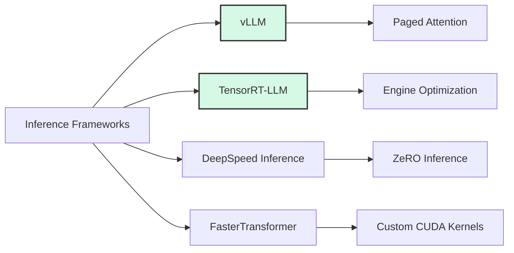

Several frameworks implement these optimizations:
- **vLLM**: Pioneered paged attention and continuous batching
- **TensorRT-LLM**: Focuses on NVIDIA GPU optimization
- **DeepSpeed Inference**: Offers ZeRO-Inference for memory optimization
- **FasterTransformer**: Provides custom CUDA kernels for transformer operations

## 6. Measuring Performance Gains

### 6.1 Key Metrics

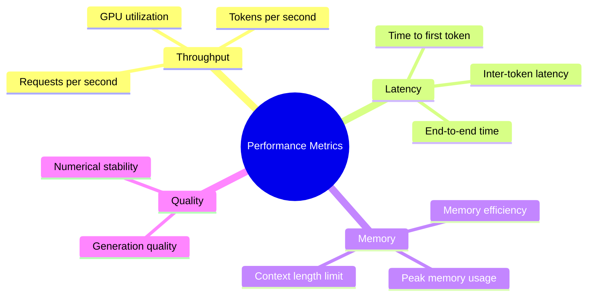

When evaluating optimizations, measure:
- **Throughput**: Tokens per second, requests per second
- **Latency**: Time to first token, inter-token latency
- **Memory Efficiency**: Peak memory usage, maximum context length
- **Quality Impact**: Any changes in generation quality

### 6.2 Benchmarking Methodology

For accurate benchmarking:
1. **Realistic Workloads**: Use representative request patterns
2. **Varied Batch Sizes**: Test with different batch sizes
3. **Mixed Sequence Lengths**: Include both short and long sequences
4. **Sustained Testing**: Measure performance over extended periods
5. **Controlled Environment**: Minimize external variables

## Conclusion

KV caching, paged attention, FlashAttention, and advanced batching strategies are powerful techniques for optimizing LLM inference. By understanding and implementing these optimizations, you can significantly improve the performance and efficiency of your LLM deployments.

In the next part, we'll implement these techniques and measure their impact on throughput and latency.

## References

1. Dao, T., et al. (2022). FlashAttention: Fast and Memory-Efficient Exact Attention with IO-Awareness. [arXiv:2205.14135](https://arxiv.org/abs/2205.14135)
2. Dao, T., et al. (2023). FlashAttention-2: Faster Attention with Better Parallelism and Work Partitioning. [arXiv:2307.08691](https://arxiv.org/abs/2307.08691)
3. Kwon, W., et al. (2023). Efficient Memory Management for Large Language Model Serving with PagedAttention. [arXiv:2309.06180](https://arxiv.org/abs/2309.06180)
4. vLLM: Easy, Fast, and Cheap LLM Serving with PagedAttention. [GitHub](https://github.com/vllm-project/vllm)
5. NVIDIA TensorRT-LLM. [GitHub](https://github.com/NVIDIA/TensorRT-LLM)
