# Day 33: LLM Serving Stacks and Deployment

Deploying large language models efficiently requires specialized serving stacks that can handle the unique challenges of LLM inference. Today, we'll explore the leading LLM serving frameworks, their architectures, and how to deploy models with streaming capabilities.

## Learning Objectives

- Understand the architecture of modern LLM serving stacks
- Compare different serving frameworks: vLLM, TGI, TensorRT-LLM
- Learn how to deploy a model server locally
- Implement streaming API endpoints for LLMs
- Explore autoscaling strategies for production deployments

## 1. Introduction to LLM Serving

Serving large language models in production presents unique challenges compared to traditional ML models:

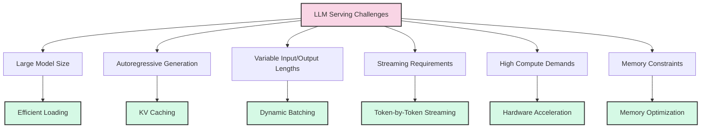

### 1.1 The LLM Serving Stack

A complete LLM serving stack typically consists of multiple layers:

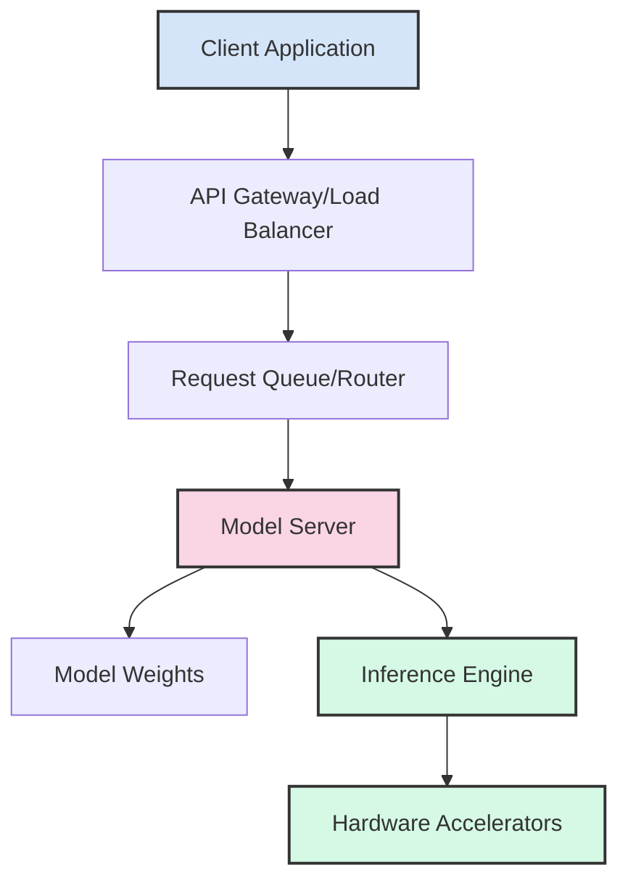

Each layer plays a critical role:
- **API Gateway**: Handles authentication, rate limiting, and request routing
- **Request Queue**: Buffers incoming requests and manages prioritization
- **Model Server**: Orchestrates model loading, batching, and inference
- **Inference Engine**: Optimizes the actual computation on hardware
- **Hardware Accelerators**: GPUs, TPUs, or specialized hardware

## 2. Leading LLM Serving Frameworks

Several specialized frameworks have emerged to address the challenges of LLM serving:

### 2.1 vLLM

vLLM is an open-source library for fast LLM inference and serving, developed by UC Berkeley.

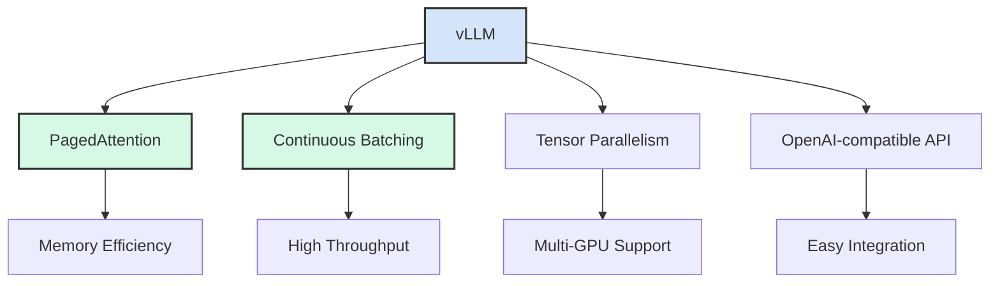

**Key Features**:
- **PagedAttention**: Memory-efficient KV cache management
- **Continuous Batching**: Dynamic request handling for optimal throughput
- **Tensor Parallelism**: Distribute model across multiple GPUs
- **OpenAI-compatible API**: Drop-in replacement for OpenAI's API
- **Streaming Support**: Token-by-token streaming for responsive UIs

### 2.2 Text Generation Inference (TGI)

TGI is Hugging Face's solution for deploying and serving LLMs, optimized for production use.

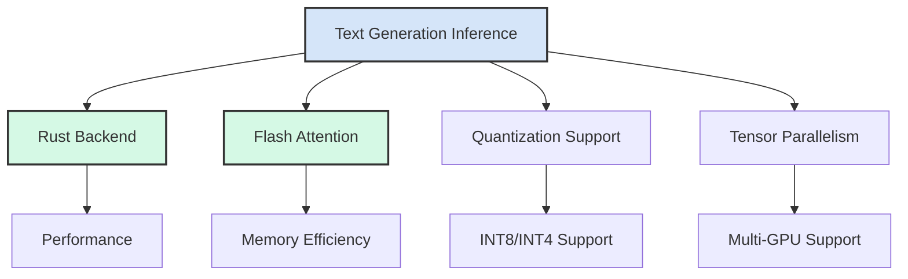

**Key Features**:
- **Rust Backend**: High-performance, memory-safe implementation
- **Flash Attention**: Optimized attention implementation
- **Quantization Support**: INT8 and INT4 quantization
- **Seamless Hugging Face Integration**: Works with Hugging Face models
- **Docker Deployment**: Easy containerized deployment

### 2.3 TensorRT-LLM

NVIDIA's TensorRT-LLM is a toolkit for optimizing LLMs for deployment on NVIDIA GPUs.

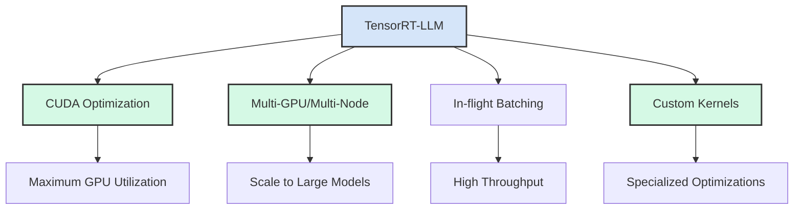

**Key Features**:
- **CUDA Optimization**: Highly optimized for NVIDIA GPUs
- **Multi-GPU/Multi-Node**: Scale to very large models
- **In-flight Batching**: Dynamic request handling
- **Custom CUDA Kernels**: Specialized implementations for LLM operations
- **INT8/FP8 Quantization**: Advanced quantization support

### 2.4 Comparison of Serving Frameworks

| Feature | vLLM | TGI | TensorRT-LLM |
|---------|------|-----|--------------|
| Memory Efficiency | ★★★★★ | ★★★★☆ | ★★★★☆ |
| Throughput | ★★★★★ | ★★★★☆ | ★★★★★ |
| Ease of Use | ★★★★☆ | ★★★★★ | ★★★☆☆ |
| Model Support | ★★★★☆ | ★★★★★ | ★★★☆☆ |
| Multi-GPU | ★★★★☆ | ★★★★☆ | ★★★★★ |
| Quantization | ★★★☆☆ | ★★★★☆ | ★★★★★ |
| Streaming | ★★★★★ | ★★★★★ | ★★★★☆ |
| Community | ★★★★☆ | ★★★★★ | ★★★☆☆ |

## 3. Serving Architecture Patterns

### 3.1 Single-Instance Serving

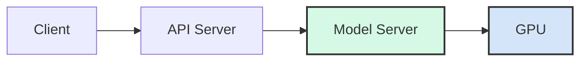

Suitable for:
- Development and testing
- Low-traffic applications
- Single-GPU deployments

### 3.2 Distributed Serving

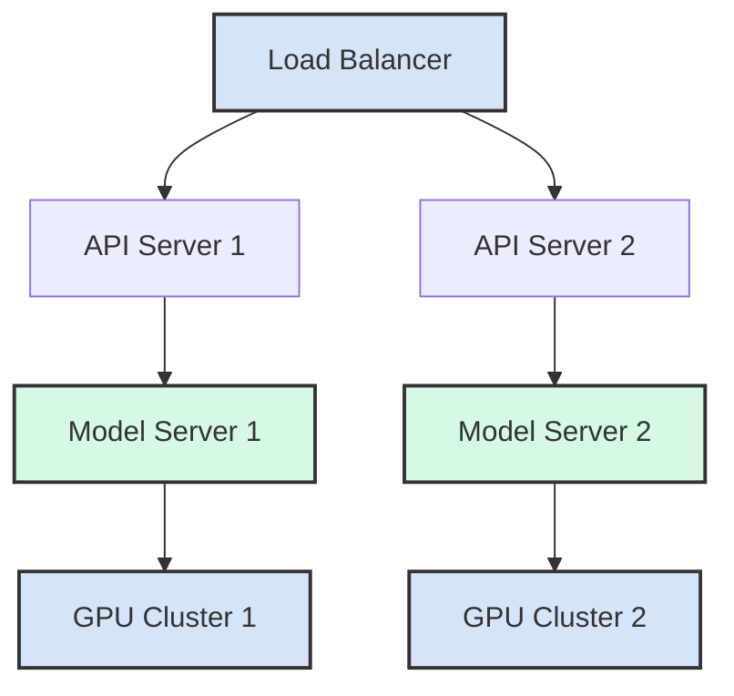

Suitable for:
- High-traffic applications
- Multi-GPU deployments
- High-availability requirements

### 3.3 Model-as-a-Service

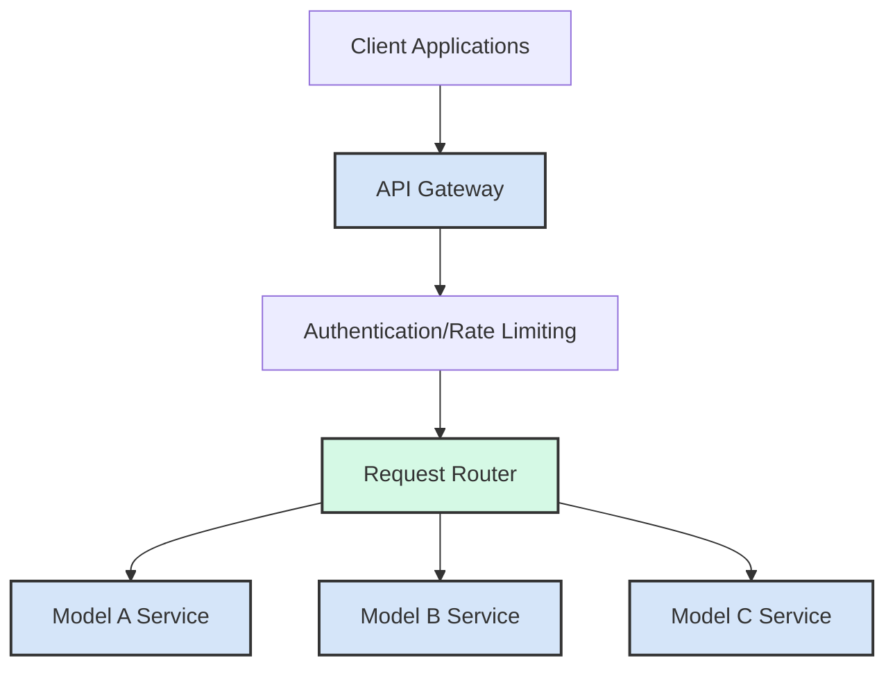

Suitable for:
- Multi-model deployments
- SaaS offerings
- Enterprise solutions

## 4. Streaming API Implementation

Streaming is crucial for responsive LLM applications, allowing tokens to be displayed as they're generated.

### 4.1 Streaming Architecture

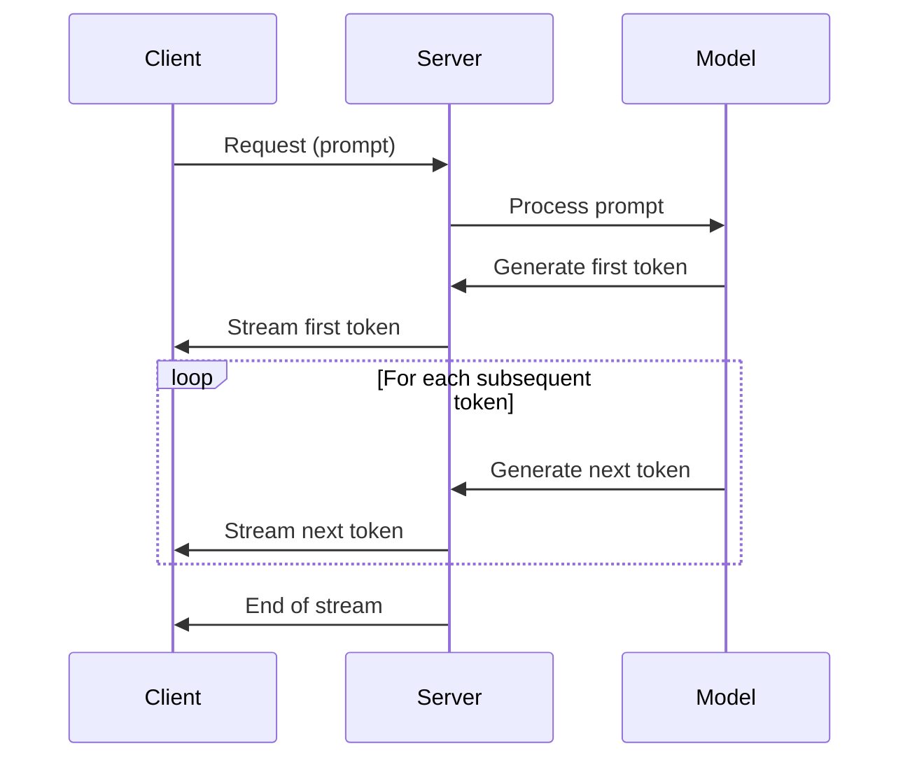

### 4.2 Streaming Protocols

Several protocols can be used for streaming:

| Protocol | Pros | Cons | Use Cases |
|----------|------|------|-----------|
| Server-Sent Events (SSE) | Simple, HTTP-based | One-way communication | Web applications |
| WebSockets | Bidirectional, efficient | More complex | Interactive applications |
| gRPC | High performance, strong typing | Requires client support | Microservices |
| HTTP Chunked Transfer | Simple, widely supported | Less efficient | Basic web integration |

## 5. Autoscaling Strategies

Efficient autoscaling is essential for cost-effective LLM deployment.

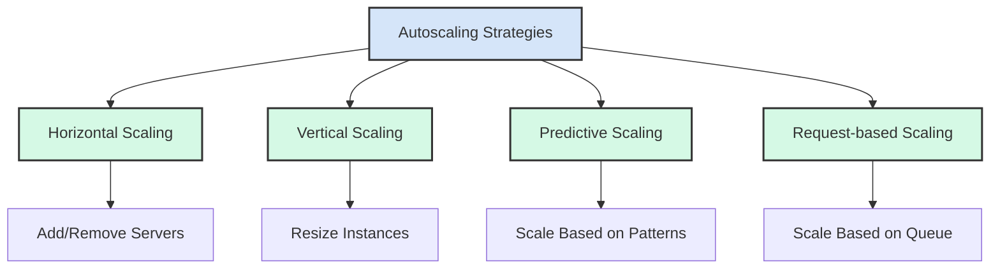

### 5.1 Key Metrics for Autoscaling

When implementing autoscaling, monitor these key metrics:

1. **Request Queue Length**: Number of pending requests
2. **GPU Utilization**: Percentage of GPU compute being used
3. **Memory Usage**: GPU memory consumption
4. **Latency**: Time to first token and tokens per second
5. **Error Rate**: Failed requests or timeouts

### 5.2 Autoscaling Challenges for LLMs

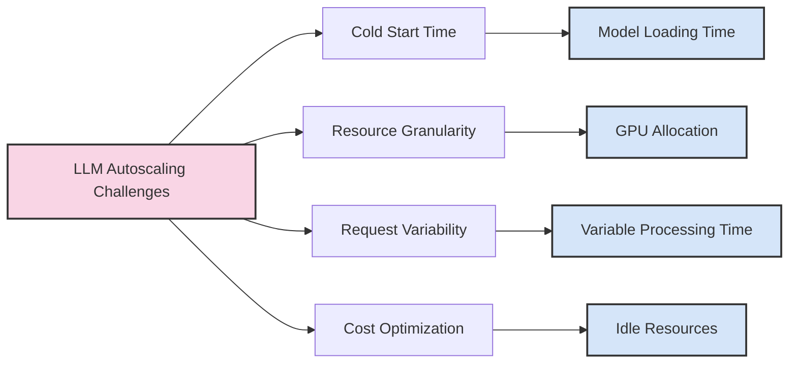

LLMs present unique autoscaling challenges:
- **Cold Start Latency**: Large models take time to load
- **Resource Granularity**: GPUs can't be partially allocated
- **Request Variability**: Processing time varies widely
- **Cost Optimization**: Balancing performance and cost

## 6. Deployment Platforms

Several platforms are available for deploying LLM serving stacks:

### 6.1 Self-hosted Options

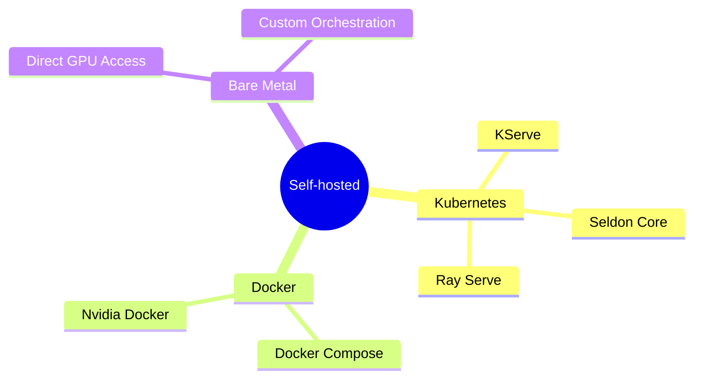

### 6.2 Cloud Platforms

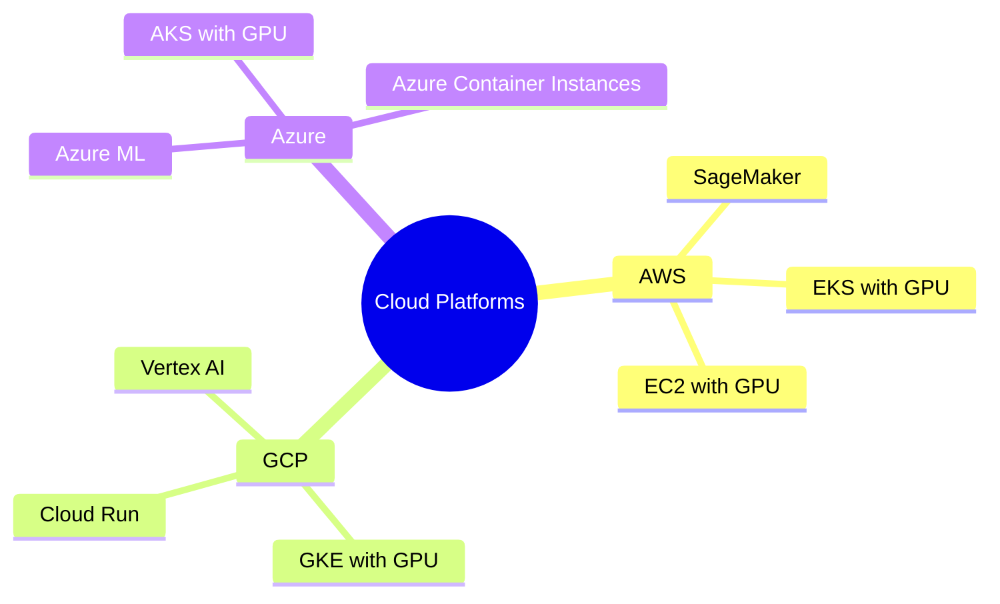

### 6.3 Specialized LLM Platforms

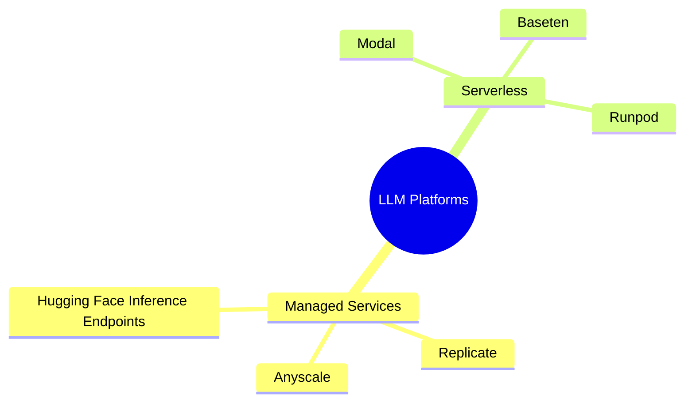

## 7. Production Considerations

When deploying LLMs in production, consider these additional factors:

### 7.1 High Availability

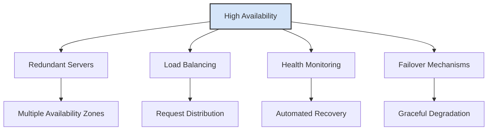

### 7.2 Security Considerations

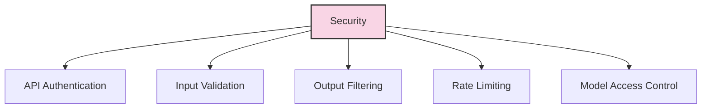

### 7.3 Monitoring and Observability

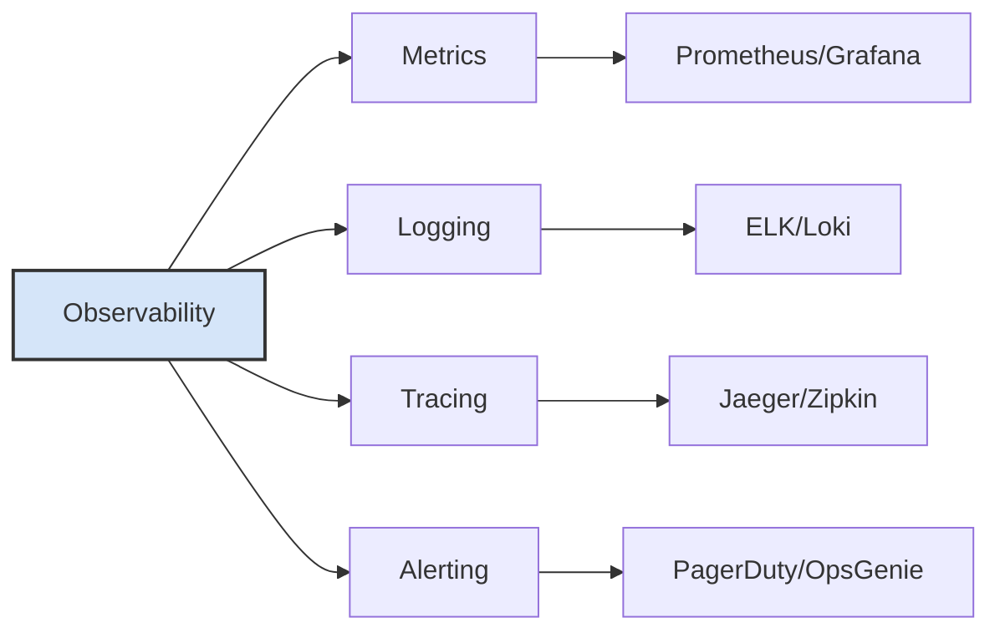

## Conclusion

Deploying LLMs efficiently requires specialized serving stacks that address the unique challenges of large language models. By understanding the architecture of modern LLM serving frameworks and implementing appropriate deployment strategies, you can build scalable, high-performance LLM applications.

In the next part, we'll implement a local model server using one of these frameworks and expose a streaming API endpoint.

## References

1. vLLM: Efficient Memory Management for Large Language Model Serving with PagedAttention. [GitHub](https://github.com/vllm-project/vllm)
2. Hugging Face Text Generation Inference. [GitHub](https://github.com/huggingface/text-generation-inference)
3. NVIDIA TensorRT-LLM. [GitHub](https://github.com/NVIDIA/TensorRT-LLM)
4. Kwon, W., et al. (2023). Efficient Memory Management for Large Language Model Serving with PagedAttention. [arXiv:2309.06180](https://arxiv.org/abs/2309.06180)
5. Frantar, E., et al. (2023). SARATHI: Efficient LLM Inference by Piggybacking Decodes with Chunked Prefills. [arXiv:2308.16369](https://arxiv.org/abs/2308.16369)
