# Day 34: Cost Optimization and Multi-Tenancy

Cost optimization is critical for production LLM deployments. Today we'll explore strategies to reduce costs while maintaining performance, including caching, rate limiting, and multi-tenant architectures.

## Learning Objectives

- Understand cost drivers in LLM serving
- Implement prompt and response caching strategies
- Design rate limiting for fair resource allocation
- Architect multi-tenant LLM systems
- Create cost/performance dashboards

## 1. Understanding LLM Cost Drivers

### 🌟 Layman's Explanation

**The Problem**: Running large language models is expensive. It's like running a high-performance sports car - it consumes a lot of fuel (compute resources) and requires premium maintenance (GPU infrastructure).

**The Solution**: We need smart strategies to reduce costs without sacrificing quality, similar to how hybrid cars maintain performance while using less fuel.

### 📚 Basic Understanding

LLM serving costs come from several sources:

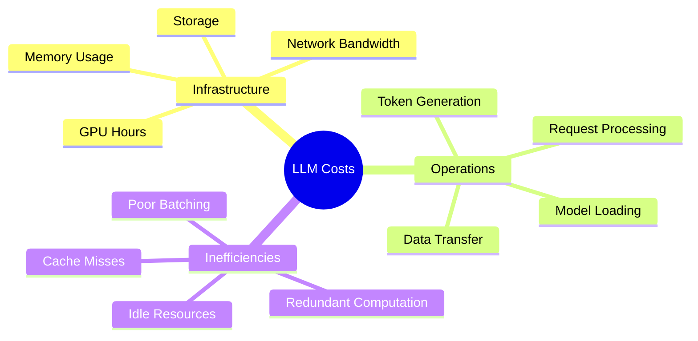

### 🔬 Intermediate Level

Cost optimization strategies can be categorized into several approaches:

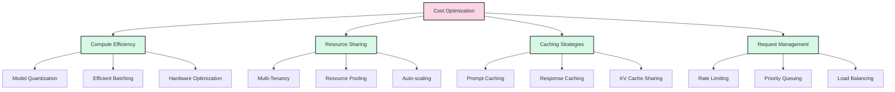

## 2. Prompt and Response Caching

### 2.1 Prompt Caching

Prompt caching stores the KV cache for common prompt prefixes, eliminating redundant computation.

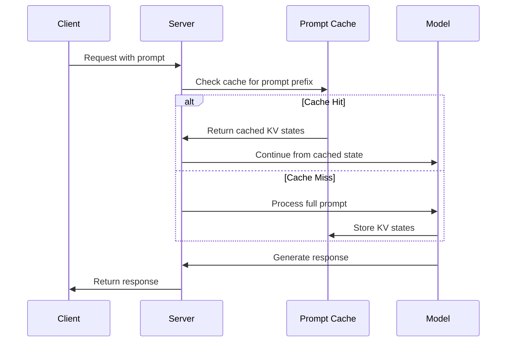

**Benefits**:
- Reduces computation for repeated prompts
- Faster response times for cached content
- Lower GPU utilization for common patterns

**Implementation Considerations**:
- Cache key design (exact match vs. similarity)
- Cache eviction policies (LRU, LFU, TTL)
- Memory management for KV states
- Cache hit rate optimization

### 2.2 Response Caching

Response caching stores complete responses for identical requests.

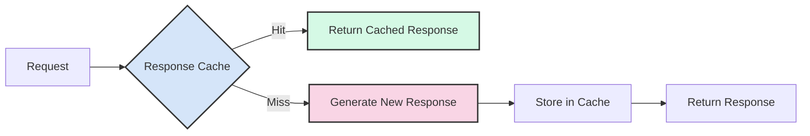

**Cache Key Strategies**:
1. **Exact Match**: Hash of complete prompt and parameters
2. **Semantic Similarity**: Embedding-based similarity matching
3. **Template-based**: Parameterized prompts with variable substitution

### 2.3 Advanced Caching Strategies

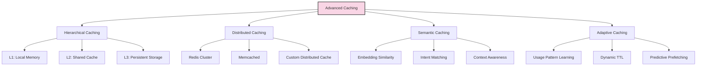

## 3. Rate Limiting Strategies

Rate limiting controls resource usage and ensures fair access across users.

### 3.1 Rate Limiting Algorithms

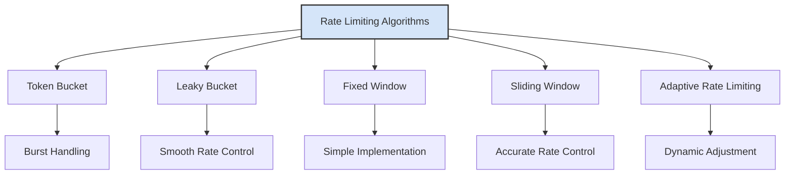

### 3.2 Multi-Dimensional Rate Limiting

For LLM services, rate limiting should consider multiple dimensions:

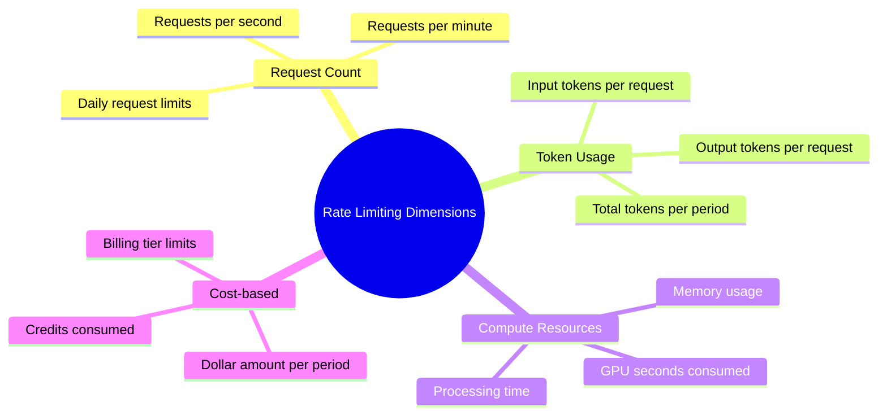

### 3.3 Rate Limiting Architecture

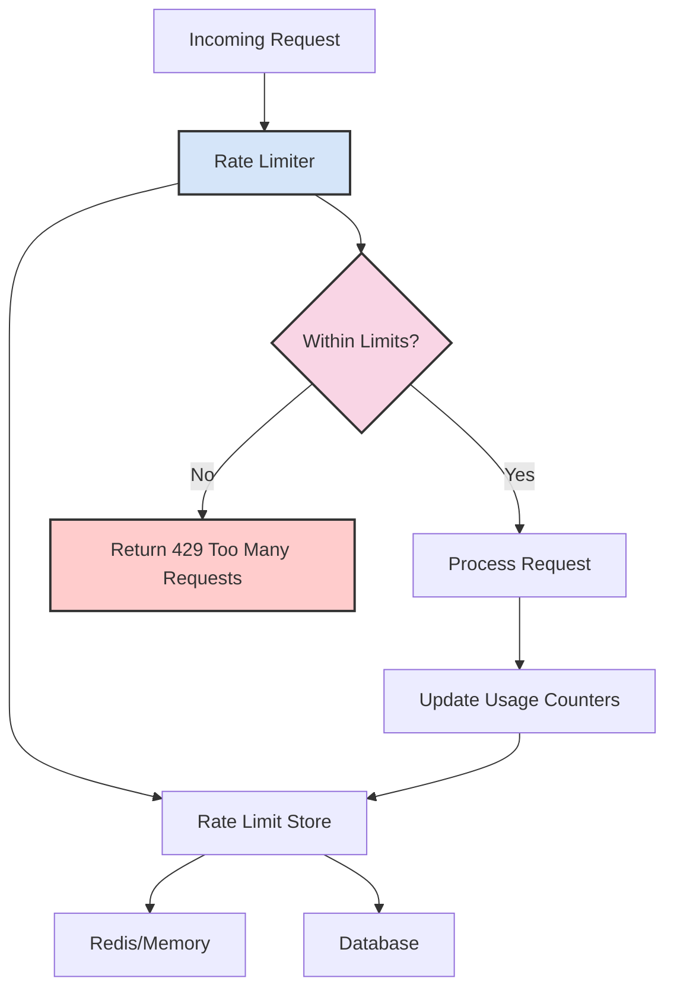

## 4. Multi-Tenancy Architecture

Multi-tenancy allows multiple customers to share the same infrastructure while maintaining isolation.

### 4.1 Multi-Tenancy Models

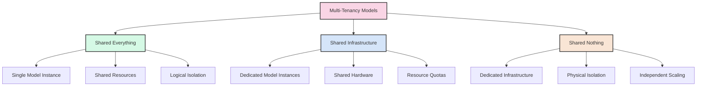

### 4.2 Tenant Isolation Strategies

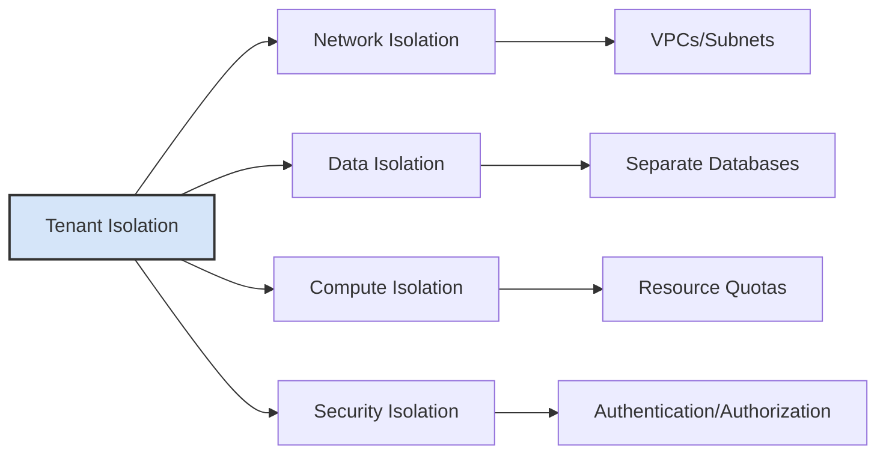

### 4.3 Resource Allocation Patterns

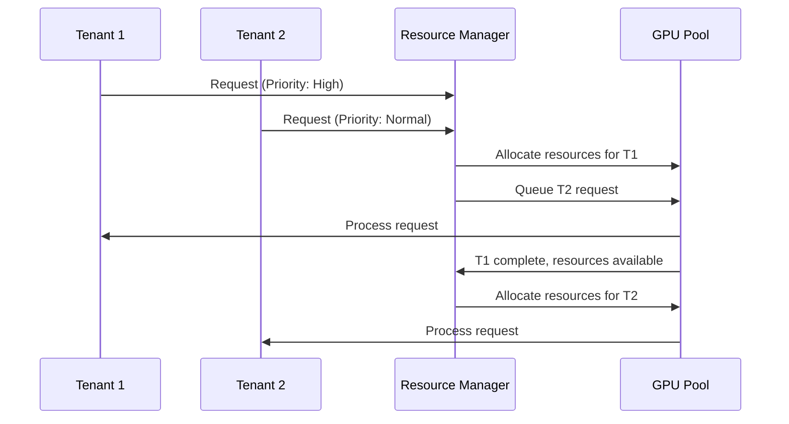

## 5. Cost Monitoring and Optimization

### 5.1 Cost Metrics and KPIs

Key metrics to track for cost optimization:

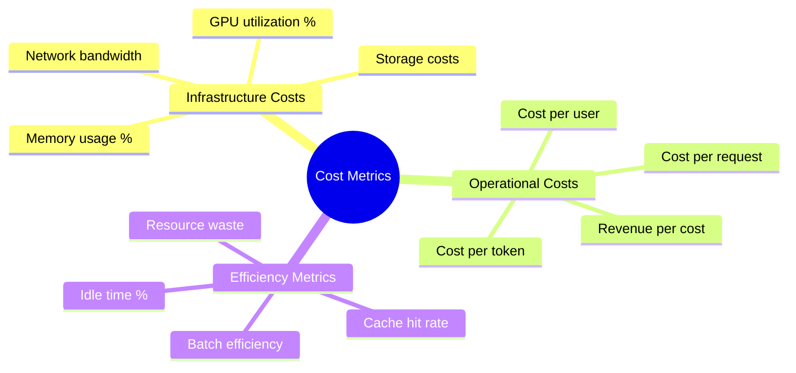

### 5.2 Cost Optimization Dashboard

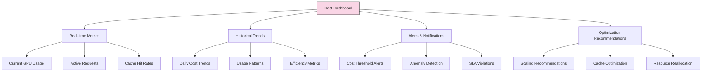

### 5.3 Cost Optimization Strategies

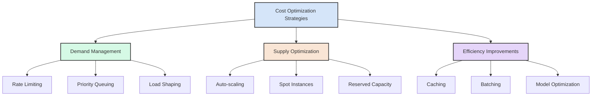

## 6. Implementation Architecture

### 6.1 Complete Multi-Tenant LLM System

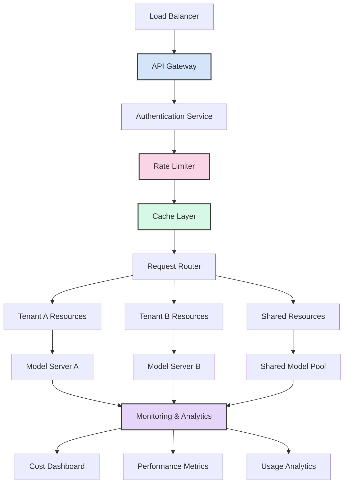

### 6.2 Cost Optimization Feedback Loop

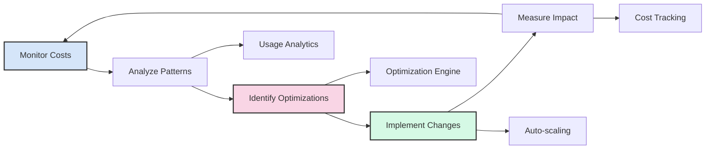

## 7. Best Practices

### 7.1 Caching Best Practices

1. **Cache Key Design**: Use consistent, collision-resistant keys
2. **TTL Strategy**: Balance freshness with hit rates
3. **Eviction Policy**: Implement appropriate LRU/LFU policies
4. **Cache Warming**: Preload frequently accessed content
5. **Monitoring**: Track hit rates and performance impact

### 7.2 Rate Limiting Best Practices

1. **Graceful Degradation**: Provide meaningful error messages
2. **Burst Handling**: Allow reasonable burst capacity
3. **Fair Queuing**: Implement per-tenant fairness
4. **Adaptive Limits**: Adjust based on system capacity
5. **Monitoring**: Track limit violations and adjust thresholds

### 7.3 Multi-Tenancy Best Practices

1. **Resource Isolation**: Prevent noisy neighbor problems
2. **Security**: Implement proper tenant data isolation
3. **Scalability**: Design for independent tenant scaling
4. **Monitoring**: Per-tenant metrics and alerting
5. **SLA Management**: Different service levels per tenant

## Conclusion

Cost optimization in LLM serving requires a multi-faceted approach combining caching, rate limiting, and efficient multi-tenancy. By implementing these strategies systematically and monitoring their impact, organizations can significantly reduce operational costs while maintaining high service quality.

In the practical exercises, we'll implement these concepts and build a cost/performance dashboard to track optimization efforts.

## References

1. Caching Strategies for Large Language Models. [Research Paper]
2. Multi-Tenant Architecture Patterns. [Architecture Guide]
3. Rate Limiting Algorithms and Implementation. [Technical Guide]
4. Cost Optimization in Cloud Computing. [Best Practices]
5. LLM Serving Infrastructure Design. [System Design Guide]
