# Day 35: Observability and Monitoring

Observability is crucial for maintaining reliable LLM serving systems in production. Today we'll implement comprehensive monitoring, logging, tracing, and alerting for LLM services.

## Learning Objectives

- Understand the three pillars of observability
- Implement structured logging for LLM services
- Set up distributed tracing for request flows
- Create metrics dashboards for performance monitoring
- Build GPU monitoring and alerting systems

## 1. The Three Pillars of Observability

### 🌟 Layman's Explanation

**The Problem**: When your LLM service breaks at 3 AM, you need to quickly understand what went wrong, where, and why. It's like being a detective solving a crime - you need evidence (logs), a timeline (traces), and measurements (metrics).

**The Solution**: Observability provides the tools to see inside your system's behavior, even when you can't predict what might go wrong.

### 📚 Basic Understanding

Observability consists of three fundamental pillars:


### 🔬 Intermediate Level

Each pillar serves a specific purpose in understanding system behavior:


## 2. Structured Logging for LLM Services

### 2.1 Log Levels and Categories


### 2.2 Log Structure for LLM Services

Essential fields for LLM service logs:

```json
{
  "timestamp": "2024-01-15T10:30:00.123Z",
  "level": "INFO",
  "service": "llm-inference",
  "request_id": "req_abc123",
  "tenant_id": "tenant_xyz",
  "model_name": "gpt-3.5-turbo",
  "event": "inference_complete",
  "duration_ms": 1250,
  "input_tokens": 150,
  "output_tokens": 75,
  "cost": 0.00225,
  "cached": false,
  "gpu_id": "gpu-0",
  "batch_size": 4,
  "queue_time_ms": 50
}
```

### 2.3 Log Aggregation Architecture


## 3. Distributed Tracing

### 3.1 Trace Anatomy for LLM Requests


### 3.2 Span Hierarchy and Context


### 3.3 Trace Sampling Strategies


## 4. Metrics and KPIs

### 4.1 LLM Service Metrics Hierarchy


### 4.2 Key Performance Indicators (KPIs)


### 4.3 Metrics Collection Architecture


## 5. GPU Monitoring

### 5.1 GPU Metrics to Monitor


### 5.2 GPU Monitoring Stack


### 5.3 GPU Alert Conditions

```mermaid
flowchart LR
    A[GPU Metrics] --> B{Threshold Check}
    
    B -->|GPU Util < 50%| C[Underutilization Alert]
    B -->|Memory > 90%| D[Memory Pressure Alert]
    B -->|Temp > 80°C| E[Thermal Alert]
    B -->|Errors > 0| F[Hardware Error Alert]
    
    C --> G[Scale Down Recommendation]
    D --> H[Memory Optimization Needed]
    E --> I[Cooling Issue Investigation]
    F --> J[Hardware Replacement Required]
    
    style B fill:#d5e5f9,stroke:#333,stroke-width:2px
    style E fill:#f9d5e5,stroke:#333,stroke-width:2px
    style F fill:#ffcccc,stroke:#333,stroke-width:2px
```



## 6. Alerting and Incident Response

### 6.1 Alert Severity Levels


### 6.2 Incident Response Workflow


## 7. Observability Tools and Stack

### 7.1 Popular Observability Stacks


### 7.2 OpenTelemetry Integration


## 8. Implementation Best Practices

### 8.1 Observability Implementation Strategy


### 8.2 Common Anti-Patterns to Avoid


## 9. Cost Considerations

### 9.1 Observability Cost Optimization


## Conclusion

Effective observability is essential for production LLM services. By implementing the three pillars of observability - logs, metrics, and traces - along with proper GPU monitoring and alerting, teams can maintain reliable, performant, and cost-effective LLM systems.

In the practical exercises, we'll implement a complete observability stack for an LLM service, including structured logging, metrics collection, distributed tracing, and GPU monitoring.

## References

1. OpenTelemetry Documentation. [https://opentelemetry.io/](https://opentelemetry.io/)
2. Prometheus Monitoring Best Practices. [Prometheus Docs](https://prometheus.io/docs/practices/)
3. Distributed Tracing in Practice. [Jaeger Documentation](https://www.jaegertracing.io/docs/)
4. NVIDIA GPU Monitoring. [NVIDIA Management Library](https://developer.nvidia.com/nvidia-management-library-nvml)
5. Site Reliability Engineering Book. [SRE Book](https://sre.google/sre-book/table-of-contents/)
